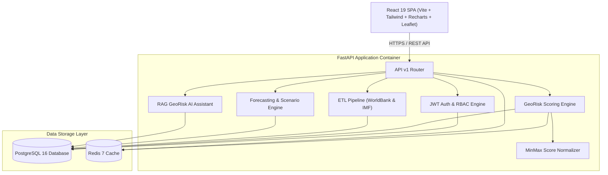
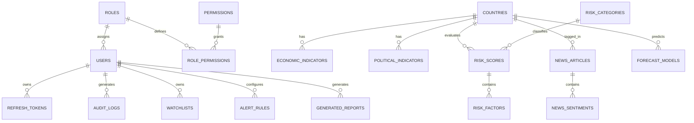

# GeoRisk Analytics — System Architecture & Database Schema

---

## System Architecture Diagram

```mermaid
graph TD
    Client["React 19 SPA (Vite + Tailwind + Recharts + Leaflet)"]
    
    subgraph Backend ["FastAPI Application Container"]
        Router["API v1 Router"]
        AuthModule["JWT Auth & RBAC Engine"]
        ScoringEngine["GeoRisk Scoring Engine"]
        Normalizer["MinMax Score Normalizer"]
        ETLPipeline["ETL Pipeline (WorldBank & IMF)"]
        ForecastEngine["Forecasting & Scenario Engine"]
        AIAssistant["RAG GeoRisk AI Assistant"]
    end
    
    subgraph DataStorage ["Data Storage Layer"]
        Postgres[(PostgreSQL 16 Database)]
        RedisCache[(Redis 7 Cache)]
    end

    Client -->|HTTPS / REST API| Router
    Router --> AuthModule
    Router --> ScoringEngine
    Router --> ETLPipeline
    Router --> ForecastEngine
    Router --> AIAssistant
    ScoringEngine --> Normalizer
    
    AuthModule --> Postgres
    ScoringEngine --> Postgres
    ETLPipeline --> Postgres
    ForecastEngine --> Postgres
    AIAssistant --> Postgres
    
    ScoringEngine --> RedisCache
    Router --> RedisCache
```

---

## Entity Relationship Diagram (Database Schema)

```mermaid
erDiagram
    USERS ||--o{ REFRESH_TOKENS : owns
    USERS ||--o{ AUDIT_LOGS : generates
    USERS ||--o{ WATCHLISTS : owns
    USERS ||--o{ ALERT_RULES : configures
    USERS ||--o{ GENERATED_REPORTS : generates
    
    ROLES ||--o{ USERS : assigns
    ROLES ||--o{ ROLE_PERMISSIONS : defines
    PERMISSIONS ||--o{ ROLE_PERMISSIONS : grants
    
    COUNTRIES ||--o{ ECONOMIC_INDICATORS : has
    COUNTRIES ||--o{ POLITICAL_INDICATORS : has
    COUNTRIES ||--o{ RISK_SCORES : evaluates
    COUNTRIES ||--o{ NEWS_ARTICLES : tagged_in
    COUNTRIES ||--o{ FORECAST_MODELS : predicts
    
    RISK_CATEGORIES ||--o{ RISK_SCORES : classifies
    RISK_SCORES ||--o{ RISK_FACTORS : contains
    NEWS_ARTICLES ||--o{ NEWS_SENTIMENTS : contains
```
