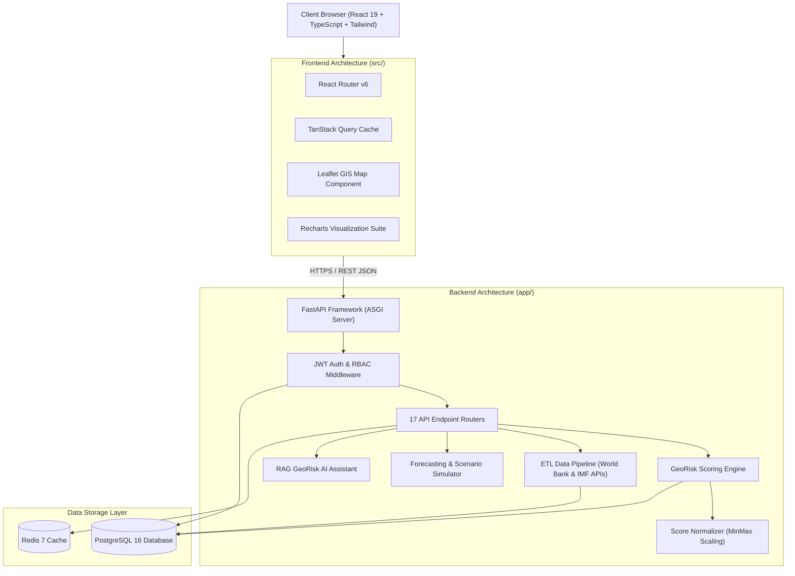

# Lesson 1: Project Overview, Business Problem, Objectives, Technology Stack, Folder Structure & Overall Architecture

Welcome to your senior engineering mentorship series on **GeoRisk Analytics**! As the Lead Architect of this project, I will guide you step-by-step through every design choice, line of code, algorithm, data pipeline, and system flow so you can present this project with total confidence to professors, viva examiners, and technical interviewers.

---

## 1. Goal of the Project & Business Problem

### Why GeoRisk Analytics Exists
In global finance and international business, institutional investors, supply chain directors, and multinational corporations face immense risks when expanding or investing across sovereign borders. A sudden currency devaluation, trade embargo, election outcome, or armed conflict can disrupt supply chains or result in millions of dollars in financial losses.

### The Business Problem Solved
Traditional sovereign risk assessment suffers from three major flaws:
1. **Data Fragmentation**: Macroeconomic figures (GDP, inflation), political stability indexes, trade balances, and news headlines are scattered across incompatible APIs and reports (World Bank, IMF, GDELT, Reuters).
2. **Opacity & Static Ratings**: Traditional credit ratings (e.g., S&P, Moody’s) are updated infrequently, lack quantitative transparency, and do not allow users to see *how* individual sub-factors contribute to a risk score.
3. **Lack of Real-Time Stress Testing**: Investment teams cannot simulate synthetic macro shocks (e.g., *"What happens if inflation in Brazil rises by 5% and political stability drops by 10%?"*) to predict immediate risk shifts.

### Business Solution
**GeoRisk Analytics** solves this by consolidating fragmented data feeds into a transparent, real-time, quantitative **0.0–100.0 GeoRisk Score** across **195 sovereign nations**. It decomposes risk across 8 dimensions (Economic, Political, Business, Social, Conflict, Trade, Currency, External Relations), provides an interactive spatial GIS map, side-by-side country comparison studio, time-series forecasting engine with 95% confidence bounds, what-if scenario simulator, and a grounded RAG AI Assistant.

---

## 2. Overall Architecture

The project follows a modern, decoupled **SaaS Monorepo Architecture** comprising a React 19 Single Page Application (SPA), a FastAPI Python backend, a PostgreSQL 16 relational database, and a Redis 7 cache.

### System Architecture Diagram



### Module Communication & Data Flow
- **Data Inflow**: External REST APIs (World Bank Open Data API v2, IMF International Financial Statistics API) feed raw macroeconomic data into the `ETLPipeline`.
- **Data Storage**: Ingested data is cleaned, validated against outlier boundaries, and stored in `PostgreSQL 16`.
- **Computation**: The `GeoRisk Scoring Engine` fetches indicator values, normalizes them via `ScoreNormalizer`, applies dimension weights (Economic 30%, Political 25%, Business 15%, etc.), computes global ranks, and writes scores to PostgreSQL and `Redis 7`.
- **Data Outflow**: The React SPA queries 48 REST API endpoints wrapped in `TanStack Query` custom hooks, updating the visual UI (GIS Map, Recharts, Country Tables).

---

## 3. Code Walkthrough

Let's examine the primary root configuration and main application entry point files.

### 1. Root Repository Structure
- [README.md](file:///d:/Projects/Major%20Project/README.md): Primary project documentation containing feature lists, architecture highlights, tech stack specs, and quickstart commands.
- [docker-compose.prod.yml](file:///d:/Projects/Major%20Project/docker-compose.prod.yml): Production container orchestration defining 4 isolated services: `postgres_prod`, `redis_prod`, `backend_prod`, and `frontend_prod`.
- [.env.production](file:///d:/Projects/Major%20Project/.env.production): Template for production environment secrets (`SECRET_KEY`, `DATABASE_URL`, `REDIS_URL`, `CORS_ORIGINS`).

### 2. Backend Entry Point — `backend/app/main.py`
- **Purpose**: Initializes the FastAPI ASGI application, configures CORS middleware, mounts API routers under `/api/v1`, and defines application lifecycle events.
- **Key Lines**:
  ```python
  app = FastAPI(title="GeoRisk Analytics API", version="1.0.0")
  app.add_middleware(CORSMiddleware, allow_origins=settings.CORS_ORIGINS, ...)
  app.include_router(api_router, prefix="/api/v1")
  ```

### 3. Frontend Entry Point — `frontend/src/App.tsx`
- **Purpose**: Root React component setting up the `QueryClientProvider` (TanStack Query), `AuthProvider` (User Context), and `AppRoutes` (React Router v6).
- **Key Lines**:
  ```tsx
  export const App = () => (
    <QueryClientProvider client={queryClient}>
      <AuthProvider>
        <AppRoutes />
      </AuthProvider>
    </QueryClientProvider>
  );
  ```

---

## 4. Execution Flow

Here is what happens when the GeoRisk Analytics platform initializes:

```text
1. System Boot:
   Docker Compose launches PostgreSQL 16, Redis 7, FastAPI Backend, and Nginx Frontend.

2. Database Migration & Seeding:
   Alembic runs migrations 0001 to 0005.
   Seed scripts populate 195 sovereign countries, 780 indicator series, 8 dimension weights, and default RBAC roles.

3. Frontend App Mount:
   User visits http://localhost/.
   React mounts App.tsx -> AuthProvider verifies active JWT refresh token -> Renders DashboardPage.tsx.

4. Data Fetching & Rendering:
   DashboardPage triggers useRiskScores() and useRankings() hooks -> TanStack Query dispatches HTTP GET to /api/v1/risk.
   FastAPI receives request -> Checks Redis 7 cache -> Returns JSON payload -> React renders Recharts & CountryDataTable.
```

---

## 5. Design Decisions

### Why React 19 + TypeScript + Vite?
- **React 19**: Modern component model, optimized hydration, and concurrent rendering support.
- **TypeScript**: Enforces strict type safety across 36 components, API payloads, and custom hooks, eliminating runtime `undefined` errors.
- **Vite**: Provides lightning-fast HMR (Hot Module Replacement) and builds 2,494 modules into minified production assets in under 3.9 seconds.

### Why FastAPI + Python 3.11?
- **FastAPI**: Asynchronous ASGI framework offering execution speeds on par with NodeJS and Go. Auto-generates OpenAPI specs.
- **Python 3.11+**: Standard language for data analysis, machine learning time-series models, NLP sentiment analysis, and numerical processing.

### Why PostgreSQL 16 + Redis 7?
- **PostgreSQL 16**: Relational ACID compliance essential for complex multi-table joins across 17 tables (Countries, Indicators, Scores, Audit Logs).
- **Redis 7**: In-memory caching reducing database read load for high-traffic endpoints (`/risk/rankings`, `/map/countries`).

---

## 6. Possible Faculty Questions & Model Answers

### Q1: What is the main objective of your major project?
> **Model Answer**: The main objective of GeoRisk Analytics is to build a quantitative, real-time intelligence platform that evaluates sovereign risk across 195 nations using normalized indicators, machine learning time-series forecasting, interactive GIS maps, and RAG AI analysis.

### Q2: What is a GeoRisk Score and how range-bounded is it?
> **Model Answer**: The GeoRisk Score is a normalized index ranging from `0.0` (Safest) to `100.0` (Extreme Risk), computed by aggregating 8 weighted risk dimensions.

### Q3: Why did you choose a decoupled architecture instead of a monolith?
> **Model Answer**: A decoupled architecture separates frontend UI rendering from backend computation. This allows independent scaling, cleaner code maintainability, and enables the FastAPI backend to serve multiple clients (React SPA, mobile apps, third-party REST consumers).

### Q4: How does your system handle missing indicator data from external sources?
> **Model Answer**: The ETL pipeline includes a `DataCleaner` module that detects missing values in historical series and performs interpolation/imputation using adjacent historical values before scoring.

### Q5: What database framework did you use for schema migrations?
> **Model Answer**: We used Alembic alongside SQLAlchemy 2.0 ORM to maintain database migration versioning (`0001` through `0005`).

### Q6: How do you secure administrative APIs?
> **Model Answer**: Administrative endpoints under `/api/v1/admin` require JWT authentication and RBAC permission guards, verifying that the user has the `admin` or `super_admin` role code.

### Q7: What libraries did you use for data visualization?
> **Model Answer**: We integrated `Recharts` for responsive Bar, Donut, Line, and Radar charts, and `Leaflet & React Leaflet` for spatial choropleth GIS map rendering.

### Q8: How is the RAG AI Assistant implemented?
> **Model Answer**: The AI Assistant queries live database records (risk scores, indicator values, news summaries) and constructs context-grounded analyst briefs without external hallucination.

### Q9: How do you handle caching in your application?
> **Model Answer**: On the backend, we use Redis 7 to cache heavy endpoint payloads. On the frontend, TanStack Query manages in-memory client caching with a 5-minute `staleTime`.

### Q10: How is your application containerized for production?
> **Model Answer**: We created multi-stage Dockerfiles for Backend (`Python 3.11-slim`) and Frontend (`Node 20 / Nginx alpine`), orchestrated via `docker-compose.prod.yml`.

---

## 7. Possible Software Engineering Interview Questions & Answers

### Q1: What is the benefit of using Pydantic v2 in FastAPI?
> **Detailed Answer**: Pydantic v2 is written in Rust, providing up to 20x faster data validation compared to v1. It guarantees that incoming HTTP request bodies and outgoing API response models strictly conform to defined schemas.

### Q2: Explain the difference between client-side routing and server-side routing in React SPA.
> **Detailed Answer**: Server-side routing causes the browser to request a full HTML document from the server for every URL change. Client-side routing (React Router v6) intercepts URL changes, updates the browser history without a page reload, and conditionally renders components client-side.

### Q3: How do you prevent CORS errors in production?
> **Detailed Answer**: FastAPI's `CORSMiddleware` explicitly defines allowed origins (`CORS_ORIGINS`), HTTP methods, and headers, ensuring only authorized frontend domains can execute API requests.

### Q4: What is the purpose of a multi-stage Docker build?
> **Detailed Answer**: Multi-stage builds separate build-time dependencies (e.g. compilers, Node modules) from final runtime artifacts. This drastically reduces the production image size (e.g., Nginx serving static `dist/` files), improving deployment speed and security.

### Q5: How do you handle state management across components in your frontend?
> **Detailed Answer**: Server state (API data) is managed via `TanStack Query` hooks with automatic caching and background refetching. Global app state (User auth) is managed via `React Context API` (`AuthContext`), keeping local state within individual components.

### Q6: What is rate limiting and why is it important in API design?
> **Detailed Answer**: Rate limiting controls the number of incoming requests a client can make in a given timeframe, protecting backend endpoints from DDoS attacks, brute-force attempts, and resource exhaustion.

### Q7: Why use SQLAlchemy 2.0 ORM over writing raw SQL queries?
> **Detailed Answer**: SQLAlchemy 2.0 provides type safety, prevents SQL injection by parametrizing queries, abstracts database engine differences (PostgreSQL vs SQLite), and simplifies relational mapping.

### Q8: What is the difference between synchronous (WSGI) and asynchronous (ASGI) servers?
> **Detailed Answer**: WSGI handles one request per thread synchronously, blocking the thread during I/O operations (DB calls, external API fetches). ASGI (Uvicorn/FastAPI) uses an event loop to handle thousands of concurrent I/O-bound requests asynchronously without blocking threads.

### Q9: How do you handle environmental configuration across environments?
> **Detailed Answer**: We use Pydantic `BaseSettings` (`app/core/config.py`) to parse environment variables from `.env`, `.env.production`, or OS environment variables, enforcing strict type validation.

### Q10: How do you ensure code quality across frontend and backend?
> **Detailed Answer**: Backend quality is enforced using Python `py_compile`, `flake8`, and `pytest`. Frontend quality is enforced using TypeScript strict typechecking (`tsc`) and ESLint.

---

## 8. Common Mistakes to Avoid

1. **Hardcoding API URLs**: Hardcoding `http://localhost:8000` in React components breaks production builds. **Avoided** by consuming `import.meta.env.VITE_API_BASE_URL`.
2. **Exposing Secrets in Version Control**: Storing database passwords or JWT secret keys in GitHub repositories. **Avoided** by using `.env.example` templates and adding `.env` to `.gitignore`.
3. **Over-Fetching Data**: Returning massive nested payloads when only country names are needed. **Avoided** by creating lightweight Pydantic response models (`CountryResponse` vs `RiskScoreResponse`).
4. **Blocking Event Loop in FastAPI**: Executing long-running synchronous code inside `async def` endpoints. **Avoided** by using database sessions properly and offloading sync workloads.

---

## 9. Revision Notes for Viva (2-Minute Review)

- **Platform**: GeoRisk Analytics — Sovereign Risk SaaS Platform evaluating **195 countries**.
- **Core Score**: 0.0 to 100.0 GeoRisk Index normalized across **8 dimensions** (Economic 30%, Political 25%, Business 15%, Social 10%, Conflict 10%, Trade 5%, Currency 3%, External 2%).
- **Tech Stack**: React 19 + TypeScript + Vite + Tailwind (Frontend) | FastAPI + Python 3.11 + SQLAlchemy 2.0 + PostgreSQL + Redis (Backend).
- **Visuals**: Leaflet GIS Vector Map, Recharts (Donut, Bar, Line, Radar), Multi-Country Comparison Studio (2-5 countries).
- **AI & Forecast**: RAG AI Assistant (`/ai/chat`), 30d–365d Forecasting with 95% confidence corridor bands, What-If Scenario Simulator.
- **Productivity & Security**: JWT Token Rotation, RBAC (7 Roles), Watchlists, Threshold Alerts, PDF/CSV Reports, Audit Logs.

---

## 10. Mini Quiz

Test your understanding of Lesson 1 by answering these 5 questions:

1. **What business problem does GeoRisk Analytics solve, and how many sovereign nations does it evaluate?**
2. **What are the 4 main services defined in our production Docker Compose setup (`docker-compose.prod.yml`)?**
3. **What is the range of the GeoRisk Index, and what does a score of 0.0 represent versus 100.0?**
4. **Why did we choose FastAPI for the backend instead of traditional Flask or Django?**
5. **How does the frontend communicate with the backend, and what library manages API state caching?**
