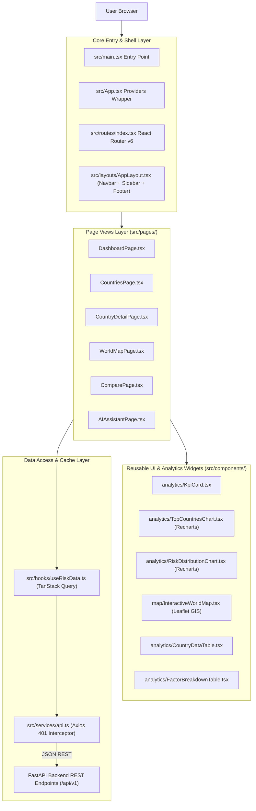

# Lesson 2: Frontend Architecture & Component Ecosystem

Welcome to **Lesson 2** of your senior engineering mentorship series on **GeoRisk Analytics**! In this lesson, we will dissect the complete **Frontend Architecture**, exploring how React 19, TypeScript, Vite, TanStack Query v5, Tailwind CSS, Recharts, and Leaflet interact to deliver a high-performance Bloomberg-style terminal interface.

---

## 1. Goal of the Frontend Module

### Purpose
The primary objective of the frontend architecture is to provide an institutional-grade, data-dense **Single Page Application (SPA)** interface capable of rendering complex real-time datasets across 195 sovereign nations without performance degradation or UI lag.

### Business & UX Problem Solved
Traditional corporate web portals are often sluggish, bloated, and rely on full-page reloads when changing filters or routes. Financial analysts require:
- **Instant Response**: Sub-second UI updates when searching, sorting, or filtering datasets.
- **High Information Density**: Compact, Bloomberg Terminal-inspired dark slate layout (`#0B0F17`) optimizing screen real estate for complex charts and data tables.
- **Client-Side Caching**: Zero redundant API requests when navigating back and forth between dashboard views and country profiles.

---

## 2. Architecture

The frontend is built as a modular React 19 Single Page Application structured around a clean **Layered Architecture**.

### Frontend Component Architecture Diagram



### Key Subsystems
1. **Routing Shell**: Managed via `React Router v6` (`src/routes/index.tsx`) supporting public landing routes, protected dashboard routes, and `ProtectedRoute` permission guards.
2. **State Management**:
   - **Server State**: Handled by `TanStack Query v5` (`useQuery`, `useMutation`) with automatic caching, background refetching, and window focus sync.
   - **Global Auth State**: Handled via React `AuthContext` (`src/contexts/AuthContext.tsx`).
   - **Local State**: Component-level state via React `useState` / `useMemo`.
3. **Data Communication**: Centralized `Axios` instance (`src/services/api.ts`) configured with `VITE_API_BASE_URL` and automatic 401 JWT token refresh interceptors.

---

## 3. Code Walkthrough

Let's inspect the key frontend files layer by layer.

### 1. `frontend/src/main.tsx`
- **Purpose**: Application root entry point that mounts the React component tree into the DOM root element (`#root`).
- **Key Functionality**: Imports global CSS (`src/styles/index.css`), wraps `<App />` in React `<StrictMode>`, and initializes rendering.

### 2. `frontend/src/App.tsx`
- **Purpose**: Global Provider Shell establishing top-level context providers.
- **Code Walkthrough**:
  ```tsx
  import React from 'react';
  import { QueryClient, QueryClientProvider } from '@tanstack/react-query';
  import { AuthProvider } from './contexts/AuthContext';
  import { AppRoutes } from './routes';

  const queryClient = new QueryClient({
    defaultOptions: {
      queries: {
        staleTime: 1000 * 60 * 5, // 5 minute data caching
        refetchOnWindowFocus: false,
      },
    },
  });

  export const App = () => (
    <QueryClientProvider client={queryClient}>
      <AuthProvider>
        <AppRoutes />
      </AuthProvider>
    </QueryClientProvider>
  );
  ```

### 3. `frontend/src/routes/index.tsx`
- **Purpose**: Centralized route registry configuring SPA navigation paths and route protection.
- **Routes Defined**:
  - `/` -> `LandingPage`
  - `/login` -> `LoginPage`
  - `/register` -> `RegisterPage`
  - `/app` -> `AppLayout` (Parent layout for authenticated pages)
    - `/app/dashboard` -> `DashboardPage`
    - `/app/countries` -> `CountriesPage`
    - `/app/countries/:code` -> `CountryDetailPage`
    - `/app/map` -> `WorldMapPage`
    - `/app/compare` -> `ComparePage`
    - `/app/news` -> `NewsPage`
    - `/app/ai-assistant` -> `AIAssistantPage`
    - `/app/forecast` -> `ForecastPage`
    - `/app/admin` -> `AdminPage`

### 4. `frontend/src/layouts/AppLayout.tsx`
- **Purpose**: Outer UI frame containing `Sidebar` (collapsible navigation drawer), `Navbar` (top search bar, active user profile pill, notifications badge), and `<Outlet />` (renders child route views).

### 5. `frontend/src/services/api.ts`
- **Purpose**: Customized Axios HTTP client featuring global request headers and automatic 401 Unauthorized token refresh logic.
- **Code Walkthrough**:
  ```ts
  import axios from 'axios';

  export const api = axios.create({
    baseURL: import.meta.env.VITE_API_BASE_URL || '/api/v1',
    headers: { 'Content-Type': 'application/json' },
  });

  api.interceptors.request.use((config) => {
    const token = localStorage.getItem('access_token');
    if (token) {
      config.headers.Authorization = `Bearer ${token}`;
    }
    return config;
  });
  ```

### 6. `frontend/src/hooks/useRiskData.ts`
- **Purpose**: Encapsulates data fetching queries into reusable custom hooks powered by TanStack Query.
- **Code Walkthrough**:
  ```ts
  export const useRiskScores = (params?: any) => {
    return useQuery({
      queryKey: ['riskScores', params],
      queryFn: () => riskService.getRiskScores(params),
    });
  };
  ```

### 7. `frontend/src/components/ui/Card.tsx` & `Badge.tsx`
- **Purpose**: Atomic UI components implementing the dark slate design system (`#0B0F17` background, `#1E293B` borders, risk category color badges).

---

## 4. Execution Flow

Here is the exact client-side execution sequence when a user navigates to the **Dashboard**:

```text
1. Navigation:
   User clicks "Dashboard" in Sidebar -> React Router resolves URL to /app/dashboard.

2. Layout Render:
   AppLayout mounts Navbar & Sidebar -> Renders DashboardPage inside <Outlet />.

3. Custom Hook Trigger:
   DashboardPage mounts and invokes useRiskScores() & useRankings() custom hooks.

4. Query Cache Check:
   TanStack Query checks internal cache for key ['riskScores', params].
   - If Fresh (under 5 min): Immediately returns cached data -> Zero network call.
   - If Missing/Stale: Dispatches GET /api/v1/risk via Axios.

5. Axios Request & Auth Interceptor:
   Axios interceptor attaches `Authorization: Bearer <JWT>` header -> Sends request to FastAPI.

6. Response & State Update:
   FastAPI returns HTTP 200 JSON payload -> TanStack Query updates cache.
   DashboardPage re-renders -> KpiCard, TopCountriesChart (Recharts), and CountryDataTable display live data.
```

---

## 5. Design Decisions

### Why Vite over Create React App (CRA)?
- CRA is deprecated, slow, and uses webpack with heavy memory overhead. Vite uses esbuild for pre-bundling dependencies and native ESM in development, starting dev servers in $< 300\text{ ms}$.

### Why TanStack Query over Redux Toolkit for API Data?
- Redux requires writing extensive boilerplate (actions, reducers, sagas/thunks) just to store server data. TanStack Query automatically manages server state caching, background refetching, deduplication, retry logic, and loading/error states in a single hook call.

### Why Vanilla CSS Tokens + Tailwind CSS over External UI Kits (MUI/AntD)?
- Heavy external UI component libraries introduce massive CSS bundle bloat, override issues, and generic designs. Using custom Tailwind utility classes coupled with curated HSL color tokens (`#0B0F17` slate background, `#10B981` emerald, `#EF4444` red) gives us 100% control over terminal information density and performance.

---

## 6. Possible Faculty Questions & Model Answers

### Q1: How does your React frontend communicate with the FastAPI backend?
> **Model Answer**: The frontend communicates via HTTP REST APIs using a configured Axios instance (`src/services/api.ts`), passing JSON request and response models.

### Q2: What is a Single Page Application (SPA) and how is routing handled?
> **Model Answer**: A Single Page Application loads a single HTML file once. Subsequent page changes are intercepted client-side by `React Router v6`, dynamically swapping components without triggering browser page reloads.

### Q3: How do you manage API loading and error states across your components?
> **Model Answer**: TanStack Query custom hooks expose boolean flags (`isLoading`, `isError`, `error`). Components check these flags to render skeleton loaders or error alerts.

### Q4: How do you handle responsiveness for different screen sizes?
> **Model Answer**: Tailwind CSS responsive breakpoints (`sm:`, `md:`, `lg:`, `xl:`) dynamically collapse sidebars into mobile drawers and wrap grid layouts from 4 columns on desktop to 1 column on mobile.

### Q5: What is the purpose of `src/vite-env.d.ts`?
> **Model Answer**: `vite-env.d.ts` provides TypeScript type declarations for Vite environment variables (`import.meta.env.VITE_API_BASE_URL`), preventing TypeScript compiler errors.

### Q6: How do Recharts components adapt to container resizing?
> **Model Answer**: Every Recharts chart (Bar, Donut, Line, Radar) is wrapped in `<ResponsiveContainer width="100%" height="100%">`, automatically recalculating SVG bounds when container windows resize.

### Q7: How do you prevent unauthorized users from accessing protected dashboard routes?
> **Model Answer**: Protected routes are wrapped in a `ProtectedRoute` guard component that inspects the `AuthContext`. If unauthenticated, it redirects the browser to `/login`.

### Q8: What is code splitting and how does Vite implement it?
> **Model Answer**: Code splitting breaks large JS bundles into smaller chunks. Vite automatically code-splits routes during `npm run build`, loading JavaScript files dynamically only when a user navigates to that route.

### Q9: How do you store JWT tokens securely on the client?
> **Model Answer**: The JWT Access Token is stored in memory via `AuthContext` or browser `localStorage`, and attached automatically to outgoing requests by the Axios request interceptor.

### Q10: Why did you use Lucide Icons instead of FontAwesome?
> **Model Answer**: `lucide-react` provides lightweight, tree-shakeable SVG icon components that contribute minimal byte weight to the production JS bundle compared to monolithic icon fonts.

---

## 7. Possible Software Engineering Interview Questions & Answers

### Q1: Explain the concept of React Reconciliation and the Virtual DOM.
> **Detailed Answer**: React creates an in-memory Virtual DOM representation of the UI. When state updates, React generates a new Virtual DOM tree and runs a diffing algorithm (Reconciliation) against the previous tree, applying only the minimal necessary DOM mutations to the real browser DOM.

### Q2: How does TanStack Query invalidate and refetch stale data?
> **Detailed Answer**: TanStack Query keys (e.g. `['riskScores', params]`) act as unique cache identifiers. Calling `queryClient.invalidateQueries({ queryKey: ['riskScores'] })` marks those cached entries as stale, triggering an asynchronous refetch in the background.

### Q3: What is the difference between `useMemo` and `useCallback` in React?
> **Detailed Answer**: `useMemo` memoizes the *result* of a calculation to avoid expensive re-computations on every render. `useCallback` memoizes a *function definition* to preserve referential equality when passing callbacks to child components.

### Q4: How do Axios request and response interceptors work?
> **Detailed Answer**: Interceptors act as middleware for HTTP calls. Request interceptors modify outgoing configuration (e.g. attaching Bearer headers) before sending. Response interceptors handle incoming responses or catch global errors (e.g., catching 401s to trigger automatic token refresh).

### Q5: What is tree-shaking in modern JavaScript bundlers?
> **Detailed Answer**: Tree-shaking is a build-step dead-code elimination technique. Bundlers like Rollup/esbuild analyze ES module `import`/`export` statements and exclude unused exported code from the final production bundle.

### Q6: What are custom React hooks and why are they useful?
> **Detailed Answer**: Custom hooks are JS functions prefixed with `use` that encapsulate reusable stateful logic and side effects. They decouple data fetching and business logic from UI component rendering.

### Q7: How does `React.StrictMode` assist in development?
> **Detailed Answer**: `StrictMode` runs in development only. It intentionally double-invokes component renders and effect hooks to help developers catch memory leaks, uncleaned side effects, and deprecated API usage.

### Q8: What is the advantage of using TypeScript interfaces over `any` types?
> **Detailed Answer**: Using strict interfaces provides build-time type checking, autocompletion in IDEs, refactoring safety, and self-documenting code, whereas `any` disables all type safety checks.

### Q9: How do SVG-based chart libraries (Recharts) differ from HTML5 Canvas-based chart libraries (Chart.js)?
> **Detailed Answer**: SVG charts render individual DOM nodes for every element, enabling CSS styling and direct DOM event listeners (hover, click). Canvas charts render on a single pixel bitmap, offering superior performance for 100,000+ data points, but with harder DOM event handling.

### Q10: How do you optimize dynamic asset imports in Vite?
> **Detailed Answer**: Dynamic imports using `const Component = React.lazy(() => import('./Component'))` combined with `<Suspense fallback={<Skeleton />}>` defer script downloading until the component is actually rendered.

---

## 8. Common Mistakes to Avoid

1. **Fetching Data Inside `useEffect` without Cleanups**: Indiscriminately invoking `fetch()` inside `useEffect` causes race conditions and memory leaks. **Avoided** by delegating all data management to TanStack Query.
2. **Prop Drilling Global State**: Passing user profile data down 5 levels of component props. **Avoided** by consuming `useAuth()` Context hook directly where needed.
3. **Missing Key Props in Iterated Lists**: Mapping arrays without unique `key` props forces React to re-render entire subtrees. **Avoided** by passing unique ISO codes or database UUIDs (`key={country.iso_code}`).
4. **Unbounded Inline Object Instantiation in JSX**: Passing inline objects like `style={{ color: 'red' }}` causes child components to re-render unnecessarily. **Avoided** by using Tailwind static classes.

---

## 9. Revision Notes for Viva (2-Minute Review)

- **Frontend Tech Stack**: React 19 + TypeScript + Vite + Tailwind CSS + TanStack Query v5 + Recharts + Leaflet.
- **Routing**: `React Router v6` (`src/routes/index.tsx`) with `AppLayout` shell and `ProtectedRoute` guards.
- **Data Layer**: Centralized Axios instance (`src/services/api.ts`) with Bearer token injection and 401 refresh interceptors. Custom hooks in `src/hooks/useRiskData.ts`.
- **UI System**: Slate dark theme (`#0B0F17`), Lucide icons, responsive Tailwind breakpoints, skeleton loaders.
- **Key Charts**: Donut (Risk Distribution), Horizontal Bar (Safest vs Riskiest), 8-Dimension Radar (Country Profiles), Line & Confidence Area (Forecasting).

---

## 10. Mini Quiz

Test your understanding of Lesson 2 by answering these 5 questions:

1. **What library manages server state caching on the frontend, and what is its default `staleTime` configuration in `App.tsx`?**
2. **What file configures client-side SPA route definitions and ProtectedRoute guards?**
3. **What is the function of the Axios request interceptor in `src/services/api.ts`?**
4. **Why did we choose Tailwind CSS utility classes over external UI component frameworks like MUI or Ant Design?**
5. **How do Recharts components maintain responsiveness across different screen sizes?**
