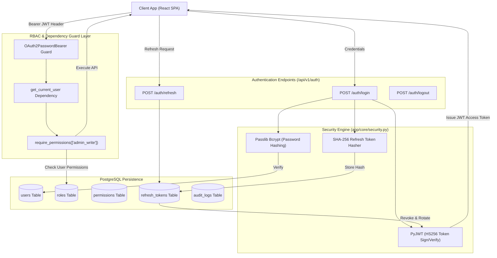

# Lesson 4: Authentication, Security & Role-Based Access Control (RBAC)

Welcome to **Lesson 4** of your senior engineering mentorship series on **GeoRisk Analytics**! In this lesson, we will explore the complete **Authentication & RBAC Architecture**, examining how Passlib bcrypt password hashing, JWT token rotation, revocable refresh tokens, database-driven permissions, and React context guards protect the application.

---

## 1. Goal of the Authentication Module

### Purpose
The primary objective of the Authentication & RBAC module is to verify user identities, issue cryptographically signed session tokens, restrict sensitive operations (such as risk weight modifications or user creation) to authorized roles, and log all security-relevant events for audit compliance.

### Security Problems Solved
- **Plaintext Password Exposure**: Storing unhashed or weakly hashed passwords exposes user credentials during database breaches. Solved using **Passlib bcrypt** with 12 salt rounds.
- **Stolen Token Replay Attacks**: Stateless JWTs cannot be revoked natively until expiry. Solved using **Dual-Token Rotation** (short-lived Access Tokens + long-lived Refresh Tokens hashed in PostgreSQL).
- **Unauthorized Privilege Escalation**: Restricts endpoint execution so that a standard Analyst cannot invoke administrative operations (e.g. `POST /api/v1/admin/etl/run`). Solved via database-driven **Role-Based Access Control (RBAC)**.

---

## 2. Architecture

The authentication system employs a **Stateless Access Token + Database-Backed Refresh Token Architecture**.

### Authentication & RBAC Architecture Diagram



---

## 3. Code Walkthrough

Let's examine the essential backend and frontend files managing security.

### 1. `backend/app/models/user.py`
- **Purpose**: SQLAlchemy 2.0 ORM models defining the security schema (`User`, `Role`, `Permission`, `RolePermission`, `RefreshToken`, `AuditLog`).
- **Code Walkthrough**:
  ```python
  class User(Base):
      __tablename__ = "users"

      id: Mapped[str] = mapped_column(String(36), primary_key=True, default=lambda: str(uuid.uuid4()))
      email: Mapped[str] = mapped_column(String(255), unique=True, index=True, nullable=False)
      username: Mapped[str] = mapped_column(String(50), unique=True, index=True, nullable=False)
      full_name: Mapped[str] = mapped_column(String(100), nullable=False)
      password_hash: Mapped[str] = mapped_column(String(255), nullable=False)
      role_id: Mapped[Optional[str]] = mapped_column(String(36), ForeignKey("roles.id", ondelete="SET NULL"))
      is_active: Mapped[bool] = mapped_column(Boolean, default=True)

      role: Mapped[Optional["Role"]] = relationship("Role", back_populates="users")
  ```

### 2. `backend/app/core/security.py`
- **Purpose**: Low-level cryptographic helper functions for password verification, password hashing, and JWT token encoding/decoding.
- **Code Walkthrough**:
  ```python
  import jwt
  from datetime import datetime, timedelta
  from passlib.context import CryptContext
  from app.core.config import settings

  pwd_context = CryptContext(schemes=["bcrypt"], deprecated="auto")

  def verify_password(plain_password: str, hashed_password: str) -> bool:
      return pwd_context.verify(plain_password, hashed_password)

  def get_password_hash(password: str) -> str:
      return pwd_context.hash(password)

  def create_access_token(subject: str, expires_delta: timedelta = None) -> str:
      expire = datetime.utcnow() + (expires_delta or timedelta(minutes=settings.ACCESS_TOKEN_EXPIRE_MINUTES))
      to_encode = {"exp": expire, "sub": str(subject), "type": "access"}
      return jwt.encode(to_encode, settings.SECRET_KEY, algorithm=settings.ALGORITHM)
  ```

### 3. `backend/app/api/v1/endpoints/auth.py`
- **Purpose**: Handles authentication routes (`/auth/login`, `/auth/refresh`, `/auth/logout`, `/users/me`) and exposes the `require_permissions` RBAC guard.
- **Code Walkthrough**:
  ```python
  def require_permissions(required_permissions: list[str]):
      def dependency(current_user: User = Depends(get_current_user)):
          # Super admin bypasses all permission checks
          if current_user.role and current_user.role.code == "super_admin":
              return current_user

          user_perms = {p.code for p in current_user.role.permissions} if current_user.role else set()
          for perm in required_permissions:
              if perm not in user_perms:
                  raise HTTPException(status_code=403, detail="Insufficient privileges")
          return current_user
      return dependency
  ```

### 4. `frontend/src/contexts/AuthContext.tsx`
- **Purpose**: React Context API provider exposing `user`, `login()`, and `logout()` functions globally throughout the frontend.

---

## 4. Execution Flow

Here is the step-by-step execution path when a user logs in and accesses a protected endpoint:

```text
1. Login Request:
   User submits credentials -> POST /api/v1/auth/login -> FastAPI invokes verify_password().

2. Token Generation & Storage:
   Password matches -> System issues Access Token (JWT 60-min) & Refresh Token (30 days).
   SHA-256 hash of Refresh Token is written to `refresh_tokens` table.

3. Protected Request Execution:
   Client sends GET /api/v1/risk with `Authorization: Bearer <Access_Token>`.
   OAuth2PasswordBearer extracts token -> Decodes sub (user_id) using SECRET_KEY.

4. RBAC Verification:
   `require_permissions` fetches user role and permissions -> Verifies user has access.
   If verified -> Request completes. If invalid -> Returns HTTP 403 Forbidden.
```

---

## 5. Design Decisions

### Why HS256 JWT over Stateful Server Sessions?
Stateful session cookies require the backend to query a central session store (e.g., Redis or DB) on every single API request. HS256 HMAC-signed JWTs allow the backend to cryptographically verify token authenticity in memory without executing a database lookup for every request.

### Why Dual-Token Rotation (Access + Refresh Tokens)?
If an Access Token is compromised, its short lifespan (60 minutes) limits the attacker's window of opportunity. The long-lived Refresh Token (30 days) is stored as a SHA-256 hash in PostgreSQL, enabling administrators to revoke specific user sessions instantly by setting `is_revoked = True`.

### Why Granular Permission Code Strings over Role Enums?
Hardcoding role enums (`if user.role == 'admin'`) makes adding new roles difficult. Using database-driven string permissions (`"risk_write"`, `"user_delete"`) allows administrators to create custom roles with arbitrary permission combinations directly from the Admin Panel without modifying code.

---

## 6. Possible Faculty Questions & Model Answers

### Q1: How are passwords stored securely in your database?
> **Model Answer**: Passwords are never stored in plaintext. They are hashed using **Passlib bcrypt** with 12 salt rounds, generating a 60-character one-way cryptographic hash.

### Q2: What algorithm signs your JSON Web Tokens?
> **Model Answer**: We use **HS256** (HMAC using SHA-256) signed with a secret server key (`SECRET_KEY`).

### Q3: What is the difference between Authentication and Authorization?
> **Model Answer**: Authentication verifies *who* the user is (e.g. logging in with email and password). Authorization verifies *what* the user is allowed to do (e.g., checking permissions before running an ETL job).

### Q4: How does token revocation work with stateless JWTs?
> **Model Answer**: Short-lived Access Tokens expire automatically. Long-lived Refresh Tokens are tracked in the `refresh_tokens` database table. Setting `is_revoked = True` prevents token renewal, revoking the user's session.

### Q5: What happens if a user submits an expired Access Token?
> **Model Answer**: The `jwt.decode()` helper raises an `ExpiredSignatureError`, intercepting the request and returning an `HTTP 401 Unauthorized` response to trigger client-side token refresh.

### Q6: What roles are pre-configured in your database seed script?
> **Model Answer**: Our system seeds 7 default roles: `Super Admin`, `Admin`, `Analyst`, `Researcher`, `Investor`, `Student`, and `Guest`.

### Q7: How does the Super Admin role handle permission checks?
> **Model Answer**: The `require_permissions` dependency contains a bypass check: if `current_user.role.code == "super_admin"`, access is granted immediately without evaluating specific permissions.

### Q8: What is the purpose of the `audit_logs` table?
> **Model Answer**: The `audit_logs` table records security events (user logins, failed attempts, role changes, weight modifications) alongside user IDs, timestamps, and IP addresses for audit compliance.

### Q9: How does the frontend handle token storage?
> **Model Answer**: The Access Token and Refresh Token are stored in browser `localStorage` and managed globally by React `AuthContext`.

### Q10: How does the Axios client handle 401 errors?
> **Model Answer**: Axios uses a response interceptor. If an API call returns `HTTP 401`, the interceptor automatically dispatches a request to `/auth/refresh` to renew the Access Token before retrying the original request.

---

## 7. Possible Software Engineering Interview Questions & Answers

### Q1: Why is bcrypt preferred over MD5 or SHA-256 for password hashing?
> **Detailed Answer**: MD5 and SHA-256 are fast hash functions designed for throughput, making them vulnerable to GPU-based hardware brute-force attacks. Bcrypt is a slow, memory-hard hashing algorithm with an adjustable work factor (salt rounds), resisting hardware-accelerated attacks.

### Q2: What is the structure of a JSON Web Token (JWT)?
> **Detailed Answer**: A JWT consists of three base64url-encoded parts separated by dots (`.`):
> 1. **Header**: Specifies the algorithm (`HS256`) and token type (`JWT`).
> 2. **Payload**: Contains claims (subject `sub`, expiration `exp`, token type).
> 3. **Signature**: Cryptographic signature generated by hashing the header, payload, and server `SECRET_KEY`.

### Q3: What is the vulnerability of storing JWT tokens in `localStorage` vs `HttpOnly` Cookies?
> **Detailed Answer**: `localStorage` is accessible via JavaScript, making tokens vulnerable to Cross-Site Scripting (XSS) attacks. `HttpOnly` cookies cannot be accessed via JavaScript, mitigating XSS, but require CSRF protection tokens.

### Q4: How do you prevent Brute-Force Password Guessing Attacks?
> **Detailed Answer**: Brute-force attacks are mitigated by setting rate limits on the `/auth/login` endpoint, implementing account lockouts after consecutive failed attempts, and tracking failed attempts in `audit_logs`.

### Q5: What is the difference between RBAC (Role-Based Access Control) and ABAC (Attribute-Based Access Control)?
> **Detailed Answer**: RBAC assigns permissions to roles, and roles to users. ABAC evaluates fine-grained rules based on attributes (e.g. user department, resource ownership, time of day). We use RBAC for predictable, enterprise-grade authorization.

### Q6: How do you implement OAuth2 Password Bearer flow in FastAPI?
> **Detailed Answer**: FastAPI provides `OAuth2PasswordBearer(tokenUrl="/api/v1/auth/login")`. It automatically inspects incoming request `Authorization` headers for `Bearer <token>` and integrates with OpenAPI Swagger docs.

### Q7: What is Token Side-Channel Timing Attack and how is it prevented?
> **Detailed Answer**: A timing attack measures tiny time differences during string comparisons. We prevent timing attacks by using constant-time comparison functions like `hmac.compare_digest()` for string verification.

### Q8: What is a Replay Attack and how does refresh token rotation prevent it?
> **Detailed Answer**: A replay attack occurs when an eavesdropper intercepts a valid token and re-transmits it. Refresh token rotation invalidates the old refresh token as soon as it is used to issue a new pair, ensuring an intercepted refresh token can only be used once.

### Q9: How do you handle password reset securely without revealing user existence?
> **Detailed Answer**: When a user submits a forgot-password request, the API returns `HTTP 200 OK` regardless of whether the email exists in the database. If found, a single-use time-limited reset token is dispatched via email.

### Q10: How does Alembic handle schema migrations for new foreign key constraints?
> **Detailed Answer**: Alembic inspects SQLAlchemy model changes, generates migration scripts using `op.create_table()` or `op.create_foreign_key()`, and executes DDL statements transactionally against PostgreSQL.

---

## 8. Common Mistakes to Avoid

1. **Using Weak JWT Secret Keys**: Using short or default strings like `"secret"` allows offline brute-forcing of signature keys. **Avoided** by storing high-entropy 256-bit strings in `.env.production`.
2. **Infinite Token Expiration**: Issuing JWT access tokens that never expire. **Avoided** by enforcing a strict 60-minute expiration (`ACCESS_TOKEN_EXPIRE_MINUTES = 60`).
3. **Failing to Index Email and Username**: Performing `SELECT * FROM users WHERE email = ?` without an index causes full table scans. **Avoided** by setting `index=True` on `email` and `username`.
4. **Hardcoding Super Admin Privileges**: Checking `if user.is_admin` everywhere creates fragmented authorization logic. **Avoided** by centralizing permission resolution inside `require_permissions()`.

---

## 9. Revision Notes for Viva (2-Minute Review)

- **Password Security**: Passlib bcrypt hashing with 12 rounds (`pwd_context.hash()`).
- **Token Architecture**: Dual-Token Rotation (Short-lived HS256 Access Token + Long-lived Refresh Token stored as SHA-256 hash in PostgreSQL).
- **RBAC**: 7 Pre-configured roles (`Super Admin`, `Admin`, `Analyst`, `Researcher`, `Investor`, `Student`, `Guest`) and granular permission string matching.
- **Dependency Guard**: `require_permissions(["permission_code"])` checks permissions, with `super_admin` bypass.
- **Frontend Integration**: `AuthContext.tsx` handles user state, and `api.ts` Axios interceptor handles auto-token refresh on 401.

---

## 10. Mini Quiz

Test your understanding of Lesson 4 by answering these 5 questions:

1. **What algorithm and library are used to hash user passwords in `app/core/security.py`?**
2. **What is the lifespan of an Access Token versus a Refresh Token in our configuration?**
3. **Why do we store a SHA-256 hash of the Refresh Token in the database instead of the raw token?**
4. **How does the `require_permissions` dependency handle a user with the `super_admin` role?**
5. **What happens in the frontend Axios interceptor when an API call returns an HTTP 401 status code?**
