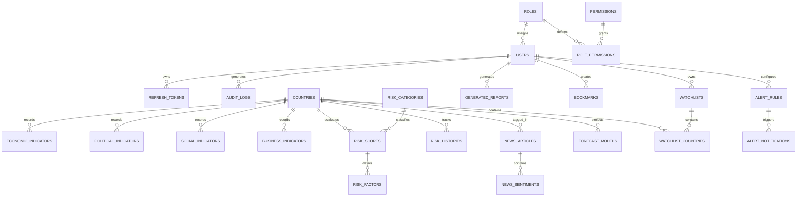

# Lesson 5: Database Design, Relational Modeling & Schema Migrations

Welcome to **Lesson 5** of your senior engineering mentorship series on **GeoRisk Analytics**! In this lesson, we will dissect the **Database Architecture & Schema Design**, exploring how 17 relational tables, 36-character UUID primary keys, foreign key constraints, composite B-Tree indexes, and Alembic migrations maintain data integrity across 195 sovereign nations.

---

## 1. Goal of the Database Module

### Purpose
The primary objective of the Database module is to store sovereign risk data, macroeconomic indicators, user identities, scoring weights, news articles, forecasts, and audit logs with strict relational integrity, zero data redundancy, and fast query response times.

### Business & Data Engineering Problems Solved
- **Data Integrity Across Indicators**: Macroeconomic, political, and social metrics must link deterministically to specific sovereign countries and evaluation years without orphan records.
- **Auditability & Historic Tracking**: Score recalculations, weight modifications, and user actions must preserve historical logs for compliance auditing.
- **High-Performance Querying**: API endpoints querying 195 countries across multi-year indicator series require optimized indexing to prevent full table scans.

---

## 2. Architecture

The database is built on **PostgreSQL 16** (with a fallback to SQLite for local development), modeled using **SQLAlchemy 2.0 ORM**, and version-controlled via **Alembic** (`0001` to `0005` migrations).

### Entity Relationship Diagram (Database ERD)



---

## 3. Code Walkthrough

Let's review the key model domains and migration scripts.

### 1. `backend/app/models/country.py`
- **Purpose**: Defines sovereign geographic entities (`Country`, `Region`, `IndicatorSource`).
- **Code Walkthrough**:
  ```python
  class Country(Base):
      __tablename__ = "countries"

      id: Mapped[str] = mapped_column(String(36), primary_key=True, default=lambda: str(uuid.uuid4()))
      name: Mapped[str] = mapped_column(String(100), unique=True, index=True, nullable=False)
      iso_code: Mapped[str] = mapped_column(String(3), unique=True, index=True, nullable=False) # e.g. USA, DEU
      iso_alpha2: Mapped[str] = mapped_column(String(2), unique=True, nullable=False)             # e.g. US, DE
      region: Mapped[str] = mapped_column(String(100), index=True, nullable=False)
      continent: Mapped[str] = mapped_column(String(50), index=True, nullable=False)
      capital: Mapped[Optional[str]] = mapped_column(String(100), nullable=True)
      latitude: Mapped[Optional[float]] = mapped_column(Float, nullable=True)
      longitude: Mapped[Optional[float]] = mapped_column(Float, nullable=True)
      flag_url: Mapped[Optional[str]] = mapped_column(String(255), nullable=True)
  ```

### 2. `backend/app/models/indicator.py`
- **Purpose**: Domain-decoupled indicator tables (`EconomicIndicator`, `PoliticalIndicator`, `SocialIndicator`, `BusinessIndicator`).
- **Code Walkthrough**:
  ```python
  class EconomicIndicator(Base):
      __tablename__ = "economic_indicators"

      id: Mapped[str] = mapped_column(String(36), primary_key=True, default=lambda: str(uuid.uuid4()))
      country_id: Mapped[str] = mapped_column(String(36), ForeignKey("countries.id", ondelete="CASCADE"), nullable=False, index=True)
      year: Mapped[int] = mapped_column(Integer, nullable=False, index=True)
      gdp_usd: Mapped[Optional[float]] = mapped_column(Float, nullable=True)
      gdp_growth_pct: Mapped[Optional[float]] = mapped_column(Float, nullable=True)
      inflation_pct: Mapped[Optional[float]] = mapped_column(Float, nullable=True)
      unemployment_pct: Mapped[Optional[float]] = mapped_column(Float, nullable=True)
  ```

### 3. `backend/app/models/risk.py`
- **Purpose**: Defines scoring engine models (`RiskCategory`, `RiskWeight`, `ScoreVersion`, `RiskScore`, `RiskFactor`, `RiskHistory`, `ScoreCalculationLog`).
- **Code Walkthrough**:
  ```python
  class RiskScore(Base):
      __tablename__ = "risk_scores"

      id: Mapped[str] = mapped_column(String(36), primary_key=True, default=lambda: str(uuid.uuid4()))
      country_id: Mapped[str] = mapped_column(String(36), ForeignKey("countries.id", ondelete="CASCADE"), nullable=False, index=True)
      year: Mapped[int] = mapped_column(Integer, default=2024, index=True)
      overall_score: Mapped[float] = mapped_column(Float, nullable=False, index=True) # 0.0 to 100.0
      risk_category_id: Mapped[str] = mapped_column(String(36), ForeignKey("risk_categories.id"))
      economic_score: Mapped[float] = mapped_column(Float, default=0.0)
      political_score: Mapped[float] = mapped_column(Float, default=0.0)
      global_rank: Mapped[Optional[int]] = mapped_column(Integer, nullable=True, index=True)

      country: Mapped["Country"] = relationship("Country")
      category: Mapped["RiskCategory"] = relationship("RiskCategory")
  ```

### 4. Alembic Migration Hierarchy
- `0001_initial_auth_rbac_tables`: Creates `users`, `roles`, `permissions`, `refresh_tokens`, `audit_logs`.
- `0002_create_etl_country_indicator_tables`: Creates `countries`, `regions`, indicator series tables.
- `0003_create_risk_engine_tables`: Creates `risk_categories`, `risk_weights`, `risk_scores`, `risk_factors`.
- `0004_create_news_forecast_tables`: Creates `news_articles`, `news_sentiments`, `forecast_models`.
- `0005_create_productivity_tables`: Creates `watchlists`, `alert_rules`, `generated_reports`, `bookmarks`.

---

## 4. Execution Flow

Here is what happens during a database migration and seed pipeline execution:

```text
1. Migration Execution:
   Developer runs `alembic upgrade head`.
   Alembic reads `alembic/versions/` -> Checks `alembic_version` table in PostgreSQL -> Executes migrations 0001 to 0005 transactionally.

2. Table Instantiation:
   PostgreSQL creates 17 tables, B-Tree indexes on `iso_code`, `country_id`, `year`, `user_id`, and foreign key constraints.

3. Seed Pipeline:
   `seed_countries.py` inserts 195 sovereign countries & 4 years of historical indicators.
   `seed_risk_rules.py` inserts 6 risk categories & 8 dimension weights -> Computes initial `RiskScore` records.
```

---

## 5. Design Decisions

### Why Relational Database (PostgreSQL) over Document DB (MongoDB)?
Sovereign analytics involves strict relational structure (e.g. `RiskScore` referencing `Country` and `RiskCategory`). Relational ACID guarantees ensure that updating a country ISO code or deleting a user cleanly cascades without leaving orphaned document records.

### Why 36-Character String UUIDs over Auto-Incrementing Integers?
Sequential integer primary keys (`id: 1, 2, 3`) leak resource counts to external users and create ID collisions when merging data across environments. 36-character UUID string primary keys (`uuid.uuid4()`) are globally unique and safe to expose in APIs.

### Why Separate Indicator Tables by Domain?
Instead of creating a single mega-table with 50+ columns, we decoupled metrics into domain tables (`EconomicIndicator`, `PoliticalIndicator`, `SocialIndicator`, `BusinessIndicator`). This improves cache locality, simplifies schema migrations, and allows adding new indicator categories without altering existing tables.

---

## 6. Possible Faculty Questions & Model Answers

### Q1: How many tables are in your database schema and what are the main domains?
> **Model Answer**: Our schema consists of **17 relational tables** divided into 5 main domains: Auth/RBAC, Sovereign Geography, Indicator Series, Risk Engine & Analytics, and Enterprise Productivity.

### Q2: Why did you use UUIDs for primary keys instead of auto-incrementing integers?
> **Model Answer**: UUIDs provide global uniqueness across distributed environments, prevent enumeration attacks, and allow primary keys to be generated client-side or in application code before insertion.

### Q3: What is the purpose of Alembic in your project?
> **Model Answer**: Alembic provides database schema version control. It tracks DDL changes as Python scripts (`0001` to `0005`), allowing database upgrades and downgrades to be executed safely across development, staging, and production environments.

### Q4: How do you enforce data integrity when a country or user is deleted?
> **Model Answer**: We enforce relational integrity using Foreign Key constraints with explicit cascade rules (`ondelete="CASCADE"` or `"SET NULL"`).

### Q5: What indexes were added to optimize query performance?
> **Model Answer**: We created B-Tree indexes on frequently queried lookup columns: `country_id`, `iso_code`, `year`, `user_id`, `overall_score`, `global_rank`, and `published_at`.

### Q6: How do you handle missing values in indicator tables?
> **Model Answer**: Indicator columns use `nullable=True` to store `NULL` for missing historical data. The scoring engine and cleaner impute missing values using adjacent series averaging.

### Q7: What is the difference between `joinedload` and default lazy loading in SQLAlchemy?
> **Model Answer**: Default lazy loading executes separate queries when a relationship property is accessed. `joinedload` emits an explicit SQL `JOIN`, fetching parent and child objects in a single query to eliminate N+1 query overhead.

### Q8: How is the database fallback handled if PostgreSQL is unavailable during testing?
> **Model Answer**: In `app/database/session.py`, if connection to PostgreSQL fails during local offline testing, the session builder gracefully falls back to an in-memory SQLite database (`sqlite:///./georisk_local.db`).

### Q9: What is foreign key cascading?
> **Model Answer**: Foreign key cascading defines database behavior when a referenced parent record is deleted. `ondelete="CASCADE"` automatically deletes all dependent child records, while `"SET NULL"` sets child foreign keys to `NULL`.

### Q10: How do you prevent table locks during schema migrations in production?
> **Model Answer**: Alembic migrations execute DDL statements inside transactions and avoid altering heavy column types without index considerations.

---

## 7. Possible Software Engineering Interview Questions & Answers

### Q1: What are Database Normalization Forms (1NF, 2NF, 3NF) and how does your schema apply them?
> **Detailed Answer**: Normalization reduces data redundancy and improves data integrity:
> - **1NF**: Ensures columns hold atomic values (e.g. separating indicators into discrete rows per year).
> - **2NF**: Ensures all non-key attributes depend on the entire primary key.
> - **3NF**: Ensures non-key attributes depend *only* on the primary key (e.g. moving region metadata into `Region` table rather than repeating it in `Country`).

### Q2: What is the difference between B-Tree, Hash, and GIN indexes in PostgreSQL?
> **Detailed Answer**: 
> - **B-Tree**: Default index suitable for equality (`=`) and range queries (`<`, `>`, `BETWEEN`). Used on `overall_score` and `year`.
> - **Hash**: Optimized strictly for exact equality lookups (`=`).
> - **GIN (Generalized Inverted Index)**: Optimized for array values and full-text search.

### Q3: How do composite indexes work and why does column order matter?
> **Detailed Answer**: A composite index indexes multiple columns (e.g., `(country_id, year)`). Column order matters because PostgreSQL can use the index for queries filtering on the leading column (`country_id`) or both columns (`country_id AND year`), but not for queries filtering solely on the second column (`year`).

### Q4: Explain the difference between ACID properties in relational databases.
> **Detailed Answer**: 
> - **Atomicity**: All operations in a transaction succeed or all roll back.
> - **Consistency**: Data adheres to schema constraints before and after transactions.
> - **Isolation**: Concurrent transactions execute without cross-interference.
> - **Durability**: Committed data survives power outages or server crashes.

### Q5: What is an Execution Plan (`EXPLAIN ANALYZE`) in PostgreSQL?
> **Detailed Answer**: `EXPLAIN ANALYZE` executes a SQL query and outputs the execution strategy chosen by the PostgreSQL query planner (e.g., Sequential Scan vs Index Scan, join algorithms, execution time in milliseconds), allowing developers to identify slow operations.

### Q6: How do you handle schema migrations in zero-downtime deployment pipelines?
> **Detailed Answer**: Zero-downtime migrations follow a non-breaking multi-step process:
> 1. Add new columns/tables as nullable or with defaults.
> 2. Deploy updated application code that writes to both old and new structures.
> 3. Backfill historical data.
> 4. Deploy code reading exclusively from new structures.
> 5. Drop old columns/tables in a final migration.

### Q7: What is the purpose of database transactions and savepoints?
> **Detailed Answer**: Transactions group operations into atomic units (`db.commit()`). Savepoints allow creating intermediate checkpoints inside a transaction, permitting partial rollbacks (`db.rollback()`) to a savepoint without aborting the entire transaction.

### Q8: How does PostgreSQL implement Multi-Version Concurrency Control (MVCC)?
> **Detailed Answer**: MVCC allows concurrent reads and writes without locking tables. When a row is updated, PostgreSQL creates a new tuple version of the row with transaction visibility identifiers (`xmin`, `xmax`). Readers see a snapshot of committed data without blocking writers.

### Q9: What is connection pool starvation and how do you mitigate it?
> **Detailed Answer**: Starvation occurs when all pooled database connections are occupied by long-running or leaked queries, causing incoming requests to timeout. Mitigated by setting connection timeouts, optimizing slow queries, and expanding pool size (`pool_size=20`, `max_overflow=10`).

### Q10: When would you use a Materialized View over a standard SQL View?
> **Detailed Answer**: Standard views execute the underlying SQL query on every execution. Materialized views persist query results physically on disk, allowing complex analytical queries (e.g. global country rankings summary) to read instantly from disk without re-executing joins.

---

## 8. Common Mistakes to Avoid

1. **Unindexed Foreign Keys**: Omitting indexes on foreign keys causes slow sequential table scans during join operations. **Avoided** by setting `index=True` on `country_id`, `user_id`, `role_id`.
2. **Missing Cascade Deletion Rules**: Deleting a country without cascade rules raises database foreign key constraint violation errors. **Avoided** by specifying `ondelete="CASCADE"`.
3. **N+1 Query Overhead in ORMs**: Querying countries and accessing indicator relationships in loops causes N+1 database roundtrips. **Avoided** by using explicit `.join()` queries.
4. **Storing Calculated Derived Metrics Redundantly**: Storing raw indicators without versioning leads to stale data. **Avoided** by tracking calculation timestamps and score versions.

---

## 9. Revision Notes for Viva (2-Minute Review)

- **Database Engine**: PostgreSQL 16 (Relational DB with fallback to SQLite for local development).
- **Migration Framework**: Alembic versioning (`0001` to `0005` migrations).
- **Total Schema Size**: 17 Relational Tables across 5 main domains (Auth, Geography, Indicators, Risk Engine, Productivity).
- **Primary Keys**: 36-character UUID strings (`uuid.uuid4()`) for global uniqueness.
- **Performance**: B-Tree indexes on `iso_code`, `country_id`, `year`, `user_id`, `overall_score`, and `global_rank`.
- **Integrity**: Explicit Foreign Keys with `ondelete="CASCADE"` or `"SET NULL"`.

---

## 10. Mini Quiz

Test your understanding of Lesson 5 by answering these 5 questions:

1. **How many relational tables constitute our PostgreSQL database schema?**
2. **Why did we choose 36-character UUID string primary keys instead of auto-incrementing integers?**
3. **What Alembic migration file creates the `countries` and indicator tables?**
4. **What database index type is used for range and lookup queries on `country_id` and `year`?**
5. **How does `ondelete="CASCADE"` behave when a parent record in the `countries` table is deleted?**
