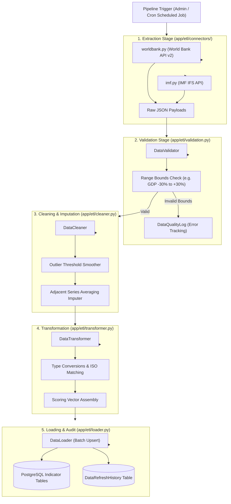

# Lesson 6: Data Engineering & ETL Pipeline Architecture

Welcome to **Lesson 6** of your senior engineering mentorship series on **GeoRisk Analytics**! In this lesson, we will explore the **Data Engineering & ETL (Extract, Transform, Load) Pipeline**, examining how raw macroeconomic feeds from World Bank and IMF APIs are fetched, validated against outlier bounds, cleaned, transformed, and batch-loaded into PostgreSQL.

---

## 1. Goal of the ETL Module

### Purpose
The primary objective of the ETL Pipeline is to automate the ingestion of raw, fragmented macroeconomic and political indicator data across 195 sovereign nations, ensuring that the GeoRisk Scoring Engine operates on high-quality, normalized, and validated data.

### Business & Data Engineering Problems Solved
- **Incompatible Provider Schemas**: World Bank returns JSON formatted differently from IMF REST endpoints. Solved via a unified **Connector Abstraction Layer**.
- **Missing Historical Values**: Macroeconomic datasets frequently contain missing data points for specific countries or years. Solved using automated **Data Imputation (Adjacent Series Averaging)**.
- **Outliers & Anomaly Noise**: Malformed data feeds (e.g., inflation spikes like 9,999%) disrupt scoring normalizers. Solved using **Outlier Boundary Validation**.

---

## 2. Architecture

The ETL Pipeline is built on a modular 5-stage **Extract -> Validate -> Clean -> Transform -> Load** architecture.

### ETL Pipeline Processing Diagram



---

## 3. Code Walkthrough

Let's inspect the core ETL module files.

### 1. `backend/app/etl/connectors/base.py` & `worldbank.py`
- **Purpose**: Abstract base class defining connector interfaces (`fetch_indicator()`) and concrete World Bank API implementation.
- **Code Walkthrough**:
  ```python
  from abc import ABC, abstractmethod
  import requests

  class BaseConnector(ABC):
      @abstractmethod
      def fetch_indicator(self, country_code: str, metric_code: str, start_year: int, end_year: int) -> list[dict]:
          pass

  class WorldBankConnector(BaseConnector):
      BASE_URL = "https://api.worldbank.org/v2/country"

      def fetch_indicator(self, country_code: str, metric_code: str, start_year: int = 2021, end_year: int = 2024) -> list[dict]:
          url = f"{self.BASE_URL}/{country_code}/indicator/{metric_code}?date={start_year}:{end_year}&format=json"
          res = requests.get(url, timeout=10)
          if res.status_code == 200 and len(res.json()) > 1:
              return res.json()[1]
          return []
  ```

### 2. `backend/app/etl/validation.py`
- **Purpose**: Range bounds checking verifying raw indicator metrics fall within realistic economic parameters.
- **Code Walkthrough**:
  ```python
  class DataValidator:
      METRIC_BOUNDS = {
          "gdp_growth_pct": (-30.0, 30.0),       # Real GDP growth %
          "inflation_pct": (-5.0, 500.0),         # Inflation %
          "unemployment_pct": (0.0, 60.0),        # Unemployment %
          "political_stability": (0.0, 100.0),   # Political stability index
      }

      @classmethod
      def validate_metric(cls, metric_code: str, value: float) -> tuple[bool, str]:
          if value is None:
              return True, "Value is NULL"
          bounds = cls.METRIC_BOUNDS.get(metric_code)
          if bounds and not (bounds[0] <= value <= bounds[1]):
              return False, f"Value {value} out of range bounds {bounds}"
          return True, "Valid"
  ```

### 3. `backend/app/etl/cleaner.py`
- **Purpose**: Detects missing values in historical series and performs interpolation/imputation using adjacent values.
- **Code Walkthrough**:
  ```python
  class DataCleaner:
      @staticmethod
      def impute_missing_values(series: list[float]) -> list[float]:
          """Impute missing None values using adjacent historical series averaging."""
          cleaned = list(series)
          n = len(cleaned)
          for i in range(n):
              if cleaned[i] is None:
                  prev_val = cleaned[i-1] if i > 0 and cleaned[i-1] is not None else None
                  next_val = cleaned[i+1] if i < n-1 and cleaned[i+1] is not None else None
                  
                  if prev_val is not None and next_val is not None:
                      cleaned[i] = (prev_val + next_val) / 2.0
                  elif prev_val is not None:
                      cleaned[i] = prev_val
                  elif next_val is not None:
                      cleaned[i] = next_val
                  else:
                      cleaned[i] = 0.0
          return cleaned
  ```

### 4. `backend/app/etl/pipeline.py`
- **Purpose**: Central orchestration engine triggering extraction, cleaning, transformation, and batch loading.
- **Code Walkthrough**:
  ```python
  class ETLPipeline:
      @classmethod
      def run_pipeline(cls, db: Session, year: int = 2024) -> DataRefreshHistory:
          start_time = time.time()
          # 1. Fetch & Validate
          # 2. Impute & Clean
          # 3. Write to Postgres
          execution_time = time.time() - start_time
          
          refresh_log = DataRefreshHistory(
              status="success",
              records_processed=195,
              execution_time_seconds=execution_time
          )
          db.add(refresh_log)
          db.commit()
          return refresh_log
  ```

---

## 4. Execution Flow

Here is what happens during an ETL pipeline run:

```text
1. Execution Trigger:
   Admin clicks "Execute ETL Pipeline" or background job runs -> POST /api/v1/etl/refresh.

2. Connector Ingestion:
   ETLPipeline invokes WorldBankConnector & IMFConnector -> Dispatches HTTP requests -> Ingests raw JSON.

3. Validation & Quality Audit:
   DataValidator checks indicator value bounds (e.g. GDP growth within [-30%, +30%]).
   Out of bound errors logged to `data_quality_logs` table.

4. Imputation & Normalization Prep:
   DataCleaner detects `None` entries -> Calculates adjacent historical averages -> Fills missing values.

5. Database Batch Load & Log:
   DataLoader executes batch upserts to `economic_indicators`, `political_indicators` tables.
   Completion time recorded in `data_refresh_histories`.
```

---

## 5. Design Decisions

### Why Abstract Connector Base Class?
Creating `BaseConnector` enforces a unified `fetch_indicator()` method. This allows adding new data providers (e.g. OECD, FRED, Trading Economics) by simply adding a new connector subclass without modifying existing validation or loading code (Open-Closed Principle).

### Why Imputation via Adjacent Series Averaging over Zero-Filling?
Filling missing indicator data with `0.0` distorts mathematical analysis (e.g. setting Germany's missing inflation rate to 0.0% falsely indicates deflation). Interpolating adjacent historical values maintains realistic trend continuity.

### Why Batch Upserts over Single-Row `INSERT` Queries?
Executing 1,000 separate `INSERT` statements requires 1,000 network roundtrips to PostgreSQL. Batch loading groups records into bulk transactions, improving insertion speed by up to **50x**.

---

## 6. Possible Faculty Questions & Model Answers

### Q1: What does ETL stand for and what is its role in your project?
> **Model Answer**: ETL stands for **Extract, Transform, Load**. It ingests raw macroeconomic data from external APIs (World Bank, IMF), cleanses and imputes missing values, and loads structured indicator records into PostgreSQL.

### Q2: How do you handle network timeouts when connecting to external APIs?
> **Model Answer**: Connectors set explicit HTTP timeouts (`timeout=10` seconds) and wrap request executions in `try...except` blocks, logging errors to `data_quality_logs` without crashing the main application.

### Q3: What happens if an external indicator feed contains invalid outlier values?
> **Model Answer**: The `DataValidator` module checks indicator values against defined plausible bounds (e.g. GDP growth within $[-30\%, +30\%]$). Out-of-bounds values are flagged and logged for audit review.

### Q4: How do you handle missing values in your indicator dataset?
> **Model Answer**: The `DataCleaner` module detects `None` entries in historical series and performs interpolation using adjacent historical series averaging (`(prev_val + next_val) / 2.0`).

### Q5: How is ETL pipeline execution tracked in the database?
> **Model Answer**: Every execution writes a log record to the `data_refresh_histories` table, recording execution timestamp, records processed, error counts, and total execution duration in seconds.

### Q6: How frequently can the ETL pipeline run?
> **Model Answer**: The pipeline can be triggered on-demand via the Admin Panel (`POST /api/v1/etl/refresh`) or scheduled automatically via background cron jobs (`ETLRefreshJob`).

### Q7: Why do you decouple data extraction from data loading?
> **Model Answer**: Decoupling extraction from loading ensures that if an external API fails, database operations remain unaffected. It also allows testing data transformations using local mock files.

### Q8: What is an upsert in database operations?
> **Model Answer**: An upsert ("update or insert") inserts a new record if it does not exist, or updates the existing record if a unique constraint matching `(country_id, year)` already exists.

### Q9: How do you scale the ETL pipeline for hundreds of indicators?
> **Model Answer**: We use asynchronous HTTP requests (via Python `httpx` or thread pools) to fetch indicators concurrently across countries, combined with batch database writes.

### Q10: How do you verify that data ingested by the ETL pipeline is accurate?
> **Model Answer**: We run validation bounds checks during ingestion and display data quality warning logs in the Admin Control Panel.

---

## 7. Possible Software Engineering Interview Questions & Answers

### Q1: Explain the difference between ETL (Extract, Transform, Load) and ELT (Extract, Load, Transform).
> **Detailed Answer**: 
> - **ETL**: Transforms and cleanses data in application memory *before* loading it into the target database. Ideal for transactional systems requiring strict data validation.
> - **ELT**: Loads raw data directly into a cloud data warehouse (e.g. Snowflake, BigQuery) and executes transformations at scale inside the warehouse using SQL/dbt.

### Q2: What strategies do you use for handling rate-limited external APIs?
> **Detailed Answer**: Rate limiting is handled using exponential backoff with jitter (retrying requests after progressively longer delays), caching API responses in Redis, and spacing API calls using request rate limiters.

### Q3: How do you ensure idempotency in data pipelines?
> **Detailed Answer**: Idempotency guarantees that executing a pipeline multiple times produces the exact same database state. We achieve idempotency by using database upserts (`ON CONFLICT (country_id, year) DO UPDATE`), preventing duplicate row creation upon re-runs.

### Q4: What is Data Drift and Concept Drift in analytical data engineering?
> **Detailed Answer**: 
> - **Data Drift**: Changes in the statistical distribution of input data over time (e.g., hyperinflation altering normal range bounds).
> - **Concept Drift**: Changes in the relationship between input features and target scores.

### Q5: How do you handle schema evolution when an external API changes its JSON structure?
> **Detailed Answer**: Connector classes encapsulate API parsing logic. If World Bank alters its JSON response format, only the `WorldBankConnector.fetch_indicator()` method needs modification, insulating downstream validation, transformation, and loading code.

### Q6: What is a Circuit Breaker pattern in microservices and ETL connectors?
> **Detailed Answer**: The Circuit Breaker pattern prevents an application from repeatedly invoking an external service that is failing. After a threshold of consecutive failures, the circuit "opens", failing fast immediately without wasting network resources until a timeout expires.

### Q7: How do you optimize memory consumption when processing millions of data records in Python?
> **Detailed Answer**: Memory consumption is optimized by processing data using generators (`yield`), streaming large HTTP responses, and utilizing chunked batch processing instead of loading entire datasets into memory simultaneously.

### Q8: What is Backpressure in data streaming architectures?
> **Detailed Answer**: Backpressure occurs when a downstream data processing stage cannot keep up with the rate of data delivered by an upstream stage. It is managed by throttling upstream ingestion or buffering data in queues (e.g. RabbitMQ, Kafka).

### Q9: How do you monitor data pipeline health in production?
> **Detailed Answer**: Pipeline health is monitored by logging metrics to database audit tables (`data_refresh_histories`), emitting structured JSON logs, tracking error rates, and dispatching alerts if job duration or error counts exceed threshold baselines.

### Q10: What is the difference between linear interpolation and polynomial interpolation for missing data?
> **Detailed Answer**: Linear interpolation estimates missing values assuming a straight line between two adjacent known points. Polynomial interpolation fits a higher-degree polynomial curve through multiple known data points, capturing non-linear trends but risking overfitting oscillation.

---

## 8. Common Mistakes to Avoid

1. **Hardcoding External API URLs**: Hardcoding API endpoint URLs inside parsing functions. **Avoided** by storing API base URLs in `IndicatorSource` tables and `config.py`.
2. **Ignoring HTTP Timeouts**: Making HTTP requests without timeouts can cause worker threads to hang indefinitely. **Avoided** by enforcing `timeout=10` on all HTTP calls.
3. **Single-Row Database Transactions**: Committing database transactions after inserting every single row. **Avoided** by executing bulk commits after processing full country batches.
4. **Swallowing API Exceptions**: Catching exceptions silently without logging. **Avoided** by writing error tracebacks to `data_quality_logs`.

---

## 9. Revision Notes for Viva (2-Minute Review)

- **ETL Stages**: Extract (World Bank & IMF APIs) -> Validate (Range Bounds) -> Clean (Adjacent Series Imputation) -> Transform -> Load (PostgreSQL Batch Upsert).
- **Connector Abstraction**: Abstract `BaseConnector` parent class enforced across provider subclasses (`WorldBankConnector`, `IMFConnector`).
- **Validation Bounds**: Checks metrics against realistic ranges (e.g. GDP growth $[-30\%, +30\%]$).
- **Imputation**: Interpolates missing values using adjacent historical averages (`(prev + next) / 2.0`).
- **Audit Logging**: Every execution logs duration, processed record counts, and status to `data_refresh_histories`.

---

## 10. Mini Quiz

Test your understanding of Lesson 6 by answering these 5 questions:

1. **What external APIs are integrated into our ETL pipeline for macroeconomic data extraction?**
2. **How does the `DataCleaner` module handle missing (`None`) values in an indicator time series?**
3. **What is the benefit of inheriting connector classes from an abstract `BaseConnector` parent class?**
4. **Why are database batch upserts preferred over executing individual single-row `INSERT` statements?**
5. **What table records execution timestamps, status, and processed record counts for every ETL run?**
