# Lesson 7: GeoRisk Scoring Engine, Normalization & Quantitative Risk Analytics

Welcome to **Lesson 7** of your senior engineering mentorship series on **GeoRisk Analytics**! In this lesson, we will dive into the core mathematical engine of the application: the **GeoRisk Scoring Engine**, exploring MinMax feature normalization, metric inversion algorithms, 8-dimension multi-criteria weighting, global ranking computation, and Redis caching.

---

## 1. Goal of the Scoring Engine Module

### Purpose
The primary objective of the GeoRisk Scoring Engine is to transform heterogeneous raw indicators (e.g. GDP growth percentage, inflation rate, political stability index) into a single, transparent, range-bounded **0.0 to 100.0 GeoRisk Index** for every sovereign nation.

### Mathematical & Quantitative Problems Solved
- **Incommensurable Units**: You cannot directly add GDP growth ($+4.5\%$) to Inflation ($+8.2\%$) or a Governance Index ($65/100$). Solved using **MinMax Feature Scaling** mapping all raw metrics onto a uniform $0.0 - 100.0$ scale.
- **Inverted Metric Orientation**: Higher inflation means *higher* risk, but higher GDP growth means *lower* risk. Solved using **Metric Inversion Handling** so that higher normalized values always represent higher risk.
- **Multi-Criteria Decision Analysis (MCDA)**: Different risk dimensions carry different significance in global finance. Solved using **Weighted Multi-Dimension Aggregation**.

---

## 2. Architecture

The Scoring Engine comprises three mathematical components: `ScoreNormalizer`, `GeoRiskEngine`, and `RankingEngine`.

### Scoring Engine Calculation Pipeline Diagram

```mermaid
graph TD
    RawData["Raw Indicator Series (PostgreSQL DB)"]

    subgraph NormalizerStage ["1. Normalization Stage (app/risk/normalizer.py)"]
        Normalizer["ScoreNormalizer"]
        MinMaxCalc["MinMax Scaling: (raw - min) / (max - min) * 100"]
        InversionCheck["Metric Inversion Check: (100 - norm) if is_inverted=True"]
        NormalizedVectors["Normalized Indicator Scores (0.0 to 100.0)"]
    end

    subgraph AggregationStage ["2. Dimension Weighting Stage (app/risk/engine.py)"]
        RiskEngine["GeoRiskEngine"]
        DimensionWeights["8 Dimension Weights (Economic 30%, Political 25%, etc.)"]
        SubScoreCalc["Dimension Sub-Score Aggregation"]
        GeoRiskIndex["Overall GeoRisk Index (0.0 to 100.0)"]
    end

    subgraph CategoryStage ["3. Category Threshold Classification"]
        CategoryMapper["Category Mapper"]
        Thresholds["Very Low (0-20), Low (20-40), Moderate (40-60), Elevated (60-75), High (75-90), Extreme (90-100)"]
    end

    subgraph RankingStage ["4. Ranking Stage (app/risk/rankings.py)"]
        RankEngine["RankingEngine"]
        GlobalSort["Ascending Overall Score Sort"]
        RegionalSort["Regional Sub-Group Sort"]
        RankAssignments["Global & Regional Ranks Assigned"]
    end

    subgraph PersistenceStage ["5. Persistence & Cache"]
        PostgresScores[(risk_scores & risk_factors Tables)]
        RedisCache[(Redis 7 Cache Invalidation)]
    end

    RawData --> NormalizerStage
    NormalizerStage --> Normalizer
    Normalizer --> MinMaxCalc
    MinMaxCalc --> InversionCheck
    InversionCheck --> NormalizedVectors
    NormalizedVectors --> AggregationStage

    AggregationStage --> RiskEngine
    RiskEngine --> DimensionWeights
    DimensionWeights --> SubScoreCalc
    SubScoreCalc --> GeoRiskIndex
    GeoRiskIndex --> CategoryStage

    CategoryStage --> CategoryMapper
    CategoryMapper --> Thresholds
    Thresholds --> RankingStage

    RankingStage --> RankEngine
    RankEngine --> GlobalSort
    GlobalSort --> RegionalSort
    RegionalSort --> RankAssignments
    RankAssignments --> PersistenceStage

    PersistenceStage --> PostgresScores
    PersistenceStage --> RedisCache
```



---

## 3. Code Walkthrough

Let's examine the mathematical code files.

### 1. `backend/app/risk/normalizer.py`
- **Purpose**: Normalizes raw metric values using MinMax feature scaling and handles metric inversion.
- **Code Walkthrough**:
  ```python
  class ScoreNormalizer:
      @staticmethod
      def normalize_minmax(raw_val: float, min_val: float, max_val: float, is_inverted: bool = False) -> float:
          """
          MinMax Feature Normalization with Metric Inversion.
          Direct Metric (is_inverted=False): Higher raw value = Higher risk score.
          Inverted Metric (is_inverted=True): Higher raw value = Lower risk score.
          """
          if raw_val is None or min_val == max_val:
              return 50.0  # Neutral midpoint default

          # Clamp raw value within min/max bounds
          clamped = max(min_val, min(max_val, raw_val))
          
          # MinMax scaling to 0.0 - 100.0
          norm = ((clamped - min_val) / (max_val - min_val)) * 100.0

          # Metric Inversion
          if is_inverted:
              norm = 100.0 - norm

          return round(norm, 2)
  ```

### 2. `backend/app/risk/engine.py`
- **Purpose**: Aggregates normalized sub-scores across 8 dimensions using active weighting profiles.
- **Code Walkthrough**:
  ```python
  class GeoRiskEngine:
      DIMENSION_WEIGHTS = {
          "economic": 0.30,          # 30%
          "political": 0.25,         # 25%
          "business": 0.15,          # 15%
          "social": 0.10,            # 10%
          "conflict": 0.10,          # 10%
          "trade": 0.05,             # 5%
          "currency": 0.03,          # 3%
          "external_relations": 0.02 # 2%
      }

      @classmethod
      def calculate_overall_score(cls, sub_scores: dict[str, float]) -> float:
          overall = 0.0
          for dim, weight in cls.DIMENSION_WEIGHTS.items():
              score = sub_scores.get(dim, 50.0)
              overall += score * weight
          return round(overall, 2)
  ```

### 3. `backend/app/risk/rankings.py`
- **Purpose**: Computes global and regional country ranks based on overall GeoRisk Scores.
- **Code Walkthrough**:
  ```python
  class RankingEngine:
      @staticmethod
      def compute_rankings(scores: list[dict]) -> list[dict]:
          """
          Sorts countries by overall_score ascending (0.0 = safest, Rank 1).
          Computes global_rank and regional_rank.
          """
          # Sort ascending by overall score (safest first)
          sorted_scores = sorted(scores, key=lambda x: x["overall_score"])
          
          region_counters = {}
          for idx, item in enumerate(sorted_scores, start=1):
              item["global_rank"] = idx
              
              region = item.get("region", "Global")
              region_counters[region] = region_counters.get(region, 0) + 1
              item["regional_rank"] = region_counters[region]

          return sorted_scores
  ```

### 4. `backend/app/services/risk_service.py`
- **Purpose**: High-level service orchestrating scoring engine execution, database reads/writes, and Redis cache invalidation.

---

## 4. Execution Flow

Here is the exact step-by-step execution path when `POST /api/v1/risk/recalculate/all` is triggered:

```text
1. Trigger Request:
   Admin triggers global recalculation -> API router receives POST request.

2. Raw Indicator Ingestion:
   RiskService queries latest indicator series for all 195 countries from PostgreSQL.

3. MinMax Normalization & Inversion:
   For every metric: ScoreNormalizer calculates MinMax bounds across global dataset.
   Applies `norm = 100.0 - norm` if metric is safety-oriented (`is_inverted=True`).

4. Dimension Aggregation & Index Computation:
   GeoRiskEngine multiplies normalized sub-scores by 8 dimension weights (30% Economic, 25% Political, etc.).
   Calculates overall GeoRisk Index (0.0 to 100.0).

5. Threshold Mapping & Ranking:
   Maps overall score to RiskCategory threshold (`Very Low`, `Low`, `Moderate`, `Elevated`, `High`, `Extreme`).
   RankingEngine sorts countries ascending -> Assigns `global_rank` and `regional_rank`.

6. Database Write & Cache Flush:
   Upserts `RiskScore` and `RiskFactor` records to PostgreSQL -> Flushes Redis 7 cache.
```

---

## 5. Design Decisions

### Why MinMax Feature Scaling over Z-Score Standardization?
Z-Score standardization calculates deviations from the mean in standard deviation units ($\sigma$). While good for statistical distributions, Z-scores produce unbounded negative and positive numbers (e.g. $-2.5$ to $+3.1$). MinMax feature scaling guarantees strict, intuitive bounded scores ($0.0$ to $100.0$) that financial non-technical stakeholders can instantly understand.

### Why Explicit Metric Inversion Handling?
Indicators move in opposite risk directions. Higher inflation rate increase sovereign risk (direct metric), whereas higher real GDP growth or higher political stability reduces sovereign risk (inverted metric). Explicitly passing `is_inverted = True` ensures that a high normalized score *always* signifies higher risk across all dimensions.

### Why 8 Weighted Risk Dimensions?
Economic (30%) and Political (25%) factors are empirically the primary drivers of sovereign debt default and capital flight. Adding Business, Social, Conflict, Trade, Currency, and External Relations vectors provides a holistic 360-degree risk evaluation.

---

## 6. Possible Faculty Questions & Model Answers

### Q1: What is the mathematical formula for your MinMax feature normalization?
> **Model Answer**: For a raw indicator value $x$, global minimum $x_{\min}$, and global maximum $x_{\max}$, the normalized score $S$ is:
> $$S = \left( \frac{x - x_{\min}}{x_{\max} - x_{\min}} \right) \times 100.0$$
> If the metric is inverted (`is_inverted = True`), the final score is $100.0 - S$.

### Q2: What are the 8 dimensions evaluated by the GeoRisk Engine and their weights?
> **Model Answer**: Economic (30%), Political (25%), Business (15%), Social (10%), Conflict (10%), Trade (5%), Currency (3%), and External Relations (2%). The sum of all weights equals 1.0 (100%).

### Q3: What score indicates the safest country versus the highest risk country?
> **Model Answer**: A score of `0.0` represents the safest possible haven (Rank 1), while a score of `100.0` represents extreme sovereign risk.

### Q4: What risk categories are defined and what are their score thresholds?
> **Model Answer**: We define 6 risk categories: `Very Low` (0–20), `Low` (20–40), `Moderate` (40–60), `Elevated` (60–75), `High` (75–90), and `Extreme` (90–100).

### Q5: How are global ranks assigned when two countries have identical scores?
> **Model Answer**: The `RankingEngine` sorts countries ascending by overall score. Countries with identical scores receive consecutive ranks based on secondary sorting parameters.

### Q6: How does the engine handle a missing indicator value during calculation?
> **Model Answer**: If an indicator value is `None`, the `ScoreNormalizer` assigns a neutral default score of `50.0`, preventing metric calculation failure.

### Q7: Why do you store individual sub-factor contributions in a separate `risk_factors` table?
> **Model Answer**: Storing sub-factor contributions in `risk_factors` allows the frontend `FactorBreakdownTable` to display exact contribution metrics without re-executing normalization logic on every page view.

### Q8: How can administrators update dimension weights in production?
> **Model Answer**: Administrators can update dimension weights via the GeoRisk Weight Studio in the Admin Panel (`PUT /api/v1/admin/weights`), creating a new `ScoreVersion` entry and triggering a score recalculation.

### Q9: What happens to the Redis cache when scores are recalculated?
> **Model Answer**: When `POST /api/v1/risk/recalculate/all` finishes, `RiskService` invokes `CacheManager.clear_cache()`, invalidating cached keys so client queries immediately receive updated scores.

### Q10: How do you verify the mathematical accuracy of your scoring engine?
> **Model Answer**: We maintain automated Pytest unit tests (`tests/test_risk_engine.py`) verifying direct scaling, inverted metric scaling, and ranking engine order logic.

---

## 7. Possible Software Engineering Interview Questions & Answers

### Q1: Explain the difference between MinMax Scaling, Z-Score Standardization, and Robust Scaling.
> **Detailed Answer**:
> - **MinMax Scaling**: Maps features to $[0, 1]$ or $[0, 100]$ using $(x - \min) / (\max - \min)$. Sensitive to extreme outliers.
> - **Z-Score Standardization**: Centers data to mean $\mu=0$ and standard deviation $\sigma=1$ using $(x - \mu) / \sigma$. Unbounded output.
> - **Robust Scaling**: Uses median and Interquartile Range (IQR) using $(x - Q_2) / (Q_3 - Q_1)$, resisting extreme outliers.

### Q2: How do you prevent floating-point precision errors in quantitative scoring engines?
> **Detailed Answer**: Floating-point rounding errors are controlled by rounding sub-scores explicitly at every aggregation step using `round(val, 2)` or utilizing Python's `decimal.Decimal` fixed-point arithmetic module.

### Q3: What is Multi-Criteria Decision Analysis (MCDA) and Simple Additive Weighting (SAW)?
> **Detailed Answer**: SAW is an MCDA technique where alternative options (countries) are evaluated across criteria (dimensions). Each criterion is assigned an importance weight $w_j$, and the total score is $R_i = \sum w_j \cdot S_{ij}$.

### Q4: How do you handle dynamic score versioning in analytical databases?
> **Detailed Answer**: We maintain a `score_versions` table tracking version identifiers (e.g. `v1.0`, `v1.1`), active status, and creation timestamps. Every `RiskScore` record references a `score_version_id`, preserving auditability when weight profiles change over time.

### Q5: What is the computational complexity of your ranking engine?
> **Detailed Answer**: Sorting $N$ country scores requires $O(N \log N)$ time complexity using Timsort (Python's built-in `sorted()`). For $N = 195$ countries, execution completes in $< 1\text{ millisecond}$.

### Q6: How do you optimize large matrix normalization in Python?
> **Detailed Answer**: For massive datasets, matrix normalization is offloaded to `NumPy` or `Pandas` vectorized array operations, executing compiled C-level SIMD operations rather than pure Python `for` loops.

### Q7: How do you design a thread-safe scoring engine service in FastAPI?
> **Detailed Answer**: Thread safety is maintained by keeping scoring calculation functions stateless and pure (accepting input vectors and returning output vectors without mutating shared global state). Database operations use isolated request-scoped sessions.

### Q8: What is Cache Invalidation Stampede (Thundering Herd) and how do you prevent it?
> **Detailed Answer**: Cache stampede occurs when a popular cache key expires and thousands of concurrent requests simultaneously hit the database to recalculate the value. Mitigated using mutex locks (Redis `SETNX`), probabilistic early expiration, or cache warming background jobs.

### Q9: How do you handle tie-breaking logic in ranking algorithms?
> **Detailed Answer**: Tie-breaking logic uses secondary sort keys (e.g., sorting primarily by `overall_score` ascending, and secondarily by `economic_score` ascending, and thirdly by `country_name` alphabetically).

### Q10: How do you benchmark execution performance of an analytical calculation engine?
> **Detailed Answer**: Performance is benchmarked using Python `time.perf_counter()`, `cProfile` memory profiling, and running load testing tools (like Locust or Apache JMeter) against API endpoints under concurrent user loads.

---

## 8. Common Mistakes to Avoid

1. **Forgetting Metric Inversion**: Normalizing GDP growth without inversion causes high GDP growth countries to receive high risk scores. **Avoided** by checking `is_inverted = True`.
2. **Dividing by Zero on Uniform Metric Series**: Executing `(x - min) / (max - min)` when `min == max` raises a `ZeroDivisionError`. **Avoided** by returning a neutral `50.0` default.
3. **Hardcoding Dimension Weights inside API Functions**: Scattering weights across router files makes updates difficult. **Avoided** by centralizing weight profiles in `GeoRiskEngine` and `risk_weights` DB tables.
4. **Stale Cache Exposure After Recalculation**: Recalculating database scores without flushing Redis cache serves stale data to users. **Avoided** by triggering `CacheManager.clear_cache()` on completion.

---

## 9. Revision Notes for Viva (2-Minute Review)

- **GeoRisk Index**: 0.0 (Safest, Rank 1) to 100.0 (Extreme Risk) normalized quantitative score across 195 countries.
- **Normalization Formula**: MinMax scaling: $S = ((x - \min) / (\max - \min)) \times 100$. Inverted safety metrics use $100.0 - S$.
- **8 Dimensions**: Economic (30%), Political (25%), Business (15%), Social (10%), Conflict (10%), Trade (5%), Currency (3%), External (2%).
- **6 Categories**: Very Low (0-20), Low (20-40), Moderate (40-60), Elevated (60-75), High (75-90), Extreme (90-100).
- **Ranking Engine**: Sorts overall scores ascending ($O(N \log N)$) and assigns global and regional ranks.
- **Testing & Caching**: Covered by Pytest suite (`tests/test_risk_engine.py`) and backed by Redis 7 cache.

---

## 10. Mini Quiz

Test your understanding of Lesson 7 by answering these 5 questions:

1. **What is the mathematical formula used by `ScoreNormalizer` to normalize a direct raw metric?**
2. **How does `ScoreNormalizer` adjust the formula when `is_inverted = True` for a safety-oriented metric like GDP growth?**
3. **What are the top two risk dimensions by percentage weight in the `GeoRiskEngine`?**
4. **What does an overall GeoRisk Score of 0.0 represent versus a score of 100.0?**
5. **What happens to the Redis 7 cache when `POST /api/v1/risk/recalculate/all` completes execution?**
