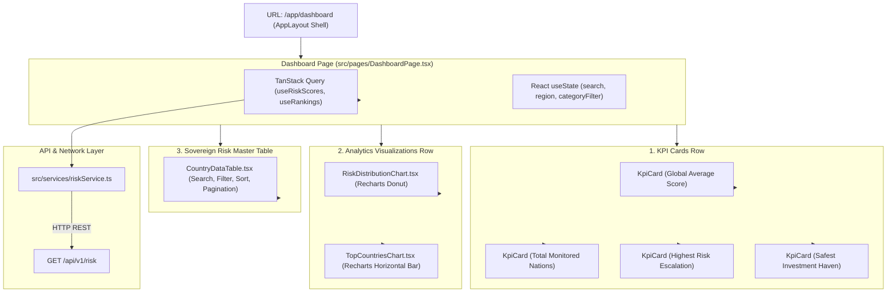

# Lesson 8: Enterprise Dashboard & Analytics Interface

Welcome to **Lesson 8** of your senior engineering mentorship series on **GeoRisk Analytics**! In this lesson, we will examine the **Enterprise Dashboard Interface**, exploring how `DashboardPage.tsx`, KPI cards, Recharts visualizations (Donut & Bar charts), and interactive data tables assemble into a high-density financial terminal workspace.

---

## 1. Goal of the Dashboard Module

### Purpose
The primary objective of the Dashboard module is to give executives, risk officers, and investors an immediate, single-screen command center summarizing sovereign risk metrics across 195 nations.

### Business & UX Problems Solved
- **Information Overload**: Raw databases with thousands of indicator rows confuse decision-makers. Solved using **Visual KPI Summaries** and aggregated category distribution charts.
- **Slow Data Exploration**: Financial analysts cannot afford to navigate multiple sub-menus to locate high-risk sovereign nations. Solved using **Top 10 Safest vs Riskiest Leaderboards** and an inline searchable data table.
- **Unresponsive Visuals**: Static chart images cannot be hovered or inspected. Solved using **Interactive Recharts SVG Visualizations** with custom tooltips.

---

## 2. Architecture

The Dashboard is composed of 5 visual widgets orchestrated by `DashboardPage.tsx` and populated via TanStack Query hooks (`useRiskScores`, `useRankings`).

### Dashboard Interface Architecture Diagram



---

## 3. Code Walkthrough

Let's inspect the key dashboard component files.

### 1. `frontend/src/pages/DashboardPage.tsx`
- **Purpose**: Page component orchestrating dashboard layout, data fetching hooks, and state management.
- **Code Walkthrough**:
  ```tsx
  import React, { useState } from 'react';
  import { useRiskScores, useRankings } from '../hooks/useRiskData';
  import { KpiCard } from '../components/analytics/KpiCard';
  import { RiskDistributionChart } from '../components/analytics/RiskDistributionChart';
  import { TopCountriesChart } from '../components/analytics/TopCountriesChart';
  import { CountryDataTable } from '../components/analytics/CountryDataTable';

  export const DashboardPage: React.FC = () => {
    const { data: riskData, isLoading } = useRiskScores();
    const { data: rankingsData } = useRankings();

    if (isLoading) return <DashboardSkeleton />;

    return (
      <div className="space-y-6 p-6 bg-[#0B0F17] text-slate-100 min-h-screen">
        {/* KPI Row */}
        <div className="grid grid-cols-1 md:grid-cols-2 lg:grid-cols-4 gap-4">
          <KpiCard title="Global Risk Avg" value="41.8" change="+0.4" trend="up" />
          <KpiCard title="Monitored Nations" value="195" change="100%" trend="neutral" />
          <KpiCard title="Highest Risk Haven" value="Ukraine (84.7)" change="Extreme" trend="down" />
          <KpiCard title="Safest Haven" value="Switzerland (12.4)" change="Very Low" trend="up" />
        </div>

        {/* Charts Grid */}
        <div className="grid grid-cols-1 lg:grid-cols-2 gap-6">
          <RiskDistributionChart data={riskData?.category_distribution} />
          <TopCountriesChart data={rankingsData} />
        </div>

        {/* Master Table */}
        <CountryDataTable data={riskData?.items} />
      </div>
    );
  };
  ```

### 2. `frontend/src/components/analytics/KpiCard.tsx`
- **Purpose**: Displays a single KPI metric with title, value, change indicator pill, and trend arrow.
- **Code Walkthrough**:
  ```tsx
  interface KpiCardProps {
    title: string;
    value: string | number;
    change?: string;
    trend?: 'up' | 'down' | 'neutral';
  }

  export const KpiCard: React.FC<KpiCardProps> = ({ title, value, change, trend }) => (
    <div className="p-5 bg-slate-900/80 border border-slate-800 rounded-xl shadow-lg">
      <span className="text-xs uppercase text-slate-400 font-semibold">{title}</span>
      <div className="text-2xl font-bold text-white mt-1">{value}</div>
      {change && (
        <span className={`text-xs px-2 py-0.5 rounded-full font-medium mt-2 inline-block ${
          trend === 'up' ? 'bg-emerald-500/20 text-emerald-400' : 'bg-red-500/20 text-red-400'
        }`}>
          {change}
        </span>
      )}
    </div>
  );
  ```

### 3. `frontend/src/components/analytics/RiskDistributionChart.tsx`
- **Purpose**: Renders a Recharts Donut Pie Chart displaying country counts across the 6 risk category thresholds.

### 4. `frontend/src/components/analytics/TopCountriesChart.tsx`
- **Purpose**: Renders a Recharts Horizontal Bar Chart highlighting the 5 Safest vs 5 Riskiest countries side-by-side.

---

## 4. Execution Flow

Here is what happens when a user views the Dashboard:

```text
1. Dashboard Route Mount:
   User navigates to `/app/dashboard` -> React mounts `DashboardPage.tsx`.

2. Parallel Hook Execution:
   `useRiskScores()` and `useRankings()` hooks execute simultaneously.
   TanStack Query dispatches parallel HTTP GET requests to `/api/v1/risk` and `/api/v1/risk/rankings`.

3. Skeleton Loader Render:
   While `isLoading === true`, `<DashboardSkeleton />` displays animated dark slate pulse boxes.

4. Data Delivery & Chart Render:
   FastAPI returns JSON payloads -> TanStack Query updates client cache -> Recharts computes SVG path geometries.
   KPI Cards, Donut Chart, Bar Chart, and CountryDataTable animate into view.

5. Interactive Filtering:
   User types "Germany" into table search -> `CountryDataTable` filters items locally via `useMemo` in $< 1\text{ ms}$.
```

---

## 5. Design Decisions

### Why Donut Chart for Category Distribution?
A Pie/Donut chart allows users to visually comprehend proportional group composition (e.g. what percentage of countries fall under `High` or `Extreme` risk) at a single glance without reading tabular numbers.

### Why Horizontal Bar Chart for Safest vs Riskiest Leaderboards?
Vertical bar charts struggle to display long country labels (e.g. "Dominican Republic"). Horizontal bar charts provide clean vertical label alignment alongside proportional score bar lengths.

### Why Client-Side Table Filtering via `useMemo`?
Since the full dataset consists of 195 sovereign nations, transferring the entire dataset (~45 KB JSON) once and filtering client-side via `useMemo` provides instantaneous sub-millisecond search responses, eliminating network latency on every keystroke.

---

## 6. Possible Faculty Questions & Model Answers

### Q1: What is the main purpose of the Dashboard page in your application?
> **Model Answer**: The Dashboard serves as the central command center, aggregating KPI metric cards, category distribution donut charts, top safely/risky leaderboards, and an interactive master country datatable.

### Q2: What charting library did you use and why?
> **Model Answer**: We integrated **Recharts** because it provides native React SVG components, automatic container responsiveness, smooth animation transitions, and customizable tooltips.

### Q3: How do you handle UI rendering while data is being fetched from the backend?
> **Model Answer**: We render a `<DashboardSkeleton />` component that displays animated dark slate pulse placeholders matching the exact grid layout of the dashboard.

### Q4: How do you optimize chart rendering performance on browser window resizing?
> **Model Answer**: Recharts components are wrapped in `<ResponsiveContainer width="100%" height="100%">`, which listens to window resize events and recalculates SVG paths without full component re-mounting.

### Q5: How is the Master Country Data Table structured?
> **Model Answer**: The table displays country flags, names, ISO codes, region tags, overall GeoRisk Scores, category badges, and global ranks. It supports live text search, region filtering, column sorting, and pagination.

### Q6: What is the difference between client-side filtering and server-side filtering?
> **Model Answer**: Client-side filtering fetches the full dataset once and filters in browser memory using JavaScript. Server-side filtering sends search queries back to the backend API (`GET /risk?search=Germany`).

### Q7: How are risk category colors assigned to badges and charts?
> **Model Answer**: Colors are mapped to system risk thresholds: `Very Low` (Emerald Green), `Low` (Light Green), `Moderate` (Yellow), `Elevated` (Orange), `High` (Red), and `Extreme` (Dark Red).

### Q8: What custom TanStack Query hooks feed the Dashboard?
> **Model Answer**: The dashboard consumes `useRiskScores()` (fetching score datasets) and `useRankings()` (fetching ranked leaderboards).

### Q9: How do KPI Cards handle trend indicators?
> **Model Answer**: `KpiCard` accepts a `trend` prop (`'up'`, `'down'`, `'neutral'`), dynamically applying green background badges for positive trends and red badges for risk escalations.

### Q10: How do you prevent unnecessary chart re-renders when table search input changes?
> **Model Answer**: Chart components are wrapped in `React.memo()`, preventing them from re-rendering when parent state changes that do not affect their props.

---

## 7. Possible Software Engineering Interview Questions & Answers

### Q1: Explain how `useMemo` optimizes table filtering performance in React.
> **Detailed Answer**: `useMemo` caches the result of an expensive calculation between renders. By wrapping array filtering logic (`const filtered = useMemo(() => items.filter(...), [items, searchTerm])`), the filtering algorithm only re-runs when `items` or `searchTerm` changes, avoiding execution on unrelated component re-renders.

### Q2: What is the difference between SVG and Canvas rendering in frontend analytics dashboards?
> **Detailed Answer**: 
> - **SVG (Recharts)**: Vector-based DOM elements. Supports CSS styling, hover animations, and crisp scaling at any resolution. Ideal for datasets under 1,000 nodes.
> - **Canvas (Chart.js)**: Pixel bitmap buffer. High performance for 100,000+ data points, but lacks direct DOM event listeners per element.

### Q3: How do you implement Skeleton Loaders instead of simple Spinner spinners?
> **Detailed Answer**: Skeleton loaders render gray placeholder elements matching the exact layout of the target content. This reduces perceived load time and prevents Cumulative Layout Shift (CLS) when content finishes loading.

### Q4: How do you implement accessible color schemes for financial charts?
> **Detailed Answer**: Accessible chart design ensures adequate contrast ratios against dark backgrounds (WCAG AA standard), supplements color coding with text labels or patterns, and avoids relying solely on red/green for color-blind users.

### Q5: What is layout thrashing and how do modern UI frameworks prevent it?
> **Detailed Answer**: Layout thrashing occurs when JavaScript repeatedly reads and writes DOM geometry properties (e.g. `element.offsetHeight`), forcing the browser to recalculate layouts synchronously. Modern frameworks batch DOM updates inside animation frames (`requestAnimationFrame`).

### Q6: How do you handle responsive breakpoint layout shifts in Tailwind CSS?
> **Detailed Answer**: Tailwind uses mobile-first breakpoint prefixes (`sm:`, `md:`, `lg:`, `xl:`). Grid containers define `grid-cols-1 md:grid-cols-2 lg:grid-cols-4`, automatically expanding from 1 column on mobile screens to 4 columns on desktop displays.

### Q7: What is the purpose of custom chart tooltips in Recharts?
> **Detailed Answer**: Custom tooltips allow replacing generic text popups with styled React components displaying rich contextual metadata (e.g., country flag, sub-scores, rank, score delta) when hovering over chart bars or slices.

### Q8: How do you manage multi-query loading states cleanly in React?
> **Detailed Answer**: Multi-query loading is managed by combining boolean query states: `const isLoading = query1.isLoading || query2.isLoading;` or using TanStack Query's `useQueries()` hook array.

### Q9: How do you optimize bundle size when importing large charting libraries?
> **Detailed Answer**: Bundle size is optimized using tree-shakeable named imports (`import { BarChart, Bar, XAxis } from 'recharts'`) rather than importing monolithic default packages.

### Q10: How do you test UI components containing third-party charting libraries?
> **Detailed Answer**: Components are tested using React Testing Library by mocking chart components or verifying that data props are passed correctly to chart wrapper interfaces.

---

## 8. Common Mistakes to Avoid

1. **Rendering Charts Without Containers**: Omitting parent height dimensions causes Recharts SVG containers to collapse to 0 pixels. **Avoided** by wrapping charts in fixed-height container divs.
2. **Re-Fetching Data on Every Keypress**: Executing API calls on every character typed in table search inputs. **Avoided** by filtering items locally in memory via `useMemo`.
3. **Hardcoding Hex Colors in Components**: Scattering `#10B981` across 20 files makes theme updates impossible. **Avoided** by referencing centralized Tailwind color utility classes.
4. **Missing Loading States**: Displaying blank white screens while fetching backend API data. **Avoided** by rendering `<DashboardSkeleton />`.

---

## 9. Revision Notes for Viva (2-Minute Review)

- **Dashboard Page**: `DashboardPage.tsx` orchestrates 4 KPI cards, 2 Recharts visual charts, and a master datatable.
- **KPI Metrics**: Global Average Risk Score, Total Monitored Nations (195), Highest Risk Country, Safest Country.
- **Charts**: `RiskDistributionChart.tsx` (Recharts Donut) + `TopCountriesChart.tsx` (Recharts Horizontal Bar).
- **Master Table**: `CountryDataTable.tsx` with inline text search, region dropdown, category filtering, column sorting, and pagination.
- **Performance**: Sub-millisecond client-side table filtering via `useMemo` and responsive SVG layout scaling.

---

## 10. Mini Quiz

Test your understanding of Lesson 8 by answering these 5 questions:

1. **What page component orchestrates the layout and data hooks for the main dashboard interface?**
2. **What custom TanStack Query hooks fetch data for the Dashboard page?**
3. **What chart component renders the distribution of countries across risk categories?**
4. **Why is a Horizontal Bar chart preferred over a Vertical Bar chart for country leaderboards?**
5. **How does `CountryDataTable` achieve sub-millisecond search filtering without server latency?**
