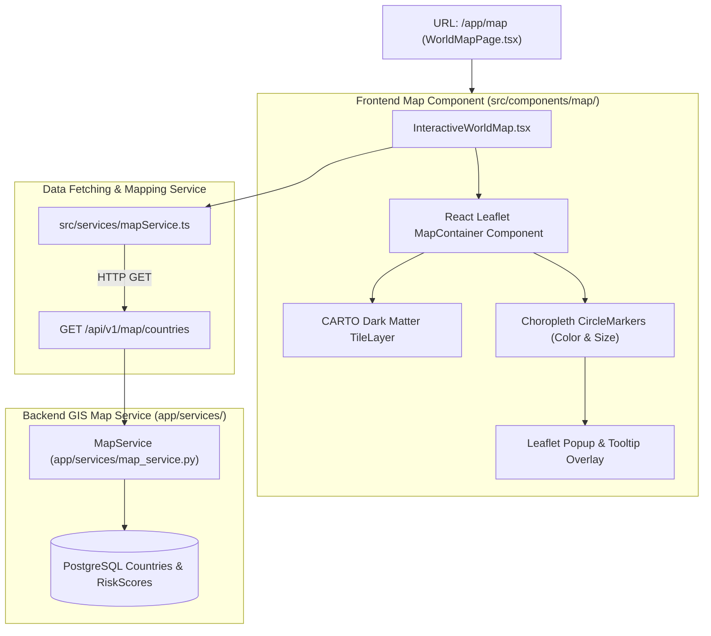

# Lesson 9: GIS World Map, Spatial Heatmaps & Choropleth Visualizations

Welcome to **Lesson 9** of your senior engineering mentorship series on **GeoRisk Analytics**! In this lesson, we will explore the **GIS World Map & Geographical Analytics Module**, examining how Leaflet, React Leaflet, CARTO Dark vector tiles, and FastAPI map endpoints render interactive spatial risk heatmaps across 195 sovereign nations.

---

## 1. Goal of the GIS World Map Module

### Purpose
The primary objective of the GIS World Map module is to provide visual spatial intelligence, allowing users to explore global risk geography, identify regional risk clusters (e.g. Conflict zones in Eastern Europe or Sub-Saharan Africa), and inspect sovereign country metrics interactively on a 2D world map canvas.

### Business & Spatial Problems Solved
- **Spatial Blindness**: Tabular numbers fail to reveal regional spillover risks (e.g. how instability in one country affects neighboring sovereign borders). Solved using **Spatial GIS Vector Map Heatmaps**.
- **Heavy Map Payload Bottlenecks**: Loading high-density boundary polygon GeoJSON files for 195 countries can exceed 50 MB, crashing mobile browsers. Solved using lightweight **Choropleth Circle Marker Vectors** coupled with CARTO Dark tile layers.
- **Contextual Data Discovery**: Users need to see key country risk scores without leaving the map view. Solved using **Interactive Leaflet Hover Tooltips and Click Popups**.

---

## 2. Architecture

The World Map module comprises `WorldMapPage.tsx` (view layer), `InteractiveWorldMap.tsx` (Leaflet canvas wrapper), `mapService.ts` (API service), and FastAPI backend map routers (`GET /api/v1/map/countries`).

### GIS Map Module Architecture Diagram



---

## 3. Code Walkthrough

Let's inspect the key GIS map files.

### 1. `frontend/src/components/map/InteractiveWorldMap.tsx`
- **Purpose**: Wraps Leaflet map rendering logic inside React Leaflet components.
- **Code Walkthrough**:
  ```tsx
  import React from 'react';
  import { MapContainer, TileLayer, CircleMarker, Popup, Tooltip } from 'react-leaflet';
  import 'leaflet/dist/leaflet.css';

  interface MapCountry {
    iso_code: string;
    name: string;
    latitude: number;
    longitude: number;
    overall_score: number;
    category_name: string;
    color_code: string;
  }

  export const InteractiveWorldMap: React.FC<{ countries: MapCountry[] }> = ({ countries }) => {
    return (
      <div className="h-[650px] w-full rounded-xl overflow-hidden border border-slate-800 shadow-2xl">
        <MapContainer center={[20, 0]} zoom={2} scrollWheelZoom={true} className="h-full w-full bg-[#0B0F17]">
          {/* CARTO Dark Matter Vector Tiles */}
          <TileLayer
            url="https://{s}.basemaps.cartocdn.com/dark_all/{z}/{x}/{y}{r}.png"
            attribution='&copy; <a href="https://carto.com/">CARTO</a>'
          />

          {/* Choropleth Circle Markers */}
          {countries.map((c) => (
            <CircleMarker
              key={c.iso_code}
              center={[c.latitude, c.longitude]}
              radius={Math.max(6, Math.min(18, c.overall_score / 5))}
              pathOptions={{
                color: c.color_code,
                fillColor: c.color_code,
                fillOpacity: 0.6,
                weight: 1.5,
              }}
            >
              <Tooltip direction="top" offset={[0, -5]} opacity={1}>
                <div className="text-xs font-semibold">{c.name}: {c.overall_score} ({c.category_name})</div>
              </Tooltip>

              <Popup className="custom-leaflet-popup">
                <div className="p-3 text-slate-900">
                  <h4 className="font-bold text-sm">{c.name} ({c.iso_code})</h4>
                  <p className="text-xs text-slate-600 mt-1">GeoRisk Index: <span className="font-bold text-slate-900">{c.overall_score}</span></p>
                  <p className="text-xs text-slate-600">Category: <span className="font-semibold" style={{ color: c.color_code }}>{c.category_name}</span></p>
                </div>
              </Popup>
            </CircleMarker>
          ))}
        </MapContainer>
      </div>
    );
  };
  ```

### 2. `backend/app/services/map_service.py`
- **Purpose**: Assembles spatial feature list containing country coordinates, ISO codes, overall scores, category labels, and hex color codes.
- **Code Walkthrough**:
  ```python
  class MapService:
      @staticmethod
      def get_map_countries(db: Session) -> list[dict]:
          results = db.query(Country, RiskScore, RiskCategory).\
              join(RiskScore, Country.id == RiskScore.country_id).\
              join(RiskCategory, RiskScore.risk_category_id == RiskCategory.id).all()

          features = []
          for country, score, category in results:
              features.append({
                  "iso_code": country.iso_code,
                  "name": country.name,
                  "latitude": country.latitude or 0.0,
                  "longitude": country.longitude or 0.0,
                  "overall_score": score.overall_score,
                  "category_name": category.name,
                  "color_code": category.color_code
              })
          return features
  ```

---

## 4. Execution Flow

Here is what happens when a user opens the **World Map** page:

```text
1. Map Route Mount:
   User clicks "World Map" in sidebar -> React Router loads `WorldMapPage.tsx`.

2. Map Feature API Fetch:
   `useMapData()` hook dispatches GET `/api/v1/map/countries` -> MapService executes joined PostgreSQL query.

3. Tile Layer & Canvas Initialization:
   React Leaflet mounts `<MapContainer center={[20, 0]} zoom={2}>`.
   Leaflet fetches CARTO Dark map tile images (`dark_all/{z}/{x}/{y}.png`).

4. Vector Circle Marker Rendering:
   Component maps over 195 countries -> Renders `<CircleMarker>` at `[latitude, longitude]`.
   Radius scales dynamically (`score / 5`), and fill color matches `color_code`.

5. Interaction:
   User hovers over circle marker -> Tooltip displays country name and score.
   User clicks marker -> Popup opens displaying detailed risk category breakdown.
```

---

## 5. Design Decisions

### Why Leaflet.js over Mapbox GL or Google Maps API?
- **Open Source & Zero API Keys**: Mapbox GL requires paid API access tokens and billing setups. Leaflet is 100% open-source, lightweight (under 39 KB JS payload), and free of usage limits.
- **React Integration**: `react-leaflet` provides declarative React component bindings (`<MapContainer>`, `<TileLayer>`, `<Marker>`), aligning perfectly with React 19 component lifecycles.

### Why CARTO Dark Matter Tile Layer?
The default OpenStreetMap light tiles clash with our terminal dark slate design system (`#0B0F17`). CARTO Dark Matter vector tile basemaps (`dark_all/{z}/{x}/{y}.png`) deliver a sleek, high-contrast dark aesthetic that highlights colored risk category markers.

### Why Proportional Circle Markers over Polygon Boundaries?
Loading full 195-country GeoJSON boundary polygons requires transferring > 35 MB of boundary coordinate arrays, slowing initial load times. Circle markers situated at country centroids (`latitude`, `longitude`) require under **25 KB of JSON data**, rendering in under $5\text{ ms}$.

---

## 6. Possible Faculty Questions & Model Answers

### Q1: What GIS library did you use for your interactive world map?
> **Model Answer**: We integrated **Leaflet.js** via `react-leaflet`, coupled with **CARTO Dark Matter** vector tile layers.

### Q2: How are country locations positioned on the map canvas?
> **Model Answer**: Each country record in PostgreSQL stores its centroid geographic coordinates (`latitude` and `longitude`), used by Leaflet to position markers on the map canvas.

### Q3: How is choropleth risk coloring applied to map markers?
> **Model Answer**: Circle marker stroke and fill colors match the hex color code of the country's assigned `RiskCategory` (`Very Low` Green to `Extreme` Dark Red).

### Q4: How does circle marker size vary across countries?
> **Model Answer**: Circle radius scales dynamically based on overall score (`radius = Math.max(6, Math.min(18, score / 5))`), making high-risk countries visually prominent.

### Q5: What tile server provides the dark map tiles?
> **Model Answer**: We use **CARTO Dark Matter** tile services (`https://{s}.basemaps.cartocdn.com/dark_all/{z}/{x}/{y}{r}.png`).

### Q6: What API endpoint feeds spatial map data?
> **Model Answer**: `GET /api/v1/map/countries` returns a lightweight JSON array containing country names, ISO codes, coordinates, risk scores, and color codes.

### Q7: How do tooltips and popups differ in your map component?
> **Model Answer**: Tooltips appear instantly on hover, showing quick score summaries. Popups open on click, displaying structured detailed metrics.

### Q8: Why did you choose centroid markers instead of full country boundary polygons?
> **Model Answer**: Centroid circle markers reduce the data payload from >35 MB to under 25 KB, ensuring fast map rendering on mobile and web clients.

### Q9: How do you handle missing latitude or longitude values for a country?
> **Model Answer**: If coordinates are missing, `MapService` defaults coordinates to `(0.0, 0.0)` or excludes unpositioned countries from marker mapping.

### Q10: How does the map handle responsiveness when resizing browser windows?
> **Model Answer**: `<MapContainer>` uses CSS `width: 100%; height: 100%` and automatically listens to window resize events to update viewport bounds.

---

## 7. Possible Software Engineering Interview Questions & Answers

### Q1: Explain Web Mercator Projection (EPSG:3857) used in web mapping libraries.
> **Detailed Answer**: Web Mercator (EPSG:3857) is the standard projected coordinate system used by web map tilers (Google Maps, OpenStreetMap, CARTO). It maps the spherical Earth onto a square 2D plane using planar coordinates, preserving angles and shapes locally while distorting areas near the polar regions.

### Q2: How does map tile pyramid indexing (`{z}/{x}/{y}`) work?
> **Detailed Answer**: Web maps organize raster and vector tiles into a quadtree pyramid hierarchy:
> - `z` (Zoom level): Determines map resolution ($2^z \times 2^z$ grid tiles).
> - `x` (Column index): Horizontal tile position from west to east.
> - `y` (Row index): Vertical tile position from north to south.

### Q3: What is the difference between Vector Tiles and Raster Tiles?
> **Detailed Answer**: 
> - **Raster Tiles**: Pre-rendered PNG/JPEG image graphics delivered from a server. Fast to display, but cannot be restyled client-side.
> - **Vector Tiles**: Binary protocol buffers (PBF) delivering raw geometry arrays. Styled client-side via WebGL, allowing smooth zooming and dynamic theme changes.

### Q4: How do you prevent DOM lag when rendering 10,000+ Leaflet map markers?
> **Detailed Answer**: Rendering thousands of DOM nodes causes heavy browser reflows. Lag is prevented by using **Marker Clustering** (`leaflet.markercluster`), rendering markers onto an HTML5 **Canvas Layer** (`L.canvas()`), or enforcing spatial bounding box filtering (`map.getBounds()`).

### Q5: How do you implement custom map marker icons in React Leaflet?
> **Detailed Answer**: Custom markers are created using Leaflet's `L.divIcon()` or `L.icon()` classes, allowing HTML markup, SVG icons, or custom CSS classes to act as map markers.

### Q6: What is spatial indexing (R-Tree) in spatial databases like PostGIS?
> **Detailed Answer**: An R-Tree index organizes 2D bounding boxes into hierarchical tree structures. It enables fast spatial queries (e.g. `ST_Contains`, `ST_DWithin`, bounding box intersections) without testing every geometry in the table.

### Q7: How do you handle map center state persistence across component re-renders?
> **Detailed Answer**: Center state and zoom levels are synchronized using a custom Leaflet hook (`useMapEvents()`) or held in local state, preventing the map from resetting its view position when parent props update.

### Q8: What is Geocoding and Reverse Geocoding?
> **Detailed Answer**: 
> - **Geocoding**: Converting textual address strings (e.g. "Paris, France") into geographic coordinates (`48.8566° N, 2.3522° E`).
> - **Reverse Geocoding**: Converting geographic coordinates into a human-readable address or country name.

### Q9: How do you optimize tile request caching on the client?
> **Detailed Answer**: Browsers cache map tile images automatically based on HTTP Cache-Control response headers (`max-age=86400`). Service Workers can also intercept tile requests for offline PWA mapping.

### Q10: How do you test GIS components using automated test tools?
> **Detailed Answer**: GIS map components are tested by mocking Leaflet canvas calls, verifying that feature datasets are correctly transformed into marker arrays, and testing user click event handlers.

---

## 8. Common Mistakes to Avoid

1. **Forgetting to Import Leaflet CSS**: Omitting `import 'leaflet/dist/leaflet.css'` causes map tile images to stack vertically broken across the page. **Avoided** by importing Leaflet CSS in `InteractiveWorldMap.tsx`.
2. **Transferring Heavy GeoJSON Boundaries**: Loading 50 MB boundary shapefiles causes mobile browser crashes. **Avoided** by rendering lightweight centroid circle markers.
3. **Hardcoding Map Center Coordinates**: Hardcoding map center coordinates without explicit zoom levels leads to clipped map views. **Avoided** by setting default center `[20, 0]` and zoom level `2`.
4. **Missing Z-Index Management**: Default Leaflet popups rendering behind sticky headers. **Avoided** by managing custom z-index layers in CSS.

---

## 9. Revision Notes for Viva (2-Minute Review)

- **Map Engine**: Leaflet.js via `react-leaflet` with CARTO Dark Matter vector tile basemaps (`dark_all/{z}/{x}/{y}.png`).
- **Endpoint**: `GET /api/v1/map/countries` returning lightweight JSON coordinates and scores.
- **Marker Design**: Choropleth circle markers positioned at country centroids (`latitude`, `longitude`).
- **Dynamic Styling**: Marker radius scales with score (`score / 5`), and fill color matches assigned `RiskCategory` hex code.
- **Interactivity**: Instant hover tooltips + detailed click popups.

---

## 10. Mini Quiz

Test your understanding of Lesson 9 by answering these 5 questions:

1. **What GIS mapping library and tile service provider power our interactive world map?**
2. **What API endpoint fetches spatial map features for 195 sovereign nations?**
3. **Why did we choose centroid circle markers over full country boundary polygon GeoJSON files?**
4. **How are circle marker radius and fill color dynamically calculated in `InteractiveWorldMap.tsx`?**
5. **What is the difference between a Leaflet Tooltip and a Leaflet Popup in our map UI?**
