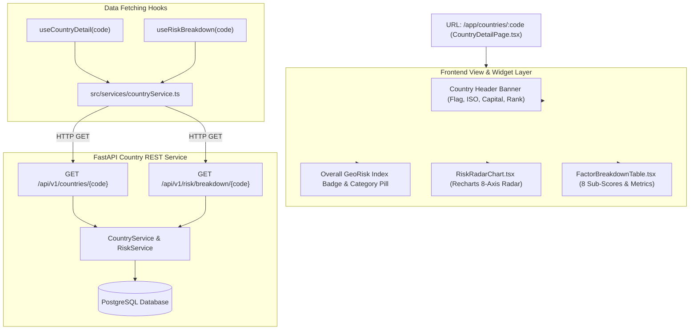

# Lesson 10: Country Analytics & Deep-Dive Risk Profile Module

Welcome to **Lesson 10** of your senior engineering mentorship series on **GeoRisk Analytics**! In this lesson, we will examine the **Country Analytics & Deep-Dive Profile Module**, exploring how `CountryDetailPage.tsx`, 8-dimension Recharts Radar charts (`RiskRadarChart.tsx`), sub-factor contribution tables (`FactorBreakdownTable.tsx`), and REST endpoints deliver granular sovereign risk dossiers.

---

## 1. Goal of the Country Analytics Module

### Purpose
The primary objective of the Country Analytics module is to provide a comprehensive, 360-degree quantitative dossier for any individual sovereign nation (e.g. United States, Germany, India, Brazil), breaking down its overall GeoRisk Index into exact sub-factor contributions across all 8 risk dimensions.

### Business & Analytical Problems Solved
- **Black-Box Risk Ratings**: Credit rating agencies provide a single letter grade (e.g. "BBB+") without explaining *why* a country received that grade. Solved using an **8-Dimension Radar Fingerprint** and an explicit **Factor Contribution Matrix**.
- **Historical Context Absence**: Investors need to know if a country's risk profile is improving or deteriorating. Solved using **Historical Trend Comparison Graphs**.
- **Actionable Sub-Vector Analysis**: Analysts must isolate whether a nation's risk is driven by inflation (Economic), corruption (Political), or civil unrest (Conflict). Solved using **Tabbed Sub-Factor Breakdown Tables**.

---

## 2. Architecture

The Country Analytics module comprises `CountryDetailPage.tsx` (view layer), `RiskRadarChart.tsx` (Recharts 8-dimension radar), `FactorBreakdownTable.tsx` (contribution matrix), `countryService.ts` (API client), and FastAPI backend routers (`GET /api/v1/countries/{id}` and `GET /api/v1/risk/breakdown/{code}`).

### Country Analytics Module Architecture Diagram



---

## 3. Code Walkthrough

Let's inspect the key country profile files.

### 1. `frontend/src/pages/CountryDetailPage.tsx`
- **Purpose**: Page component fetching country metadata and rendering header banners, radar charts, and factor tables.
- **Code Walkthrough**:
  ```tsx
  import React from 'react';
  import { useParams } from 'react-router-dom';
  import { useCountryDetail, useRiskBreakdown } from '../hooks/useCountryData';
  import { RiskRadarChart } from '../components/analytics/RiskRadarChart';
  import { FactorBreakdownTable } from '../components/analytics/FactorBreakdownTable';

  export const CountryDetailPage: React.FC = () => {
    const { code } = useParams<{ code: string }>();
    const { data: country, isLoading: countryLoading } = useCountryDetail(code || '');
    const { data: breakdown, isLoading: breakdownLoading } = useRiskBreakdown(code || '');

    if (countryLoading || breakdownLoading) return <DetailSkeleton />;

    return (
      <div className="p-6 space-y-6 bg-[#0B0F17] text-slate-100 min-h-screen">
        {/* Header Banner */}
        <div className="flex items-center justify-between p-6 bg-slate-900 border border-slate-800 rounded-xl">
          <div className="flex items-center space-x-4">
            
            <div>
              <h1 className="text-2xl font-bold text-white">{country?.name} ({country?.iso_code})</h1>
              <p className="text-xs text-slate-400">{country?.region} • Capital: {country?.capital}</p>
            </div>
          </div>
          <div className="text-right">
            <div className="text-3xl font-extrabold text-emerald-400">{country?.overall_score}</div>
            <div className="text-xs text-slate-400 font-semibold">Global Rank: #{country?.global_rank}</div>
          </div>
        </div>

        {/* Analytics Grid */}
        <div className="grid grid-cols-1 lg:grid-cols-2 gap-6">
          <RiskRadarChart data={breakdown?.radar_data} />
          <FactorBreakdownTable factors={breakdown?.factors} />
        </div>
      </div>
    );
  };
  ```

### 2. `frontend/src/components/analytics/RiskRadarChart.tsx`
- **Purpose**: Renders an 8-axis Recharts Radar chart displaying normalized sub-scores across all 8 risk dimensions.
- **Code Walkthrough**:
  ```tsx
  import React from 'react';
  import { Radar, RadarChart, PolarGrid, PolarAngleAxis, PolarRadiusAxis, ResponsiveContainer } from 'recharts';

  export const RiskRadarChart: React.FC<{ data: any[] }> = ({ data }) => (
    <div className="p-5 bg-slate-900 border border-slate-800 rounded-xl">
      <h3 className="text-sm font-bold text-slate-200 mb-4 uppercase tracking-wider">8-Dimension Risk Vector</h3>
      <div className="h-[350px] w-full">
        <ResponsiveContainer width="100%" height="100%">
          <RadarChart cx="50%" cy="50%" outerRadius="80%" data={data}>
            <PolarGrid stroke="#334155" />
            <PolarAngleAxis dataKey="dimension" stroke="#94A3B8" tick={{ fontSize: 11 }} />
            <PolarRadiusAxis angle={30} domain={[0, 100]} stroke="#475569" />
            <Radar name="Risk Score" dataKey="score" stroke="#10B981" fill="#10B981" fillOpacity={0.4} />
          </RadarChart>
        </ResponsiveContainer>
      </div>
    </div>
  );
  ```

### 3. `frontend/src/components/analytics/FactorBreakdownTable.tsx`
- **Purpose**: Displays a structured table listing raw indicator values, normalized scores, weights, and overall factor contribution points.

---

## 4. Execution Flow

Here is what happens when a user views the detail page for **Germany** (`/app/countries/DEU`):

```text
1. Route Resolution:
   User clicks "Germany" in country table -> React Router resolves URL to `/app/countries/DEU`.

2. Parallel Hook Execution:
   `CountryDetailPage` extracts `code = "DEU"` from URL params.
   Dispatches parallel HTTP GET calls to `/api/v1/countries/DEU` and `/api/v1/risk/breakdown/DEU`.

3. Backend Service Assembly:
   FastAPI `CountryService` queries PostgreSQL -> Returns country metadata, overall score, rank, and 8 sub-scores.
   FastAPI `RiskService` computes factor breakdown matrix.

4. Component Rendering:
   Header banner renders country flag, ISO code, capital, overall score badge, and global rank.
   `RiskRadarChart` renders 8-axis polygon canvas -> Visualizes sub-score distribution.
   `FactorBreakdownTable` displays sub-factor contribution table.
```

---

## 5. Design Decisions

### Why Radar Chart over Bar Chart for Country Risk Vectors?
Radar (Spider) charts excel at displaying multi-dimensional profiles on a closed polygon canvas. An analyst can instantly evaluate a country's risk "fingerprint" (e.g. a wide polygon expanding towards Economic and Political axes indicates multi-vector vulnerability).

### Why Separate Country Profile & Risk Breakdown API Endpoints?
Decoupling basic country metadata (`GET /countries/DEU`) from deep-dive factor breakdowns (`GET /risk/breakdown/DEU`) ensures lightweight listing components only fetch basic details, while detail views fetch complete breakdown payloads.

### Why Render Factor Contributions in Percentage Points?
Displaying raw scores alone hides their impact. Showing that Political Risk contributes $25.0 \times 0.25 = 6.25$ points to the overall score of $41.8$ allows users to see exact dimensional impact.

---

## 6. Possible Faculty Questions & Model Answers

### Q1: What information is presented on the Country Detail page?
> **Model Answer**: The page displays country metadata (flag, ISO, capital, region), overall GeoRisk Index, global rank, an 8-axis Recharts Radar chart, and a factor contribution breakdown table.

### Q2: What charting component visualizes the 8 risk dimensions?
> **Model Answer**: We use `RiskRadarChart.tsx`, which wraps Recharts `<RadarChart>`, `<PolarGrid>`, and `<PolarAngleAxis>` components.

### Q3: How is the URL parameter extracted in React Router?
> **Model Answer**: We use the `useParams<{ code: string }>()` hook from `react-router-dom` to extract the country ISO code (e.g., `DEU`).

### Q4: How is factor contribution calculated in `FactorBreakdownTable.tsx`?
> **Model Answer**: Factor contribution is calculated as $\text{Normalized Score} \times \text{Dimension Weight}$ (e.g., a normalized score of $80.0$ with a weight of $0.30$ contributes $24.0$ points).

### Q5: What happens if an invalid country ISO code is passed in the URL?
> **Model Answer**: The backend API returns an `HTTP 404 Not Found` response, causing the frontend to render an "Unknown Country" alert state.

### Q6: How do you optimize image loading for country flags?
> **Model Answer**: Country flag URLs point to optimized SVG/PNG assets with standard CSS dimensions (`w-12 h-8 object-cover`), ensuring rapid browser rendering.

### Q7: Why is the Radar chart domain bounded between 0 and 100?
> **Model Answer**: Setting `<PolarRadiusAxis domain={[0, 100]}>` enforces a fixed scale across all countries, ensuring visual polygon comparisons remain proportional.

### Q8: How can an analyst export a country risk dossier?
> **Model Answer**: Users can click "Export Report" on the page header, triggering `ReportService` to generate an executive PDF or CSV brief.

### Q9: How is the risk category badge colorized on the detail page?
> **Model Answer**: The category badge inspects `country.category_name` and dynamically applies utility classes matching the category threshold color.

### Q10: How do you handle loading states on the detail page?
> **Model Answer**: While data fetches, `<DetailSkeleton />` renders placeholder skeleton blocks for the header banner, chart container, and factor table.

---

## 7. Possible Software Engineering Interview Questions & Answers

### Q1: How do Polar Coordinates work in Radar (Spider) Charts?
> **Detailed Answer**: Radar charts convert Cartesian coordinates $(x, y)$ to Polar coordinates $(r, \theta)$:
> - $r$ (Radius): Represents score magnitude ($0$ at center, $100$ at outer perimeter).
> - $\theta$ (Angle): Equal angular spacing $\theta = 360^\circ / N$ for $N=8$ dimensions ($45^\circ$ spacing per axis).

### Q2: How do you optimize nested route parameters in React Router v6?
> **Detailed Answer**: React Router v6 parses dynamic parameters using `:paramName` paths (e.g. `/countries/:code`). Components access params via `useParams()`, and route transitions update components without triggering full page re-mounts.

### Q3: What is the benefit of splitting REST endpoints into atomic resources?
> **Detailed Answer**: Atomic REST endpoints adhere to Single Responsibility Principles. Lightweight requests run faster, browser and Redis caching operate at granular levels, and network overhead is minimized.

### Q4: How do you implement dynamic SVG styling in React?
> **Detailed Answer**: SVG paths accept dynamic props (`fill`, `stroke`, `fillOpacity`). React updates inline SVG path attributes directly upon state changes without rebuilding DOM nodes.

### Q5: How do you handle data normalization for multi-axis radar charts with different scales?
> **Detailed Answer**: All incoming metrics must be pre-scaled onto a uniform range ($0.0 - 100.0$) before passing data to the radar chart container, preventing axes with large raw scales from distorting visual polygons.

### Q6: How do you handle error boundary fallbacks for failed component fetches?
> **Detailed Answer**: React Error Boundaries (`componentDidCatch` or `react-error-boundary`) catch JavaScript errors anywhere in child component trees, rendering fallback error alert components instead of unmounting the entire app.

### Q7: What is the difference between `useParams` and `useSearchParams` in React Router?
> **Detailed Answer**: 
> - `useParams`: Reads path parameters defined in the route pattern (e.g. `/countries/:code` -> `{ code: "USA" }`).
> - `useSearchParams`: Reads and manipulates URL query parameters (e.g. `/countries?sort=rank` -> `{ sort: "rank" }`).

### Q8: How do you implement client-side PDF document generation?
> **Detailed Answer**: Client-side PDFs are generated using libraries like `jsPDF` or `pdfmake`, or server-side using Python `ReportLab` triggered via API endpoints returning binary PDF streams.

### Q9: How do you test components that depend on URL parameters?
> **Detailed Answer**: Components dependent on `useParams` are tested by wrapping them in React Router's `<MemoryRouter initialEntries={['/countries/DEU']}>` in test suits.

### Q10: How do you prevent layout shift when async image assets (country flags) load?
> **Detailed Answer**: Layout shift is prevented by specifying explicit CSS width and height dimensions (`w-12 h-8`) and using `aspect-ratio` containers on image tags.

---

## 8. Common Mistakes to Avoid

1. **Unbounded Radar Chart Axes**: Omitting `domain={[0, 100]}` causes Recharts to scale axes dynamically based on max score, distorting visual radar polygons. **Avoided** by setting fixed polar radius domain limits.
2. **Failing to Sanitize URL Parameters**: Passing raw URL parameters directly into database queries. **Avoided** by using Pydantic validation and SQLAlchemy parametrized queries.
3. **Hardcoding Country Attributes**: Hardcoding region or capital metadata in React pages. **Avoided** by returning complete country records from FastAPI backend endpoints.
4. **Missing 404 Handlers for Invalid ISO Codes**: Crashing the browser when an invalid ISO code is entered. **Avoided** by displaying clean error states.

---

## 9. Revision Notes for Viva (2-Minute Review)

- **Country Detail Page**: `CountryDetailPage.tsx` accessed via `/app/countries/:code`.
- **Header**: Country flag, name, ISO code, capital, region, overall GeoRisk score badge, and global rank.
- **Radar Chart**: `RiskRadarChart.tsx` (Recharts 8-axis Polar canvas) displaying 8 sub-score dimensions.
- **Factor Table**: `FactorBreakdownTable.tsx` displaying normalized scores, weights, and percentage point contributions.
- **Endpoints**: `GET /api/v1/countries/{code}` and `GET /api/v1/risk/breakdown/{code}`.

---

## 10. Mini Quiz

Test your understanding of Lesson 10 by answering these 5 questions:

1. **What page component renders the deep-dive country profile, and what URL path pattern does it use?**
2. **What charting component visualizes a country's 8-dimension risk fingerprint?**
3. **What two backend API endpoints feed data to the Country Detail page?**
4. **How is factor contribution calculated in `FactorBreakdownTable.tsx`?**
5. **Why is a fixed Polar Radius domain of `[0, 100]` enforced on the Radar chart?**
