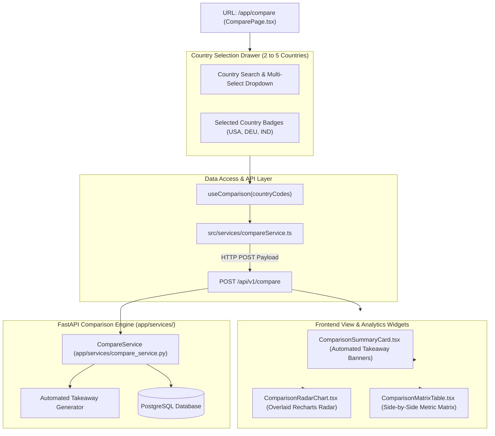

# Lesson 11: Multi-Country Comparison Studio & Benchmarking Module

Welcome to **Lesson 11** of your senior engineering mentorship series on **GeoRisk Analytics**! In this lesson, we will explore the **Multi-Country Comparison Studio**, examining how `ComparePage.tsx`, overlaid Recharts Radar polygons (`ComparisonRadarChart.tsx`), automated analytical takeaway banners (`ComparisonSummaryCard.tsx`), and side-by-side indicator matrix tables (`ComparisonMatrixTable.tsx`) allow analysts to benchmark 2 to 5 sovereign nations concurrently.

---

## 1. Goal of the Comparison Module

### Purpose
The primary objective of the Comparison Studio is to allow financial analysts and supply chain managers to perform side-by-side benchmarking across multiple sovereign nations, evaluating risk trade-offs before committing capital to specific international markets.

### Business & Analytical Problems Solved
- **Cross-Border Decision Ambiguity**: Choosing between alternative investment markets (e.g. expanding into Vietnam vs India vs Mexico) requires comparing complex multi-dimensional risk vectors. Solved using **Overlaid Radar Polygon Comparisons**.
- **Manual Data Alignment Overhead**: Aligning spreadsheets for 5 countries across 8 dimensions takes hours. Solved using an **Automated Side-by-Side Indicator Matrix Table**.
- **Synthesizing Key Differentiators**: Identifying which country is safest or has the strongest economy requires manual scanning. Solved using **Automated Analytical Takeaway Banners**.

---

## 2. Architecture

The Comparison Module comprises `ComparePage.tsx` (view layer), `ComparisonSummaryCard.tsx` (takeaway banners), `ComparisonRadarChart.tsx` (overlaid radar), `ComparisonMatrixTable.tsx` (indicator matrix), `compareService.ts` (API client), and FastAPI backend routers (`POST /api/v1/compare`).

### Comparison Studio Architecture Diagram



---

## 3. Code Walkthrough

Let's inspect the core comparison module files.

### 1. `frontend/src/pages/ComparePage.tsx`
- **Purpose**: Page component managing multi-select country state (2 to 5 codes) and orchestrating comparison widgets.
- **Code Walkthrough**:
  ```tsx
  import React, { useState } from 'react';
  import { useComparison } from '../hooks/useCompareData';
  import { ComparisonSummaryCard } from '../components/compare/ComparisonSummaryCard';
  import { ComparisonRadarChart } from '../components/compare/ComparisonRadarChart';
  import { ComparisonMatrixTable } from '../components/compare/ComparisonMatrixTable';

  export const ComparePage: React.FC = () => {
    const [selectedCodes, setSelectedCodes] = useState<string[]>(['USA', 'DEU', 'IND']);
    const { data: comparisonData, isLoading } = useComparison(selectedCodes);

    return (
      <div className="p-6 space-y-6 bg-[#0B0F17] text-slate-100 min-h-screen">
        {/* Header & Controls */}
        <div className="flex items-center justify-between p-4 bg-slate-900 border border-slate-800 rounded-xl">
          <h1 className="text-xl font-bold text-white">Multi-Country Comparison Studio</h1>
          <CountryMultiSelect selected={selectedCodes} onChange={setSelectedCodes} max={5} min={2} />
        </div>

        {/* Analytical Takeaways Banner */}
        {comparisonData && <ComparisonSummaryCard takeaways={comparisonData.takeaways} />}

        {/* Visual Comparison Grid */}
        <div className="grid grid-cols-1 lg:grid-cols-2 gap-6">
          <ComparisonRadarChart data={comparisonData?.radar_series} countries={comparisonData?.countries} />
          <ComparisonMatrixTable matrix={comparisonData?.matrix} countries={comparisonData?.countries} />
        </div>
      </div>
    );
  };
  ```

### 2. `frontend/src/components/compare/ComparisonRadarChart.tsx`
- **Purpose**: Renders multiple overlaid Recharts Radar polygons, with distinct stroke colors assigned per country.
- **Code Walkthrough**:
  ```tsx
  import React from 'react';
  import { Radar, RadarChart, PolarGrid, PolarAngleAxis, PolarRadiusAxis, ResponsiveContainer, Legend } from 'recharts';

  const COLOR_PALETTE = ['#10B981', '#3B82F6', '#F59E0B', '#EF4444', '#8B5CF6'];

  export const ComparisonRadarChart: React.FC<{ data: any[]; countries: any[] }> = ({ data, countries }) => (
    <div className="p-5 bg-slate-900 border border-slate-800 rounded-xl">
      <h3 className="text-sm font-bold text-slate-200 mb-4 uppercase">Risk Profile Overlay</h3>
      <div className="h-[380px] w-full">
        <ResponsiveContainer width="100%" height="100%">
          <RadarChart cx="50%" cy="50%" outerRadius="75%" data={data}>
            <PolarGrid stroke="#334155" />
            <PolarAngleAxis dataKey="dimension" stroke="#94A3B8" tick={{ fontSize: 11 }} />
            <PolarRadiusAxis angle={30} domain={[0, 100]} stroke="#475569" />
            
            {countries.map((c, idx) => (
              <Radar
                key={c.iso_code}
                name={c.name}
                dataKey={c.iso_code}
                stroke={COLOR_PALETTE[idx % COLOR_PALETTE.length]}
                fill={COLOR_PALETTE[idx % COLOR_PALETTE.length]}
                fillOpacity={0.2}
              />
            ))}
            <Legend />
          </RadarChart>
        </ResponsiveContainer>
      </div>
    </div>
  );
  ```

### 3. `backend/app/services/compare_service.py`
- **Purpose**: Assembles side-by-side indicator matrices and generates automated analytical takeaways (*Safest Haven*, *Highest Risk Vector*, *Strongest Economy*).
- **Code Walkthrough**:
  ```python
  class CompareService:
      @classmethod
      def compare_countries(cls, db: Session, country_codes: list[str]) -> dict:
          # Fetch country & score records
          scores = db.query(RiskScore).join(Country).filter(Country.iso_code.in_(country_codes)).all()
          
          # Automated Takeaways Analysis
          safest = min(scores, key=lambda s: s.overall_score)
          riskiest = max(scores, key=lambda s: s.overall_score)
          best_econ = min(scores, key=lambda s: s.economic_score)

          takeaways = [
              {"title": "Safest Haven", "country": safest.country.name, "detail": f"Lowest overall score ({safest.overall_score})"},
              {"title": "Highest Risk Vector", "country": riskiest.country.name, "detail": f"Elevated exposure ({riskiest.overall_score})"},
              {"title": "Strongest Economy", "country": best_econ.country.name, "detail": f"Lowest economic risk ({best_econ.economic_score})"}
          ]

          return {"countries": scores, "takeaways": takeaways, ...}
  ```

---

## 4. Execution Flow

Here is what happens during a multi-country comparison run:

```text
1. Country Selection:
   User selects 3 countries (e.g. USA, Germany, India) in dropdown -> `selectedCodes = ['USA', 'DEU', 'IND']`.

2. API Comparison Post Request:
   `useComparison()` triggers `POST /api/v1/compare` with JSON payload `{ "country_codes": ["USA", "DEU", "IND"] }`.

3. Backend Matrix & Takeaway Assembly:
   FastAPI `CompareService` queries PostgreSQL for all 3 country records.
   Computes safest haven, highest risk vector, and strongest economic profile -> Formats takeaway JSON.

4. Component Render:
   `ComparisonSummaryCard` renders takeaway pill cards.
   `ComparisonRadarChart` maps over 3 countries -> Draws 3 overlaid colored Radar polygons.
   `ComparisonMatrixTable` renders side-by-side indicator comparison grid.
```

---

## 5. Design Decisions

### Why Enforce a Bound of 2 to 5 Countries?
Comparing less than 2 countries provides no comparative value. Overlaying more than 5 radar polygons on a single chart creates severe visual clutter and overlapping line confusion. Restricting selection between **2 and 5 countries** preserves high readability.

### Why POST Request Payload over GET Query Parameters?
Passing arrays of strings in HTTP GET query parameters (`?codes=USA&codes=DEU&codes=IND`) can hit URL length limits and creates inconsistent server caching. Passing JSON bodies in `POST /api/v1/compare` allows clean, extensible request payloads.

### Why Automated Analytical Takeaway Banners?
Financial analysts often need to quickly summarize findings for executive presentations. Automated takeaway cards highlight top performers (*Safest Haven*, *Strongest Economy*, *Best Governance*) instantly without requiring manual data scanning.

---

## 6. Possible Faculty Questions & Model Answers

### Q1: What is the main objective of the Multi-Country Comparison Studio?
> **Model Answer**: It enables side-by-side quantitative benchmarking for 2 to 5 sovereign nations across all 8 risk dimensions and macroeconomic indicators simultaneously.

### Q2: Why is selection bounded between 2 and 5 countries?
> **Model Answer**: Comparing fewer than 2 countries offers no benchmark, while overlaying more than 5 radar polygons creates visual clutter and unreadable chart overlaps.

### Q3: How are different countries distinguished on the Radar chart?
> **Model Answer**: Each country is assigned a unique high-contrast stroke and fill color from a curated palette (Emerald, Blue, Amber, Red, Purple), accompanied by an interactive legend.

### Q4: What HTTP method and payload are used to request comparison data?
> **Model Answer**: We use `POST /api/v1/compare` passing a JSON request body containing `{ "country_codes": ["USA", "DEU", "IND"] }`.

### Q5: What automated takeaways are generated by the backend comparison service?
> **Model Answer**: The backend analyzes score matrices and automatically identifies the **Safest Haven**, **Highest Risk Vector**, **Strongest Economy**, and **Best Political Stability**.

### Q6: What component renders the side-by-side indicator grid?
> **Model Answer**: `ComparisonMatrixTable.tsx` renders a tabular grid listing indicators as rows and selected countries as side-by-side comparison columns.

### Q7: How are missing indicator values handled in the comparison table?
> **Model Answer**: If an indicator is missing for one country, the matrix cell displays a neutral dash (`-`) or `N/A` badge without breaking column alignment.

### Q8: Can users export the comparative analysis?
> **Model Answer**: Yes, users can click "Export Comparison", invoking `ReportService` to compile the comparative matrix into an executive PDF or CSV export.

### Q9: How does the chart legend interact with the Radar display?
> **Model Answer**: The Recharts `<Legend />` displays active country names with matching color swatches, allowing users to toggle individual country visibility.

### Q10: How do you handle selection state changes in React?
> **Model Answer**: Country code selections are held in React state `selectedCodes`. Updating state dispatches an automatic background fetch via TanStack Query.

---

## 7. Possible Software Engineering Interview Questions & Answers

### Q1: How do you optimize rendering performance when overlaying multiple SVG charts?
> **Detailed Answer**: SVG performance is maintained by minimizing node counts, applying low opacity fills (`fillOpacity={0.2}`), reducing stroke animation complexity, and wrapping chart wrappers in `React.memo()`.

### Q2: Why use a POST request for fetching data in complex analytical queries?
> **Detailed Answer**: While GET is standard for fetching resources, POST is appropriate when sending complex query filter bodies, structured multi-item arrays, or large filter criteria that exceed HTTP GET URL length limitations.

### Q3: How do you implement dynamic color assignment across dynamic array inputs?
> **Detailed Answer**: Colors are mapped using modulo indexing over a fixed high-contrast color array: `COLOR_PALETTE[index % COLOR_PALETTE.length]`, guaranteeing distinct colors for any input length up to palette size.

### Q4: What is the difference between client-side data merging and server-side comparison aggregation?
> **Detailed Answer**: 
> - **Client-side**: Fetches 5 separate country payloads and merges arrays in JavaScript memory. Higher network roundtrips.
> - **Server-side**: Sends 1 batch request, executes SQL `.in_()` query, and returns a single pre-calculated comparison payload. Minimizes network overhead.

### Q5: How do you handle array state updates (adding/removing items) immutably in React?
> **Detailed Answer**: State updates use immutable array methods:
> - **Add**: `setSelected([...prev, newCode])`
> - **Remove**: `setSelected(prev.filter(c => c !== targetCode))`

### Q6: What is a Matrix Data Structure in analytical UI development?
> **Detailed Answer**: A matrix data structure represents two-dimensional data ($M \times N$). Rows represent metrics (e.g. GDP, Inflation) and columns represent entities (Countries), allowing clean dynamic table mapping.

### Q7: How do you enforce minimum and maximum selection constraints in multi-select UI widgets?
> **Detailed Answer**: Selection controls check array length before updating state (`if (selected.length < 5) setSelected(...)`), disabling selection checkboxes when max limit is reached.

### Q8: How do you implement accessible contrast ratios when overlaying multiple semi-transparent colors?
> **Detailed Answer**: Semi-transparent fills (`opacity 0.2`) preserve background visibility, while solid 2px stroke lines ensure distinct polygon outlines that meet WCAG contrast guidelines.

### Q9: What is the benefit of generating automated text takeaways on the backend?
> **Detailed Answer**: Server-side takeaway generation ensures consistent business logic across web clients, mobile apps, and exported PDF reports, eliminating duplicate client-side calculation code.

### Q10: How do you write unit tests for multi-entity comparison algorithms?
> **Detailed Answer**: Unit tests supply a mock array of 3 country score objects, asserting that `CompareService` accurately identifies the minimum score as "Safest Haven" and maximum score as "Highest Risk".

---

## 8. Common Mistakes to Avoid

1. **Allowing Unlimited Country Selections**: Allowing users to select 20 countries causes unreadable chart overlap and crashes browser memory. **Avoided** by enforcing a strict 5-country maximum limit.
2. **Executing 5 Separate HTTP GET Calls**: Dispatching 5 separate API calls to compare 5 countries creates network bottlenecks. **Avoided** by using a single batched `POST /api/v1/compare` endpoint.
3. **Using Low-Contrast Color Palettes**: Using similar colors (e.g. 3 shades of blue) makes distinguishing radar lines impossible. **Avoided** by using a high-contrast palette (Emerald, Blue, Amber, Red, Purple).
4. **Failing to Handle Single Country Selection**: Permitting comparison on 1 country breaks comparison logic. **Avoided** by enforcing a minimum 2-country limit.

---

## 9. Revision Notes for Viva (2-Minute Review)

- **Comparison Studio**: `ComparePage.tsx` enabling side-by-side quantitative benchmarking for **2 to 5 countries**.
- **Radar Overlay**: `ComparisonRadarChart.tsx` drawing overlaid Recharts Radar polygons with distinct stroke colors.
- **Takeaways Banner**: `ComparisonSummaryCard.tsx` displaying automated insights (*Safest Haven*, *Highest Risk Vector*, *Strongest Economy*).
- **Matrix Grid**: `ComparisonMatrixTable.tsx` displaying side-by-side indicator metrics.
- **Endpoint**: `POST /api/v1/compare` receiving JSON `{ "country_codes": ["USA", "DEU", "IND"] }`.

---

## 10. Mini Quiz

Test your understanding of Lesson 11 by answering these 5 questions:

1. **What is the minimum and maximum number of countries supported in the Comparison Studio?**
2. **What component visualizes overlaid multi-country risk profiles on a single chart canvas?**
3. **What automated analytical takeaways are generated by the backend `CompareService`?**
4. **Why is `POST /api/v1/compare` used instead of an HTTP GET request with query parameters?**
5. **How are different countries visually distinguished on the overlaid Radar chart?**
