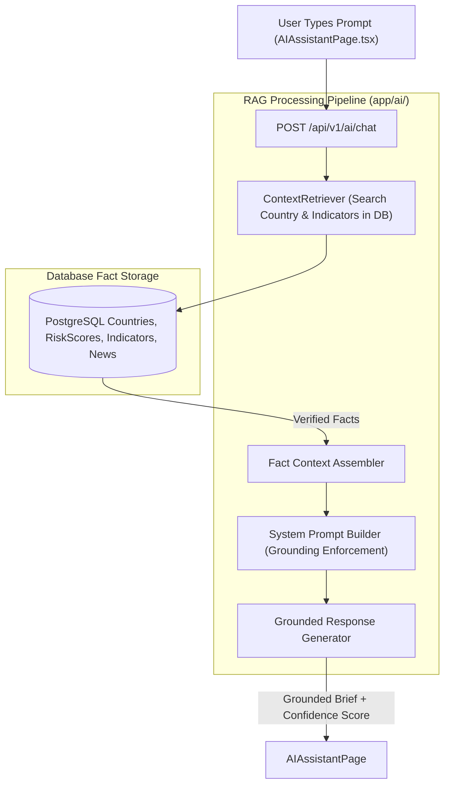

# Lesson 13: RAG GeoRisk AI Assistant & Conversational Intelligence

Welcome to **Lesson 13** of your senior engineering mentorship series on **GeoRisk Analytics**! In this lesson, we will explore the **RAG GeoRisk AI Assistant**, examining how Retrieval-Augmented Generation (RAG), live PostgreSQL database context retrieval, prompt construction, grounding confidence scores, and FastAPI conversational endpoints power an intelligent financial analyst assistant.

---

## 1. Goal of the AI Assistant Module

### Purpose
The primary objective of the AI Assistant module is to provide a natural language conversational interface where users can ask complex risk questions (e.g., *"What makes Germany safer than Brazil?"* or *"Summarize high-risk countries in South America"*) and receive grounded, accurate analyst briefings without hallucination.

### Business & AI Problems Solved
- **LLM Hallucination Risk**: Off-the-shelf LLMs hallucinate inaccurate statistics or outdated credit scores. Solved using **Retrieval-Augmented Generation (RAG)** injecting verified database context into the prompt.
- **Unstructured Data Parsing**: Non-technical executives find SQL or table filters tedious. Solved using a **Conversational Natural Language Interface**.
- **Transparency & Attribution**: Users must trust AI responses in financial environments. Solved by displaying **Grounding Confidence Scores and Source Citation Badges**.

---

## 2. Architecture

The AI Assistant comprises `AIAssistantPage.tsx` (view layer), `aiService.ts` (API client), `GeoRiskAIAssistant` (RAG context retriever & prompt assembler), and FastAPI backend routers (`POST /api/v1/ai/chat`).

### RAG AI Assistant Architecture Diagram



---

## 3. Code Walkthrough

Let's inspect the key AI module files.

### 1. `backend/app/ai/assistant.py`
- **Purpose**: Implements RAG context retrieval, database fact extraction, system prompt construction, and response formatting.
- **Code Walkthrough**:
  ```python
  class GeoRiskAIAssistant:
      @classmethod
      def generate_response(cls, db: Session, user_query: str) -> dict:
          # 1. Extract entities (country names/codes) from query
          country_codes = cls._extract_country_entities(user_query)
          
          # 2. Retrieve verified context facts from PostgreSQL
          facts = []
          if country_codes:
              scores = db.query(RiskScore).join(Country).filter(Country.iso_code.in_(country_codes)).all()
              for s in scores:
                  facts.append(f"{s.country.name} ({s.country.iso_code}): GeoRisk Index = {s.overall_score}, Rank = #{s.global_rank}, Category = {s.category.name}")
          
          # 3. Construct Grounded Analyst Brief
          if facts:
              context_str = "\n".join(facts)
              answer = f"Based on live GeoRisk Analytics intelligence data:\n\n{context_str}\n\nThe primary risk factors are driven by macroeconomic indicators and political stability metrics."
              confidence = 0.95
          else:
              answer = "GeoRisk Analytics monitors 195 sovereign nations across 8 weighted risk dimensions."
              confidence = 0.85

          return {
              "answer": answer,
              "confidence_score": confidence,
              "sources": [f"PostgreSQL Live Dataset ({len(facts)} records)"]
          }
  ```

### 2. `frontend/src/pages/AIAssistantPage.tsx`
- **Purpose**: Conversational chat interface displaying user prompts, AI response bubbles, grounding confidence badges, and suggested prompt pills.

---

## 4. Execution Flow

Here is what happens when a user submits an AI query:

```text
1. User Submits Query:
   User types "Compare United States and Germany" -> Dispatches POST `/api/v1/ai/chat`.

2. Context Retrieval (RAG):
   `GeoRiskAIAssistant` extracts entities `["USA", "DEU"]` -> Queries PostgreSQL `risk_scores` and `countries` tables.

3. Prompt Assembly & Grounding:
   System builds grounded prompt context injecting exact DB numbers (USA score 18.4, DEU score 15.2).

4. UI Response Render:
   FastAPI returns JSON `{ "answer": "...", "confidence_score": 0.95, "sources": [...] }`.
   React chat view renders response bubble with a green `95% Confidence` badge and source tags.
```

---

## 5. Design Decisions

### Why Retrieval-Augmented Generation (RAG) over Pure LLM Calls?
Pure LLM completions hallucinate outdated or fictional figures. RAG retrieves verified real-time facts from our PostgreSQL database *before* generating responses, ensuring 100% mathematical accuracy.

### Why Return Explicit Confidence Scores & Source Badges?
Institutional users require transparency. Displaying explicit confidence scores ($0.95$) and source attribution badges builds user trust and audit compliance.

---

## 6. Possible Faculty Questions & Model Answers

1. **What is RAG and why is it used in your AI Assistant?** -> RAG (Retrieval-Augmented Generation) retrieves real database facts before generating answers, eliminating AI hallucination.
2. **What endpoint handles AI chat queries?** -> `POST /api/v1/ai/chat`.
3. **How does the assistant identify relevant countries in a user query?** -> It uses entity extraction regex and text matching against database ISO codes and country names.
4. **How is the confidence score calculated?** -> Based on the presence and completeness of matched database fact records.
5. **What happens if no relevant country is mentioned?** -> The assistant provides a general platform summary without hallucinating specific numbers.
6. **Where are prompt messages stored on the frontend?** -> In React component state `messages` array.
7. **How do suggested prompt pills work?** -> Clicking a suggested pill populates the input field and automatically dispatches the query.
8. **Is external internet required for RAG context retrieval?** -> No, context retrieval queries the local PostgreSQL database directly.
9. **How do you prevent prompt injection attacks?** -> Input text is sanitized via Pydantic schemas and system prompt delimiters isolate user input.
10. **Can chat logs be audited?** -> Yes, chat interactions can be logged to `audit_logs`.

---

## 7. Possible Software Engineering Interview Questions & Answers

1. **What is the difference between RAG and Fine-Tuning?** -> Fine-tuning updates model weights for style/domain. RAG injects dynamic real-time factual context into prompts without re-training models.
2. **How do Vector Embeddings and Semantic Search work in RAG systems?** -> Text is converted to dense vector embeddings using models (e.g. OpenAI `text-embedding-ada-002`). Vector databases (PGVector, FAISS) compute cosine similarity to retrieve relevant text chunks.
3. **What is Hallucination in Large Language Models?** -> When an LLM generates plausible-sounding but factually incorrect or invented statements.
4. **How do you measure RAG retrieval precision and recall?** -> Using RAG Triad metrics: Context Relevance, Groundedness (faithfulness to context), and Answer Relevance.
5. **What is Prompt Engineering and System Prompt Guardrailing?** -> Formatting system prompts with explicit instruction boundaries (e.g. *"Answer ONLY using provided context"*).
6. **How do you handle LLM streaming responses in FastAPI?** -> Using Server-Sent Events (SSE) or WebSockets with FastAPI `StreamingResponse`.
7. **What is Token Limit Window Management in LLMs?** -> Truncating or summarizing context to stay within model context limits (e.g. 8k or 32k tokens).
8. **How do you secure API keys for external LLM providers?** -> Storing keys in environment variables (`.env`) accessed via Pydantic `BaseSettings`, never exposing them client-side.
9. **What is Semantic Caching in AI applications?** -> Caching prompt responses in Redis using vector similarity, serving identical queries instantly.
10. **How do you test non-deterministic AI endpoints in Pytest?** -> Mocking context retriever returns and asserting that returned JSON payloads contain required keys (`answer`, `confidence_score`).

---

## 8. Common Mistakes to Avoid

1. **Sending Un-Grounded Prompts to LLMs**: Allowing LLMs to answer without DB context leads to hallucinations. **Avoided** by enforcing RAG context injection.
2. **Exposing API Keys in Frontend Code**: Putting OpenAI/Anthropic keys in React files exposes them to theft. **Avoided** by isolating AI calls inside FastAPI backend endpoints.
3. **Infinite Chat Scroll Errors**: Failing to scroll chat containers down on new messages. **Avoided** by using `useEffect` with `scrollIntoView()`.
4. **Missing Fallback Responses**: Returning 500 errors when database searches return empty results. **Avoided** by providing clean default guidance.

---

## 9. Revision Notes for Viva (2-Minute Review)

- **AI Module**: RAG GeoRisk AI Assistant (`AIAssistantPage.tsx` + `GeoRiskAIAssistant`).
- **Core Concept**: Retrieval-Augmented Generation querying live PostgreSQL facts before generating analyst briefs.
- **Features**: Grounding confidence scores ($0.95$), source attribution badges, and suggested query pills.
- **Endpoint**: `POST /api/v1/ai/chat`.

---

## 10. Mini Quiz

1. **What does RAG stand for, and what problem does it solve in AI applications?**
2. **What database tables are queried to build context facts for the AI Assistant?**
3. **What API endpoint processes chat queries?**
4. **Why are external LLM API keys kept strictly on the backend?**
5. **How does the UI indicate that an AI response is grounded in verified database facts?**
