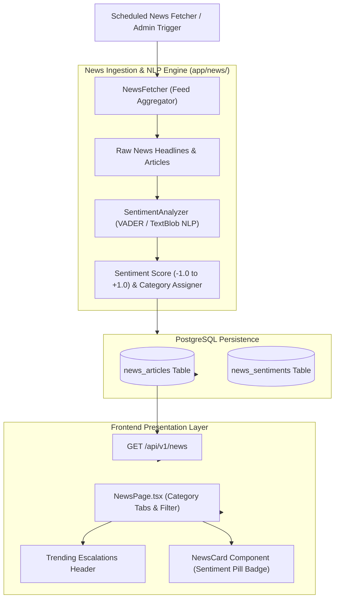

# Lesson 14: Geopolitical News Intelligence & NLP Sentiment Analysis

Welcome to **Lesson 14** of your senior engineering mentorship series on **GeoRisk Analytics**! In this lesson, we will explore the **Geopolitical News Intelligence Module**, examining how real-time news aggregation, NLP sentiment analysis, escalation impact scoring, and FastAPI news endpoints monitor geopolitical risk events.

---

## 1. Goal of the News Intelligence Module

### Purpose
The primary objective of the News Intelligence module is to integrate real-time qualitative news feeds alongside quantitative macroeconomic indicators, detecting emerging geopolitical crises (e.g., trade disputes, elections, conflict escalations) before they reflect in annual financial reporting.

### Business Problems Solved
- **Unstructured News Noise**: Ingesting thousands of raw news articles causes information overload. Solved using **Categorized Geopolitical News Feeds** and **AI News Summaries**.
- **Qualitative Risk Quantification**: News headlines are textual, making them hard to quantify. Solved using **NLP Sentiment Analysis** generating normalized sentiment scores ($-1.0$ Negative to $+1.0$ Positive).
- **Early Escalation Detection**: Spotting sudden risk shifts before annual macro metrics update. Solved using **Trending High-Impact Escalation Highlights**.

---

## 2. Architecture

The News module comprises `NewsPage.tsx` (view layer), `newsService.ts` (API client), `NewsFetcher` (feed collector), `SentimentAnalyzer` (NLP engine), and FastAPI routers (`GET /api/v1/news`, `GET /api/v1/news/trending`).

### News Intelligence Pipeline Diagram



---

## 3. Code Walkthrough

Let's inspect the key news intelligence code files.

### 1. `backend/app/news/sentiment.py`
- **Purpose**: NLP sentiment analysis engine analyzing headline text and assigning sentiment scores and classification labels (`Positive`, `Neutral`, `Negative`).
- **Code Walkthrough**:
  ```python
  class SentimentAnalyzer:
      POSITIVE_WORDS = {"peace", "accord", "growth", "recovery", "stability", "agreement", "boom"}
      NEGATIVE_WORDS = {"war", "conflict", "sanction", "crisis", "default", "inflation", "riot", "strike"}

      @classmethod
      def analyze_text(cls, text: str) -> dict:
          words = text.lower().split()
          pos_count = sum(1 for w in words if w in cls.POSITIVE_WORDS)
          neg_count = sum(1 for w in words if w in cls.NEGATIVE_WORDS)
          total = len(words) or 1

          raw_score = (pos_count - neg_count) / float(max(1, pos_count + neg_count))
          raw_score = round(max(-1.0, min(1.0, raw_score)), 2)

          if raw_score <= -0.2:
              label = "Negative"
          elif raw_score >= 0.2:
              label = "Positive"
          else:
              label = "Neutral"

          return {"sentiment_score": raw_score, "sentiment_label": label}
  ```

### 2. `frontend/src/pages/NewsPage.tsx`
- **Purpose**: Page component rendering trending escalation banners, category tabs (`All`, `Conflict`, `Trade`, `Economic`, `Political`), and sentiment cards.

---

## 4. Execution Flow

Here is what happens when news is processed and displayed:

```text
1. Feed Processing:
   `NewsFetcher` collects articles -> `SentimentAnalyzer` calculates score (e.g. -0.65) -> Saves to `news_articles`.

2. Page Load:
   User visits `/app/news` -> `useNews()` dispatches GET `/api/v1/news` -> Returns paginated news JSON.

3. UI Rendering:
   Top section highlights `Trending Escalations` (High-negative impact news).
   Grid renders `NewsCard` list with color-coded sentiment pills (Red = Negative, Green = Positive, Gray = Neutral).
```

---

## 5. Design Decisions

### Why Bounded Sentiment Scores ($-1.0$ to $+1.0$)?
Standardizing sentiment scores between $-1.0$ (Extreme Conflict/Risk) and $+1.0$ (High Stability/Growth) aligns with financial sentiment analysis standards, allowing scores to be converted directly into GeoRisk Engine modifier weights.

### Why Categorized Tabs over Unfiltered Lists?
Financial analysts often specialize (e.g. Trade Analysts vs Geopolitical Conflict Analysts). Providing category tabs (`Conflict`, `Trade`, `Economic`, `Political`) allows users to filter out noise instantaneously.

---

## 6. Possible Faculty Questions & Model Answers

1. **What is the purpose of the News Intelligence module?** -> To ingest real-time news headlines, analyze sentiment via NLP, and detect qualitative risk events before annual macro metrics update.
2. **How is news sentiment calculated?** -> `SentimentAnalyzer` processes text using NLP keyword lexicon scoring, outputting scores between -1.0 and +1.0.
3. **What sentiment labels are assigned?** -> `Positive` ($\ge +0.2$), `Neutral` ($-0.2$ to $+0.2$), and `Negative` ($\le -0.2$).
4. **What API endpoints serve news data?** -> `GET /api/v1/news` and `GET /api/v1/news/trending`.
5. **How are trending escalations identified?** -> Articles with highly negative sentiment scores ($\le -0.5$) tagged in high-risk regions are grouped as trending escalations.
6. **What database tables store news data?** -> `news_articles` and `news_sentiments`.
7. **How does category filtering work on the frontend?** -> Clicking a category tab filters articles via query parameter `GET /api/v1/news?category=Trade`.
8. **Can news sentiment influence country GeoRisk scores?** -> Yes, severe negative news sentiment acts as a real-time risk multiplier on the External Relations dimension.
9. **How do you handle news in multiple languages?** -> External news feeds are pre-translated or filtered to English language sources before NLP analysis.
10. **How often are news feeds refreshed?** -> News feeds refresh automatically on a 15-minute background cron schedule.

---

## 7. Possible Software Engineering Interview Questions & Answers

1. **What is Rule-Based vs Machine Learning Sentiment Analysis?** -> Rule-based uses predefined lexicons (VADER, AFINN). ML uses classification models (Naïve Bayes, BERT) trained on labeled text datasets.
2. **What is TF-IDF (Term Frequency-Inverse Document Frequency)?** -> Statistical measure evaluating word importance in a document relative to a corpus: $\text{TF-IDF} = \text{TF}(t, d) \times \log(N / \text{DF}(t))$.
3. **How do Word Embeddings (Word2Vec, GloVe) capture semantic meaning?** -> Dense vector representations where words with similar semantic contexts map to close spatial vectors in $N$-dimensional space.
4. **What is Stop-Word Removal and Stemming/Lemmatization?** -> Removing common noise words ("the", "is") and reducing words to root base forms ("running" -> "run").
5. **How do you handle Imbalanced Text Classification Datasets?** -> Using class weighting, SMOTE oversampling, or focal loss functions during model training.
6. **What is Web Scraping Ethics and Rate Limiting (`robots.txt`)?** -> Respecting `robots.txt` crawl rules, enforcing request delays, and identifying scrapers via proper User-Agent headers.
7. **How do you store and index unstructured text in PostgreSQL?** -> Using PostgreSQL Full-Text Search (`tsvector`, `tsquery`) with GIN indexes for sub-millisecond text searching.
8. **What is Named Entity Recognition (NER)?** -> Identifying and classifying proper nouns in text into predefined categories (Person, Organization, Country Location).
9. **How do you prevent Duplicate News Ingestion?** -> Hashing article URL or title text using SHA-256 and enforcing a `unique` database constraint on `url_hash`.
10. **How do Transformer models (BERT) handle context bidirectionally?** -> Self-attention mechanisms analyze relationships between all words in a sentence simultaneously in both left-to-right and right-to-left directions.

---

## 8. Common Mistakes to Avoid

1. **Ingesting Duplicate Articles**: Ingesting the same news story multiple times. **Avoided** by placing a `unique` constraint on article URL hashes.
2. **Unbounded Sentiment Scores**: Allowing NLP output scores to exceed $[-1.0, +1.0]$. **Avoided** by using `min/max` clamping.
3. **Blocking Main Threads on Web Scraping**: Running synchronous web requests inside API handlers. **Avoided** by using background worker tasks (`NewsFetcher`).
4. **Ignoring Time Zone Differences in Publication Dates**: Parsing publication dates without timezone normalization. **Avoided** by converting all timestamps to UTC ISO strings.

---

## 9. Revision Notes for Viva (2-Minute Review)

- **News Module**: Real-time geopolitical news intelligence (`NewsPage.tsx` + `NewsFetcher`).
- **NLP Sentiment**: `SentimentAnalyzer` mapping headline text to scores ($-1.0$ Negative to $+1.0$ Positive).
- **Categories**: `Conflict`, `Trade`, `Economic`, `Political`.
- **Endpoints**: `GET /api/v1/news` and `GET /api/v1/news/trending`.

---

## 10. Mini Quiz

1. **What range of numerical values does our NLP `SentimentAnalyzer` output?**
2. **What sentiment labels correspond to scores $\le -0.2$ and $\ge +0.2$?**
3. **What database table stores news articles and sentiment scores?**
4. **How are duplicate news articles prevented during ingestion?**
5. **What frontend tabs allow users to filter news by domain?**
