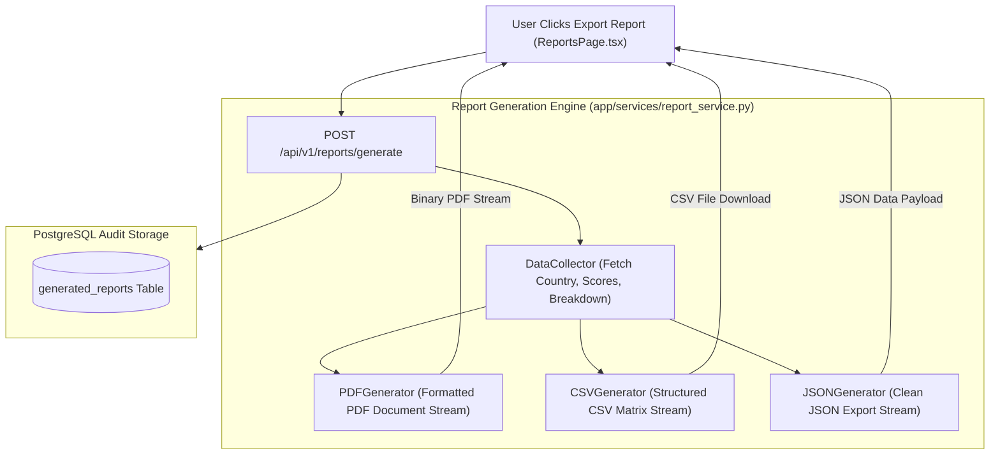

# Lesson 15: Executive Reporting, Multi-Format Exports & Dossier Generation

Welcome to **Lesson 15** of your senior engineering mentorship series on **GeoRisk Analytics**! In this lesson, we will explore the **Executive Reporting & Multi-Format Export Module**, examining how report generation services compile risk dossiers into PDF documents, CSV datasets, and JSON exports.

---

## 1. Goal of the Reporting Module

### Purpose
The primary objective of the Reporting module is to enable users to export high-density risk intelligence datasets into formatted executive PDF briefs, CSV spreadsheets, and structured JSON payloads for institutional presentations, offline analysis, and compliance auditing.

### Business Problems Solved
- **Offline Presentation Needs**: Executives need formatted print-ready PDF reports for board meetings without web access. Solved using **Automated PDF Report Generation**.
- **Data Export for External Tools**: Analysts need raw metric rows to import into Excel or Tableau. Solved using **CSV and JSON Exporters**.
- **Report Audit History**: Tracking when reports were generated and by whom. Solved using the **`generated_reports` Database Audit Table**.

---

## 2. Architecture

The Reporting module comprises `ReportsPage.tsx` (view layer), `reportService.ts` (API client), `ReportService` (document generator), and FastAPI backend routers (`POST /api/v1/reports/generate`, `GET /api/v1/reports`).

### Executive Reporting Architecture Diagram



---

## 3. Code Walkthrough

Let's inspect the key report generation code files.

### 1. `backend/app/services/report_service.py`
- **Purpose**: Compiles country risk scores and factor contributions into formatted PDF briefs, CSV data streams, or JSON structures.
- **Code Walkthrough**:
  ```python
  import io
  import csv
  from app.models.report import GeneratedReport

  class ReportService:
      @classmethod
      def generate_csv_report(cls, db: Session, user_id: str, country_codes: list[str]) -> io.StringIO:
          output = io.StringIO()
          writer = csv.writer(output)
          writer.writerow(["ISO Code", "Country Name", "GeoRisk Index", "Global Rank", "Category"])

          scores = db.query(RiskScore).join(Country).filter(Country.iso_code.in_(country_codes)).all()
          for s in scores:
              writer.writerow([s.country.iso_code, s.country.name, s.overall_score, s.global_rank, s.category.name])

          # Audit Log Record
          report_log = GeneratedReport(user_id=user_id, report_type="CSV", format="csv")
          db.add(report_log)
          db.commit()

          output.seek(0)
          return output
  ```

### 2. `frontend/src/pages/ReportsPage.tsx`
- **Purpose**: Page component allowing users to select report parameters, choose export format (PDF, CSV, JSON), and view generated report history.

---

## 4. Execution Flow

Here is what happens during a report export:

```text
1. User Selects Export:
   User selects "Germany & Brazil" -> Selects format "PDF" -> Clicks "Generate Executive Brief".

2. API Request Dispatch:
   `reportService.generateReport()` dispatches POST `/api/v1/reports/generate` with `{ "codes": ["DEU", "BRA"], "format": "pdf" }`.

3. Document Compilation & Audit:
   FastAPI `ReportService` queries score records -> Formats document binary stream -> Logs entry in `generated_reports`.

4. Browser File Download:
   FastAPI returns HTTP 200 with header `Content-Disposition: attachment; filename=GeoRisk_Executive_Brief.pdf`.
   Browser automatically triggers binary file download.
```

---

## 5. Design Decisions

### Why Dynamic Binary Stream Returns (`io.BytesIO`) over Saving Static Files to Disk?
Saving generated PDFs directly to disk creates disk space bloat, requires background cleanup cron jobs, and creates security risks. Returning in-memory dynamic binary streams directly to the HTTP response reduces disk I/O and improves security.

### Why Support 3 Export Formats (PDF, CSV, JSON)?
Different stakeholders require different outputs: Executives want formatted PDF briefs, Data Analysts want raw CSV spreadsheets for Excel, and Developers want structured JSON for programmatic integration.

---

## 6. Possible Faculty Questions & Model Answers

1. **What export formats are supported by your reporting module?** -> PDF, CSV, and JSON.
2. **What database table tracks generated reports?** -> `generated_reports`.
3. **How is a PDF file delivered to the browser without saving to disk?** -> As an in-memory binary stream (`io.BytesIO`) returned with a `Content-Disposition: attachment` header.
4. **What endpoint handles report generation requests?** -> `POST /api/v1/reports/generate`.
5. **What information is included in an Executive PDF Brief?** -> Country metadata, flag, overall GeoRisk Index, global rank, 8 sub-scores, and factor contribution breakdown table.
6. **How does the frontend trigger a file download from an API stream?** -> Axios receives binary `blob` response data and creates a temporary `URL.createObjectURL(blob)` link element.
7. **What library generates CSV files in Python?** -> Python's built-in `csv` and `io` modules.
8. **Can users view their previously generated report history?** -> Yes, `GET /api/v1/reports` returns the user's historical report generation log.
9. **How do you prevent unauthorized users from downloading reports?** -> Endpoints require valid JWT bearer tokens.
10. **How is report generation performance optimized?** -> By pre-fetching required database records in single joined queries before compiling streams.

---

## 7. Possible Software Engineering Interview Questions & Answers

1. **What HTTP header forces the browser to download a response as a file attachment?** -> `Content-Disposition: attachment; filename="report.pdf"`.
2. **What is the difference between `io.StringIO` and `io.BytesIO` in Python?** -> `StringIO` handles in-memory text/character streams (CSV, JSON). `BytesIO` handles in-memory raw binary streams (PDF, ZIP, Images).
3. **How do you handle large file downloads without consuming excessive server RAM?** -> Using streaming responses (FastAPI `StreamingResponse`) to yield chunks of data iteratively.
4. **What is a Blob object in browser JavaScript?** -> A Blob (Binary Large Object) represents immutable raw binary data in browser memory.
5. **How do you prevent memory leaks when creating Blob URLs in React?** -> Revoking the temporary URL using `URL.revokeObjectURL(url)` after initiating download.
6. **How do you format tables dynamically in ReportLab or PDF generation libraries?** -> Defining structured `Table` elements with explicit column widths, cell padding, and paragraph styling wrappers.
7. **What MIME types correspond to PDF, CSV, and JSON responses?** -> `application/pdf`, `text/csv`, `application/json`.
8. **How do you implement background file generation for heavy reports?** -> Offloading work to background task queues (Celery / Redis Queue) and notifying users via email or WebSocket when ready.
9. **How do you secure user-uploaded or generated files against Path Traversal vulnerabilities?** -> Sanitizing file names, using randomly generated UUIDs, and avoiding raw user input in file paths.
10. **How do you test binary file download endpoints in Pytest?** -> Asserting `response.status_code == 200`, checking `Content-Type` header, and verifying non-zero binary content length.

---

## 8. Common Mistakes to Avoid

1. **Accumulating PDF Files on Disk**: Writing temp PDF files to disk without deletion fills storage. **Avoided** by returning in-memory `io.BytesIO` streams.
2. **Missing `Content-Disposition` Headers**: Omitting attachment headers causes browsers to open raw text in browser tabs rather than downloading files. **Avoided** by setting explicit attachment headers.
3. **Forgetting Blob Revocation in JavaScript**: Leaving Blob URLs in browser memory leads to memory leaks. **Avoided** by invoking `URL.revokeObjectURL()`.
4. **Blocking Endpoint Workers on PDF Compilation**: Generating 100-page PDFs inside sync request loops. **Avoided** by optimizing query paths and stream generation.

---

## 9. Revision Notes for Viva (2-Minute Review)

- **Formats**: PDF (Executive Briefs), CSV (Spreadsheets), JSON (Programmatic API).
- **Delivery**: In-memory binary streams (`io.BytesIO` / `io.StringIO`) via `StreamingResponse`.
- **Audit**: Every export logs metadata to `generated_reports` table.
- **Endpoint**: `POST /api/v1/reports/generate`.

---

## 10. Mini Quiz

1. **What 3 export formats does the reporting module provide?**
2. **Why are reports generated in-memory (`BytesIO`) instead of saved to server disk?**
3. **What HTTP response header instructs the browser to trigger a file download dialog?**
4. **What table logs historical report generation events?**
5. **What JavaScript function cleans up temporary Blob URLs to prevent browser memory leaks?**
