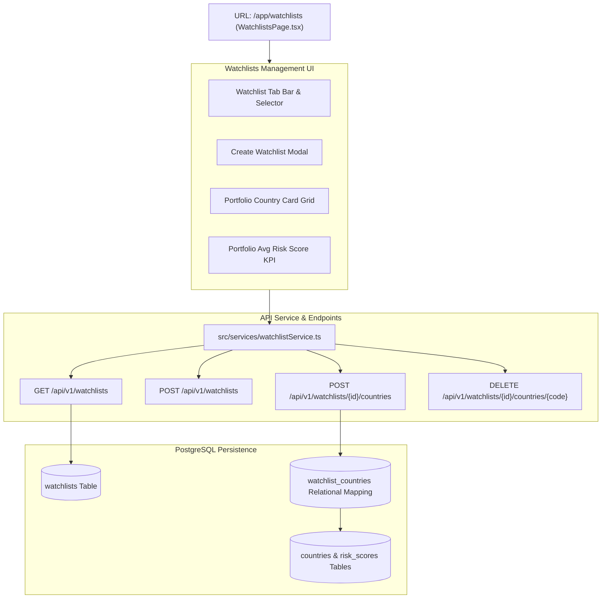

# Lesson 16: Custom Watchlists & Country Portfolio Management

Welcome to **Lesson 16** of your senior engineering mentorship series on **GeoRisk Analytics**! In this lesson, we will explore the **Custom Watchlists Module**, examining how relational watchlist tables, user-specific country portfolio management, custom naming, and FastAPI CRUD endpoints enable personalized sovereign monitoring.

---

## 1. Goal of the Watchlists Module

### Purpose
The primary objective of the Watchlists module is to allow logged-in users (investors, risk managers, analysts) to organize sovereign countries into custom portfolios (e.g. *"LATAM Exposure Portfolio"*, *"EU Tech Havens"*), tracking their risk score changes centrally without navigating through global country lists.

### Business Problems Solved
- **Portfolio Tracking Friction**: Investors with assets in 10 specific countries waste time searching for them individually. Solved using **Custom User Watchlists**.
- **Multi-Portfolio Organization**: Risk managers oversee different client funds with distinct country exposures. Solved using **Multi-Watchlist CRUD Support**.
- **Personalized Analytics Aggregation**: Viewing average risk metrics across specific country portfolios. Solved using **Watchlist Summary Statistics**.

---

## 2. Architecture

The Watchlists module comprises `WatchlistsPage.tsx` (view layer), `watchlistService.ts` (API client), `WatchlistService` (business logic), and FastAPI backend routers under `/api/v1/watchlists`.

### Watchlists Architecture Diagram



---

## 3. Code Walkthrough

Let's inspect the key watchlist code files.

### 1. `backend/app/models/watchlist.py`
- **Purpose**: SQLAlchemy ORM models defining user watchlists and country mapping tables (`Watchlist`, `WatchlistCountry`).
- **Code Walkthrough**:
  ```python
  class Watchlist(Base):
      __tablename__ = "watchlists"

      id: Mapped[str] = mapped_column(String(36), primary_key=True, default=lambda: str(uuid.uuid4()))
      user_id: Mapped[str] = mapped_column(String(36), ForeignKey("users.id", ondelete="CASCADE"), nullable=False, index=True)
      name: Mapped[str] = mapped_column(String(100), nullable=False)
      description: Mapped[Optional[str]] = mapped_column(String(255), nullable=True)

      items: Mapped[list["WatchlistCountry"]] = relationship("WatchlistCountry", back_populates="watchlist", cascade="all, delete-orphan")

  class WatchlistCountry(Base):
      __tablename__ = "watchlist_countries"

      id: Mapped[str] = mapped_column(String(36), primary_key=True, default=lambda: str(uuid.uuid4()))
      watchlist_id: Mapped[str] = mapped_column(String(36), ForeignKey("watchlists.id", ondelete="CASCADE"), nullable=False, index=True)
      country_id: Mapped[str] = mapped_column(String(36), ForeignKey("countries.id", ondelete="CASCADE"), nullable=False)

      watchlist: Mapped["Watchlist"] = relationship("Watchlist", back_populates="items")
      country: Mapped["Country"] = relationship("Country")
  ```

### 2. `frontend/src/pages/WatchlistsPage.tsx`
- **Purpose**: Page component displaying active watchlists, average risk metrics, country card grids, and modal dialogs for adding/removing countries.

---

## 4. Execution Flow

Here is what happens when a user manages a watchlist:

```text
1. Page Mount:
   User visits `/app/watchlists` -> `useWatchlists()` dispatches GET `/api/v1/watchlists` with Bearer token.

2. Watchlist Retrieval:
   FastAPI filters `watchlists` table by `current_user.id` -> Returns list of user portfolios with nested country items.

3. Add Country to Portfolio:
   User selects "Add Germany" -> Dispatches POST `/api/v1/watchlists/{id}/countries` with `{ "country_code": "DEU" }`.
   Backend inserts record into `watchlist_countries` -> Returns updated portfolio JSON.

4. UI Metric Recalculation:
   `WatchlistsPage` updates state -> Recalculates Portfolio Average Risk Score -> Re-renders country card grid.
```

---

## 5. Design Decisions

### Why Many-to-Many Relational Junction Table (`watchlist_countries`)?
A user can create multiple watchlists, and a single country (e.g. Germany) can exist inside multiple watchlists (e.g. *"EU Portfolio"* and *"Top Safe Havens"*). A many-to-many junction table (`watchlist_countries`) maintains clean relational normalization without data duplication.

### Why Cascading Deletes (`cascade="all, delete-orphan"`)?
If a user deletes a watchlist, deleting orphan records in `watchlist_countries` automatically prevents database clutter and foreign key constraint errors.

---

## 6. Possible Faculty Questions & Model Answers

1. **What is the purpose of the Watchlists module?** -> To allow authenticated users to organize countries into personalized monitoring portfolios.
2. **What database tables model watchlists?** -> `watchlists` (portfolio metadata) and `watchlist_countries` (many-to-many junction table linking watchlists to countries).
3. **How is user data isolation maintained?** -> Every watchlist query filters strictly by `user_id == current_user.id`.
4. **What CRUD operations are supported?** -> Create watchlist, Read user watchlists, Add country to watchlist, Remove country from watchlist, Delete watchlist.
5. **How is portfolio average risk score calculated?** -> By averaging overall GeoRisk scores across all countries contained in the selected watchlist.
6. **Can a country belong to multiple watchlists?** -> Yes, the junction table model allows a country to be added to multiple watchlists.
7. **What API endpoint fetches a user's watchlists?** -> `GET /api/v1/watchlists`.
8. **How does the frontend handle watchlist creation?** -> A modal dialog captures portfolio name and description, dispatching `POST /api/v1/watchlists`.
9. **What happens when a user deletes a watchlist?** -> The watchlist and all its associated junction records in `watchlist_countries` are deleted via `cascade="all, delete-orphan"`.
10. **How do custom hooks update watchlist state?** -> TanStack Query invalidates `['watchlists']` cache key on mutations, triggering an automatic background refetch.

---

## 7. Possible Software Engineering Interview Questions & Answers

1. **What is a Many-to-Many (M:N) Relationship and how is it implemented in SQL?** -> A relationship where multiple records in Table A map to multiple records in Table B, implemented using a Junction/Bridge table containing foreign keys referencing both tables.
2. **What is Orphan Removal in ORMs?** -> When a child record is disconnected from its parent collection, orphan removal automatically deletes the child record from the database.
3. **How do you prevent duplicate entries in a junction table?** -> Adding a `UniqueConstraint("watchlist_id", "country_id")` constraint across foreign key pairs.
4. **What is Row-Level Security (RLS) vs Application-Level Authorization?** -> RLS enforces access policies directly inside the database engine. Application-level authorization checks `user_id` in API code before executing queries.
5. **How do you optimize nested relational fetches in SQLAlchemy?** -> Using `.joinedload()` or `.subqueryload()` to fetch parent watchlists and nested country items in a single query.
6. **What is optimistic UI updating in frontend frameworks?** -> Immediately updating UI state assuming an API call will succeed, rolling back state if the network call fails.
7. **How do you validate request bodies for nested resource creation?** -> Defining Pydantic schemas for payload validation (`WatchlistCreate`, `WatchlistCountryAdd`).
8. **What is the difference between soft deletion and hard deletion for user resources?** -> Hard deletion removes records completely. Soft deletion marks `deleted_at`, preserving historical audit logs.
9. **How do you write Pytest tests for CRUD endpoints?** -> Testing creation, retrieval, authorization boundaries, duplicate entry rejection, and deletion.
10. **How do you handle scaling for millions of user watchlists?** -> Creating indexes on `(user_id)` and `(watchlist_id, country_id)` composite pairs.

---

## 8. Common Mistakes to Avoid

1. **Missing `user_id` Scope Filters**: Fetching all watchlists without filtering by `user_id` leaks private portfolios across users. **Avoided** by appending `.filter(Watchlist.user_id == current_user.id)`.
2. **Allowing Duplicate Country Additions**: Adding Germany 5 times to the same watchlist. **Avoided** by enforcing unique junction constraints.
3. **N+1 Query Roundtrips**: Querying watchlists and fetching country details in separate loops. **Avoided** by using `.joinedload()`.
4. **Orphan Records**: Deleting a watchlist without cleaning up junction rows. **Avoided** by setting cascade deletion rules.

---

## 9. Revision Notes for Viva (2-Minute Review)

- **Module**: Custom Watchlists (`WatchlistsPage.tsx` + `WatchlistService`).
- **Schema**: `watchlists` (user_id, name, description) + `watchlist_countries` (junction table).
- **Features**: Multi-watchlist creation, country addition/removal, average risk score KPI calculation, user data isolation.
- **Endpoints**: `GET /api/v1/watchlists`, `POST /api/v1/watchlists`, `POST /api/v1/watchlists/{id}/countries`.

---

## 10. Mini Quiz

1. **What two database tables model user watchlists in our PostgreSQL schema?**
2. **How do backend API endpoints ensure users can only access their own private watchlists?**
3. **What happens to records in `watchlist_countries` when a parent watchlist is deleted?**
4. **What mathematical metric is computed across all countries in a selected watchlist portfolio?**
5. **How is duplicate country addition to the same watchlist prevented?**
