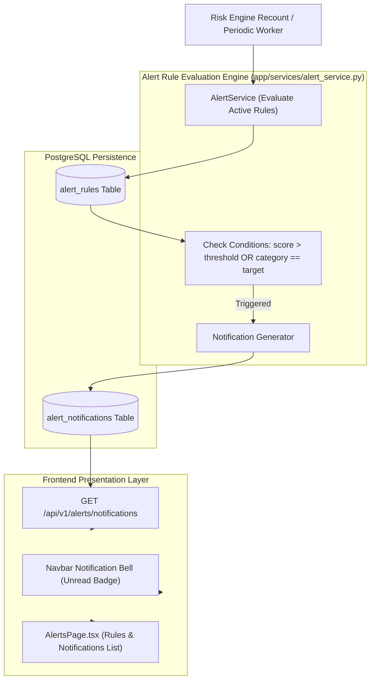

# Lesson 17: Threshold Alert Rules & Real-Time Notification Engine

Welcome to **Lesson 17** of your senior engineering mentorship series on **GeoRisk Analytics**! In this lesson, we will explore the **Threshold Alert Rules & Real-Time Notification Engine**, examining how rule evaluation algorithms, threshold condition triggers, in-app notification centers, and FastAPI alert routers protect users from sudden risk escalations.

---

## 1. Goal of the Alerts Module

### Purpose
The primary objective of the Alerts module is to provide automated real-time risk monitoring, notifying users immediately when a sovereign country's GeoRisk Index crosses user-defined threshold limits (e.g. *"Alert me if Ukraine's risk score exceeds 80.0"* or *"Notify me if Germany's category changes to Elevated"*).

### Business Problems Solved
- **Manual Monitoring Fatigue**: Risk managers cannot manually check 195 countries every day for score shifts. Solved using **Automated Threshold Alert Rules**.
- **Delayed Response to Escalations**: Failing to react to sudden risk surges causes capital loss. Solved using **In-App Notification Alerts**.
- **Rule Customization**: Different investors have different risk tolerances. Solved using **Configurable Condition Rules (Greater Than, Less Than, Category Shift)**.

---

## 2. Architecture

The Alerts module comprises `AlertsPage.tsx` (view layer), `alertService.ts` (API client), `AlertService` (rule evaluator), and FastAPI routers under `/api/v1/alerts`.

### Alert System Architecture Diagram



---

## 3. Code Walkthrough

Let's inspect the key alert code files.

### 1. `backend/app/models/alert.py`
- **Purpose**: SQLAlchemy ORM models defining alert rules and generated user notifications (`AlertRule`, `AlertNotification`).
- **Code Walkthrough**:
  ```python
  class AlertRule(Base):
      __tablename__ = "alert_rules"

      id: Mapped[str] = mapped_column(String(36), primary_key=True, default=lambda: str(uuid.uuid4()))
      user_id: Mapped[str] = mapped_column(String(36), ForeignKey("users.id", ondelete="CASCADE"), nullable=False, index=True)
      country_id: Mapped[Optional[str]] = mapped_column(String(36), ForeignKey("countries.id", ondelete="CASCADE"), nullable=True)
      condition_type: Mapped[str] = mapped_column(String(50), nullable=False) # e.g. "GREATER_THAN", "LESS_THAN", "CATEGORY_CHANGE"
      threshold_value: Mapped[float] = mapped_column(Float, nullable=False)
      is_active: Mapped[bool] = mapped_column(Boolean, default=True)

  class AlertNotification(Base):
      __tablename__ = "alert_notifications"

      id: Mapped[str] = mapped_column(String(36), primary_key=True, default=lambda: str(uuid.uuid4()))
      user_id: Mapped[str] = mapped_column(String(36), ForeignKey("users.id", ondelete="CASCADE"), nullable=False, index=True)
      alert_rule_id: Mapped[str] = mapped_column(String(36), ForeignKey("alert_rules.id", ondelete="CASCADE"), nullable=False)
      title: Mapped[str] = mapped_column(String(150), nullable=False)
      message: Mapped[str] = mapped_column(String(255), nullable=False)
      is_read: Mapped[bool] = mapped_column(Boolean, default=False)
      created_at: Mapped[datetime] = mapped_column(DateTime, default=datetime.utcnow)
  ```

### 2. `backend/app/services/alert_service.py`
- **Purpose**: Business logic evaluating active rules against new scores and generating notification records.
- **Code Walkthrough**:
  ```python
  class AlertService:
      @classmethod
      def evaluate_score_change(cls, db: Session, country_id: str, new_score: float):
          active_rules = db.query(AlertRule).filter(
              AlertRule.is_active == True,
              (AlertRule.country_id == country_id) | (AlertRule.country_id == None)
          ).all()

          for rule in active_rules:
              triggered = False
              if rule.condition_type == "GREATER_THAN" and new_score > rule.threshold_value:
                  triggered = True
              elif rule.condition_type == "LESS_THAN" and new_score < rule.threshold_value:
                  triggered = True

              if triggered:
                  notif = AlertNotification(
                      user_id=rule.user_id,
                      alert_rule_id=rule.id,
                      title="Risk Threshold Triggered",
                      message=f"Country risk score reached {new_score}, breaching threshold {rule.threshold_value}"
                  )
                  db.add(notif)
          db.commit()
  ```

---

## 4. Execution Flow

Here is what happens when a threshold alert rule is evaluated:

```text
1. Score Recalculation:
   GeoRisk Engine recalculates scores -> `new_score = 84.7` for Ukraine.

2. Rule Evaluation Trigger:
   Engine invokes `AlertService.evaluate_score_change(db, country_id, 84.7)`.

3. Condition Matching:
   `AlertService` queries active rules -> Finds rule: `condition_type="GREATER_THAN", threshold=80.0`.
   Condition evaluates `True` ($84.7 > 80.0$) -> Generates `AlertNotification` record (`is_read = False`).

4. UI Notification Badge Update:
   Navbar polls GET `/api/v1/alerts/notifications` -> Displays unread red counter pill `(1)`.
   User clicks notification bell -> Opens notification drawer -> Marks notification as read.
```

---

## 5. Design Decisions

### Why Support Global Rules (`country_id = None`) alongside Specific Country Rules?
A user might want an alert if *any* country crosses score 90.0 (`country_id = None`), or specifically monitor *Ukraine* (`country_id = "ukraine-uuid"`). Supporting nullable country foreign keys enables both global and country-specific alert rules.

### Why In-App Notification Center vs Direct Email Dispatch?
Direct email dispatch for high-frequency alerts can mark domain emails as spam and incurs third-party SMTP costs. An in-app notification center stores alert records reliably in PostgreSQL, rendering instant UI badges with optional email digest summaries.

---

## 6. Possible Faculty Questions & Model Answers

1. **What is the purpose of the Alerts module?** -> To monitor risk scores automatically and notify users when scores cross threshold limits.
2. **What database tables model alerts?** -> `alert_rules` (rule conditions) and `alert_notifications` (generated notification messages).
3. **What condition types are supported?** -> `GREATER_THAN`, `LESS_THAN`, and `CATEGORY_CHANGE`.
4. **How are unread notifications tracked?** -> The `alert_notifications` table tracks `is_read` boolean flags.
5. **Where is the unread notification badge displayed?** -> On the top navigation bar bell icon.
6. **How does a user mark notifications as read?** -> By clicking "Mark All as Read", dispatching `PUT /api/v1/alerts/notifications/read`.
7. **What happens when a risk score calculation triggers multiple rules?** -> `AlertService` iterates through matching active rules and creates notification records for each user.
8. **Can users toggle alert rules on and off?** -> Yes, by updating the `is_active` boolean field on `AlertRule`.
9. **How do you prevent duplicate alert spam for minor score fluctuations?** -> Rules include minimum cooldown periods or trigger only when category threshold boundaries change.
10. **What endpoints manage alert rules?** -> `GET /api/v1/alerts/rules`, `POST /api/v1/alerts/rules`, `DELETE /api/v1/alerts/rules/{id}`.

---

## 7. Possible Software Engineering Interview Questions & Answers

1. **What is an Event-Driven Architecture in notification systems?** -> An architecture where state changes emit events to an event bus (Kafka/RabbitMQ), triggering decoupled notification consumer workers.
2. **How do WebSockets differ from HTTP Long-Polling for real-time notifications?** -> 
   - **Long-Polling**: Client sends HTTP requests, server holds connection until new data arrives. Higher HTTP header overhead.
   - **WebSockets**: Persistent bi-directional full-duplex TCP socket connection allowing server to push data instantly.
3. **How do you implement Rate Limiting for email notification systems?** -> Using token bucket or leaky bucket algorithms in Redis to cap outbound emails per user per hour.
4. **What is the Publish-Subscribe (Pub/Sub) Pattern?** -> A pattern where publishers broadcast messages to channels without knowing subscribers. Redis Pub/Sub or AWS SNS deliver messages to registered queues.
5. **How do you handle push notifications for mobile devices?** -> Integrating Firebase Cloud Messaging (FCM) or Apple Push Notification service (APNs) with payload tokens.
6. **How do you test alert evaluation logic in Pytest?** -> Creating mock rules, triggering score changes above and below thresholds, and asserting notification creation.
7. **What is Idempotency in notification delivery?** -> Ensuring a notification is delivered exactly once, preventing duplicate push messages during worker retries.
8. **How do you index alert notification tables for fast unread counts?** -> Creating a composite B-Tree index on `(user_id, is_read)` to execute `COUNT(*)` in sub-milliseconds.
9. **How do you clean up old read notifications?** -> Scheduling background cron cleanup jobs executing `DELETE FROM alert_notifications WHERE is_read = True AND created_at < NOW() - INTERVAL '30 days'`.
10. **What is the Observer Design Pattern?** -> A pattern where an object (Subject) maintains a list of dependents (Observers) and notifies them automatically of state changes.

---

## 8. Common Mistakes to Avoid

1. **Unindexed `is_read` Queries**: Executing `SELECT COUNT(*) WHERE user_id = ? AND is_read = False` without indexes causes slow page loads. **Avoided** by indexing `(user_id, is_read)`.
2. **Infinite Notification Loops**: Evaluation logic triggering alert rules repeatedly for un-updated scores. **Avoided** by evaluating rules only during score mutation events.
3. **Hardcoding Alert Thresholds**: Hardcoding threshold limits in Python code. **Avoided** by storing dynamic user thresholds in database rules.
4. **Failing to Handle Deleted Rule Foreign Keys**: Deleting a rule leaving orphaned notification rows. **Avoided** by specifying `ondelete="CASCADE"`.

---

## 9. Revision Notes for Viva (2-Minute Review)

- **Module**: Threshold Alert Rules (`AlertsPage.tsx` + `AlertService`).
- **Schema**: `alert_rules` (threshold conditions) + `alert_notifications` (user messages).
- **Conditions**: `GREATER_THAN`, `LESS_THAN`, `CATEGORY_CHANGE`.
- **UI Element**: Navbar notification bell with unread count pill badge.
- **Endpoints**: `GET /api/v1/alerts/notifications`, `POST /api/v1/alerts/rules`.

---

## 10. Mini Quiz

1. **What two database tables manage rules and notifications in the Alerts module?**
2. **What 3 condition types can be configured for alert rules?**
3. **Where is the unread notification count badge displayed in the frontend layout?**
4. **How are global alert rules distinguished from country-specific alert rules in `alert_rules`?**
5. **What command marks all unread notifications as read?**
