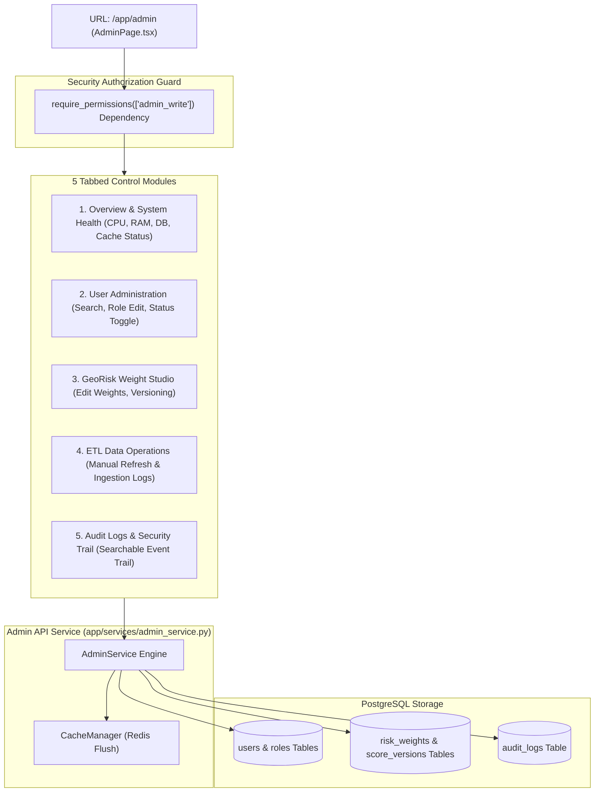

# Lesson 18: Enterprise Admin Panel, System Operations & Weight Studio

Welcome to **Lesson 18** of your senior engineering mentorship series on **GeoRisk Analytics**! In this lesson, we will explore the **Enterprise Admin Panel & System Management Layer**, examining how user administration datatables, GeoRisk Weight Studio versioning, manual ETL pipeline triggers, Redis cache controls, system health monitoring, and audit log trails operate under strict RBAC protection.

---

## 1. Goal of the Admin Panel Module

### Purpose
The primary objective of the Admin Panel is to provide system administrators with a centralized control panel to manage user accounts, assign RBAC roles, modify GeoRisk scoring dimension weights, trigger manual ETL pipeline refreshes, clear application caches, inspect system resources (CPU, RAM, DB health), and review security audit trails.

### Business & Operational Problems Solved
- **Unmanaged User Access**: Adding or deactivating users requires database access. Solved using an **In-App User Management Datatable**.
- **Rigid Scoring Models**: Updating scoring dimension weights requires code redeployment. Solved using the **GeoRisk Weight Studio**.
- **Lack of Operational Visibility**: Ops teams cannot monitor server health or audit trail actions. Solved using **System Resource Monitoring Cards** and **Audit Log Search**.

---

## 2. Architecture

The Admin Panel comprises `AdminPage.tsx` (5 tabbed management modules), `adminService.ts` (API client), `AdminService` (system operations), and FastAPI backend routers under `/api/v1/admin`.

### Admin Control Panel Architecture Diagram



---

## 3. Code Walkthrough

Let's inspect the key admin control files.

### 1. `backend/app/services/admin_service.py`
- **Purpose**: System administration service gathering metrics, updating user roles, versioning weights, logging audit events, and clearing Redis cache.
- **Code Walkthrough**:
  ```python
  import psutil
  from app.models.user import User, AuditLog
  from app.models.risk import RiskWeight, ScoreVersion

  class AdminService:
      @classmethod
      def get_system_health(cls, db: Session) -> dict:
          return {
              "status": "OPERATIONAL",
              "cpu_usage_pct": psutil.cpu_percent(),
              "memory_usage_pct": psutil.virtual_memory().percent,
              "active_db_connections": db.execute("SELECT count(*) FROM pg_stat_activity").scalar() or 1,
              "cache_status": "ONLINE"
          }

      @classmethod
      def update_dimension_weight(cls, db: Session, admin_id: str, weight_id: str, new_weight: float) -> RiskWeight:
          weight = db.query(RiskWeight).filter(RiskWeight.id == weight_id).first()
          if not weight:
              raise HTTPException(status_code=404, detail="Weight record not found")

          weight.weight_pct = new_weight
          
          # Log Audit Event
          audit = AuditLog(user_id=admin_id, action="UPDATE_WEIGHT", module="GeoRisk Weight Studio", status="SUCCESS")
          db.add(audit)
          db.commit()
          return weight
  ```

### 2. `frontend/src/pages/AdminPage.tsx`
- **Purpose**: Centralized 5-module tabbed dashboard interface (`System Health`, `User Admin`, `Weight Studio`, `ETL Operations`, `Audit Logs`).

---

## 4. Execution Flow

Here is what happens when an administrator modifies a GeoRisk dimension weight:

```text
1. Weight Modification:
   Admin opens "Weight Studio" tab -> Modifies Economic Weight to `35%` -> Clicks "Save Weight Profile".

2. API Authorization & Service Execution:
   Dispatches PUT `/api/v1/admin/weights` -> `require_permissions(['admin_write'])` verifies user is `admin`/`super_admin`.
   `AdminService` updates `risk_weights` table -> Creates new `ScoreVersion` record (`v1.1`).

3. Score Recalculation & Cache Clear:
   `GeoRiskEngine` recalculates scores across 195 countries -> `CacheManager.clear_cache()` flushes Redis 7.

4. Audit Log Write:
   System writes entry to `audit_logs` table (`user_id`, `action="UPDATE_WEIGHT"`, `timestamp`).
```

---

## 5. Design Decisions

### Why Centralize 5 Administrative Modules into a Single Tabbed Page?
Separating admin functions into 5 distinct pages increases navigation overhead. Centralizing operations into a tabbed layout (`AdminPage.tsx`) gives administrators a single workspace for system management.

### Why Audit Log Every Administrative Action?
Administrative actions alter core scoring logic or user access rights. Recording every action in `audit_logs` guarantees accountability, regulatory compliance, and security traceability.

---

## 6. Possible Faculty Questions & Model Answers

1. **What is the purpose of the Admin Panel?** -> To manage users, assign roles, modify scoring weights, trigger manual ETL jobs, inspect system health, clear caches, and review audit logs.
2. **What 5 modules are included in the Admin Panel?** -> 1. System Overview & Health, 2. User Administration, 3. GeoRisk Weight Studio, 4. ETL Operations, 5. Audit Logs.
3. **How is the Admin Panel secured against non-admin users?** -> Endpoints check `require_permissions(['admin_write'])` and frontend routes use `ProtectedRoute` role checks.
4. **What is the GeoRisk Weight Studio?** -> An interface allowing administrators to modify dimension weights and create new `ScoreVersion` entries.
5. **How does the system measure CPU and RAM usage?** -> Using Python's `psutil` library in `AdminService.get_system_health()`.
6. **What endpoint clears the application cache?** -> `POST /api/v1/admin/cache/clear`.
7. **What database table tracks administrative operations?** -> `audit_logs`.
8. **What happens when an administrator triggers a manual ETL refresh?** -> FastAPI invokes `ETLPipeline.run_pipeline()`, fetching fresh indicators from World Bank & IMF endpoints.
9. **Can an administrator deactivate a user account without deleting it?** -> Yes, by toggling the `is_active` boolean flag on the `User` model.
10. **What endpoints manage admin operations?** -> `/api/v1/admin/dashboard`, `/api/v1/admin/users`, `/api/v1/admin/weights`, `/api/v1/admin/etl/run`, `/api/v1/admin/audit`, `/api/v1/admin/cache/clear`.

---

## 7. Possible Software Engineering Interview Questions & Answers

1. **What is the Principle of Least Privilege in enterprise security?** -> Granting users only the minimal permissions necessary to perform their specific job functions.
2. **How do you implement Audit Trail Logging in SQL databases?** -> Using explicit audit tables (`audit_logs`) or database triggers recording `user_id`, `action`, `old_values`, `new_values`, and `timestamp`.
3. **What is Python's `psutil` library used for?** -> Fetching system utilization metrics (CPU, Memory, Disk, Network, Process lists) in Python applications.
4. **How do you safely execute cache flushing in production Redis clusters?** -> Using selective pattern matching (`redis.unlink()`) or target namespace deletion rather than blocking `FLUSHALL` commands.
5. **What is a System Health Check Endpoint?** -> An endpoint returning HTTP 200 OK and status JSON indicating whether database, cache, and external dependencies are operational.
6. **How do you handle pagination and searching for audit logs with millions of rows?** -> Using composite B-Tree indexes on `(timestamp, module)` and SQL `LIMIT` / `OFFSET` queries.
7. **What is the difference between Soft Deactivation and Hard Deletion?** -> Soft deactivation (`is_active = False`) retains user historical logs while revoking login access. Hard deletion permanently drops records.
8. **How do you implement feature toggles in enterprise SaaS?** -> Storing feature flags in Redis or database settings, allowing administrators to enable/disable modules dynamically without code deployments.
9. **How do you test administrative endpoints in Pytest?** -> Asserting that standard non-admin user tokens receive `HTTP 403 Forbidden` while admin tokens receive `HTTP 200 OK`.
10. **What is System Governance in software architecture?** -> The policies, processes, and tools enforcing security, compliance, data quality, and operational reliability across an organization.

---

## 8. Common Mistakes to Avoid

1. **Unprotected Admin API Endpoints**: Omitting permission guards on `/admin/*` routes allows non-admins to edit weights. **Avoided** by attaching `require_permissions(['admin_write'])`.
2. **Blocking Redis Flush Commands**: Running synchronous `FLUSHALL` on large Redis instances blocks all incoming requests. **Avoided** by using target key invalidation.
3. **Failing to Audit Weight Modifications**: Changing weights without logging makes tracing score shifts impossible. **Avoided** by writing audit logs on weight mutations.
4. **Hardcoding System Health Thresholds**: Hardcoding static health strings. **Avoided** by querying live hardware metrics via `psutil`.

---

## 9. Revision Notes for Viva (2-Minute Review)

- **Admin Control Panel**: `AdminPage.tsx` with 5 tabbed modules (System Overview, User Admin, Weight Studio, ETL Operations, Audit Logs).
- **Security**: Protected by `require_permissions(['admin_write'])` guard.
- **Monitoring**: Live CPU, RAM, active DB connections via Python `psutil`.
- **Weight Studio**: Allows modifying dimension weights and versioning `ScoreVersion`.
- **Endpoints**: `/api/v1/admin/dashboard`, `/api/v1/admin/users`, `/api/v1/admin/weights`, `/api/v1/admin/audit`, `/api/v1/admin/cache/clear`.

---

## 10. Mini Quiz

1. **What 5 modules compose the Enterprise Admin Control Panel?**
2. **What dependency guard protects all `/admin/*` API endpoints?**
3. **What Python library measures CPU and RAM utilization in `AdminService`?**
4. **What database table records administrative events for security auditing?**
5. **What happens to the Redis cache when an administrator updates scoring weights in the Weight Studio?**
