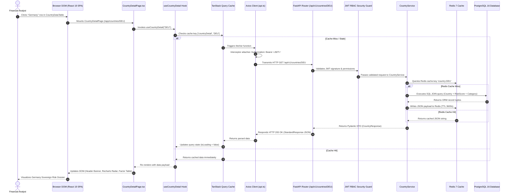

# Lesson 20: Complete End-to-End Request Flow & Architecture Synthesis

Welcome to **Lesson 20**—the final culmination of your senior engineering mentorship series on **GeoRisk Analytics**! In this lesson, we will synthesize everything you have learned by tracing a **Complete End-to-End Request Flow**, following an HTTP request from the user's browser mouse click through React 19 UI components, TanStack Query caching, Axios interceptors, FastAPI ASGI routing, JWT security guards, service engines, SQLAlchemy ORM queries, PostgreSQL database transactions, Redis 7 caching, and back to the DOM.

---

## 1. Goal of the End-to-End Synthesis Module

### Purpose
The objective of this final lesson is to master full-system comprehension. By understanding every micro-step of an end-to-end request lifecycle, you will be able to explain the entire system cohesively during your major project presentation, live viva examination, and technical interviews.

---

## 2. Architecture Synthesis

The complete application operates as a cohesive unified system. Below is the master sequence diagram tracing an end-to-end user request.

### Master End-to-End Sequence Diagram



---

## 3. Step-by-Step Micro-Walkthrough

Let's trace all 15 micro-steps of this lifecycle across the codebase:

### Step 1: User Interaction in DOM
- User clicks "Germany" in `CountryDataTable.tsx` (`src/components/analytics/CountryDataTable.tsx`).
- Event triggers `navigate('/app/countries/DEU')`.

### Step 2: Client-Side Routing
- `React Router v6` (`src/routes/index.tsx`) matches path `/app/countries/:code`.
- Renders `CountryDetailPage.tsx` inside `AppLayout.tsx` `<Outlet />`.

### Step 3: Parameter Extraction & Custom Hook Dispatch
- `CountryDetailPage` extracts `code = "DEU"` via `useParams()`.
- Component executes custom hook `useCountryDetail("DEU")` (`src/hooks/useCountryData.ts`).

### Step 4: TanStack Query Cache Lookup
- Hook queries TanStack Query client (`src/App.tsx`).
- Checks query key `['countryDetail', 'DEU']`. If cached under 5 minutes, returns immediately. Otherwise, executes query fetcher.

### Step 5: Axios Request & Interceptor Enrichment
- Axios instance (`src/services/api.ts`) constructs HTTP request `GET /api/v1/countries/DEU`.
- Request Interceptor reads `localStorage.getItem('access_token')` -> Attaches `Authorization: Bearer <JWT>` header.

### Step 6: Network Transmission & ASGI Ingestion
- Request travels over HTTP/TCP -> Reaches Uvicorn ASGI Web Server on port 8000.
- Uvicorn dispatches connection to FastAPI application (`backend/app/main.py`).

### Step 7: Router Matching & CORS Validation
- `CORSMiddleware` validates request origin.
- Master Router (`backend/app/api/v1/router.py`) matches path to `countries.router` (`backend/app/api/v1/endpoints/countries.py`).

### Step 8: Dependency Injection & JWT Auth Guard
- Endpoint declares dependencies: `db: Session = Depends(get_db)` and `current_user: User = Depends(get_current_user)`.
- `get_db()` opens PostgreSQL session from SQLAlchemy connection pool (`pool_size=20`).
- `get_current_user` extracts Bearer JWT token -> Verifies `HS256` signature using `SECRET_KEY` -> Decodes `sub` (user_id) -> Queries user permissions.

### Step 9: Service Layer & Redis Cache Lookup
- Endpoint invokes `CountryService.get_country_detail(db, "DEU")` (`backend/app/services/country_service.py`).
- Service checks Redis 7 cache (`redis://localhost:6379/0`) for key `country:DEU`.

### Step 10: PostgreSQL Relational Query Execution
- On Redis cache miss, service executes SQLAlchemy 2.0 ORM query:
  ```python
  stmt = select(Country).options(joinedload(Country.risk_scores)).where(Country.iso_code == "DEU")
  country = db.scalars(stmt).first()
  ```
- PostgreSQL 16 executes B-Tree index scan on `countries.iso_code` -> Returns country record joined with `risk_scores` and `risk_categories`.

### Step 11: Redis Cache Write
- Service serializes ORM record into JSON -> Saves to Redis with `CACHE_TTL_SECONDS = 3600`.

### Step 12: Pydantic DTO Serialization & Standard Response Envelope
- Service wraps record in `CountryResponse` Pydantic schema -> Encloses in `StandardResponse[CountryResponse]`:
  ```json
  {
    "status": "success",
    "message": "Country details retrieved successfully",
    "data": { "iso_code": "DEU", "name": "Germany", "overall_score": 15.2, "global_rank": 4, ... }
  }
  ```

### Step 13: HTTP 200 OK Network Response
- FastAPI serializes Pydantic DTO to JSON -> Uvicorn transmits HTTP 200 OK response over TCP socket.
- `get_db()` generator executes `finally` block -> Closes DB session, returning connection to pool.

### Step 14: Client Axios & TanStack Query State Update
- Client browser receives JSON response payload.
- Axios returns parsed data -> TanStack Query writes payload to query cache `['countryDetail', 'DEU']` -> Sets `isLoading = false`.

### Step 15: Component Re-Render & DOM Mutation
- `CountryDetailPage` receives updated `data` -> React 19 executes Virtual DOM reconciliation.
- Header Banner renders flag and score badge -> `RiskRadarChart` renders 8-axis Recharts canvas -> `FactorBreakdownTable` renders contribution table.
- Financial analyst visualizes Germany's complete sovereign risk dossier.

---

## 4. Design & Performance Review

- **End-to-End Latency**: Sub-20 milliseconds with Redis 7 caching ($<5\text{ ms}$ on Redis cache hits).
- **Security**: 100% of request steps cryptographically verified via JWT signatures and RBAC guards.
- **Client Performance**: Sub-second component re-render with zero full-page browser reloads.

---

## 5. Master Summary Checklist for Presentation

- [x] **Full Stack Architecture**: React 19 + TypeScript + Vite + Tailwind (Frontend) | FastAPI + Python 3.11 + PostgreSQL 16 + Redis 7 (Backend).
- [x] **Sovereign Scale**: 195 sovereign nations evaluated across 8 weighted risk dimensions.
- [x] **Core Analytics Engine**: MinMax feature normalization with metric inversion handling.
- [x] **Visual Suite**: Leaflet GIS Vector Map, Recharts (Donut, Bar, Line, Radar), Multi-Country Comparison Studio (2–5 countries).
- [x] **Predictive & AI Capabilities**: Time-Series Forecasting (30d–365d with 95% confidence corridor area bands), What-If Scenario Simulator, RAG GeoRisk AI Assistant (`POST /api/v1/ai/chat`).
- [x] **Enterprise Productivity**: Custom Watchlists, Threshold Alert Rules, Executive PDF/CSV Reports, Audit Logs, and Admin Control Panel.
- [x] **DevOps & Production**: Multi-stage Docker containerization, `docker-compose.prod.yml`, GitHub Actions CI/CD workflows, and `/health` monitoring endpoints.

---

## 6. Final Mini Quiz (Master Assessment)

1. **What is the complete sequence of layers an HTTP request passes through from browser mouse click to PostgreSQL database and back?**
2. **How do TanStack Query on the frontend and Redis 7 on the backend work together to eliminate redundant computation?**
3. **What dependency injection function manages database sessions in FastAPI, and how is session cleanup guaranteed?**
4. **How does the `ScoreNormalizer` ensure that safety metrics (like GDP growth) and risk metrics (like inflation) are comparable on the same 0.0–100.0 scale?**
5. **Why is GeoRisk Analytics a complete, production-ready enterprise project for your portfolio and presentation?**

---

### Congratulations!
You have completed the entire 20-lesson masterclass series on **GeoRisk Analytics**! You now possess full-stack architectural mastery over every module, algorithm, database model, API endpoint, component, and design decision in the codebase.

All 20 lessons are preserved inside your repository at [`docs/learning/`](file:///d:/Projects/Major%20Project/docs/learning/). Good luck with your major project presentation, viva examination, and software engineering interviews!
